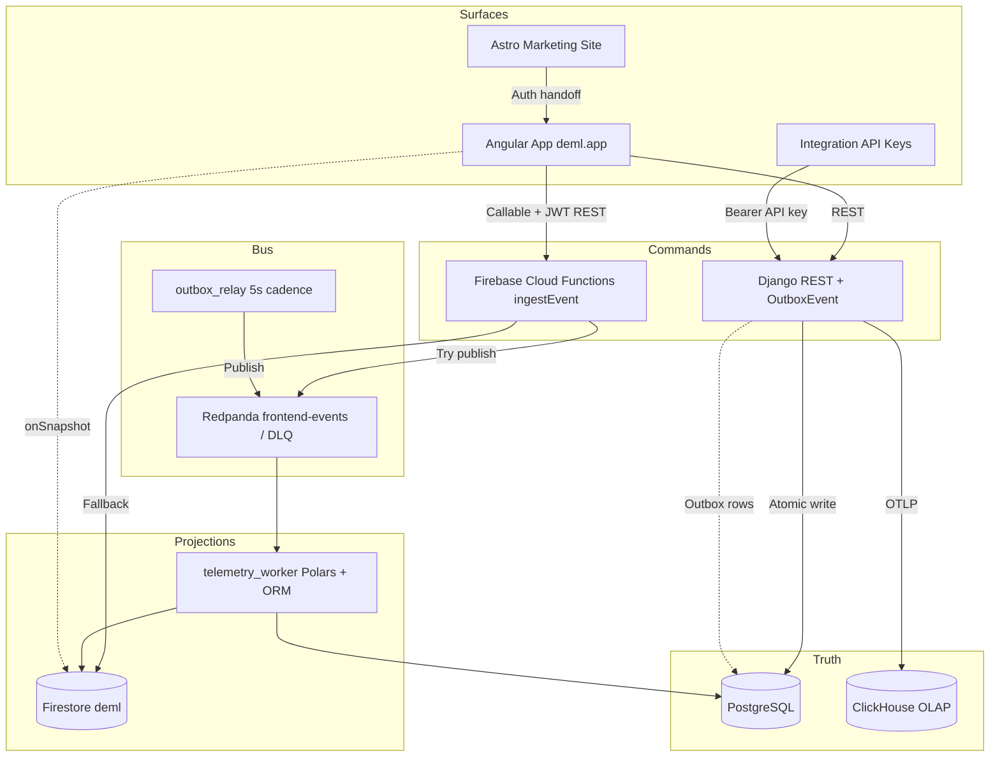
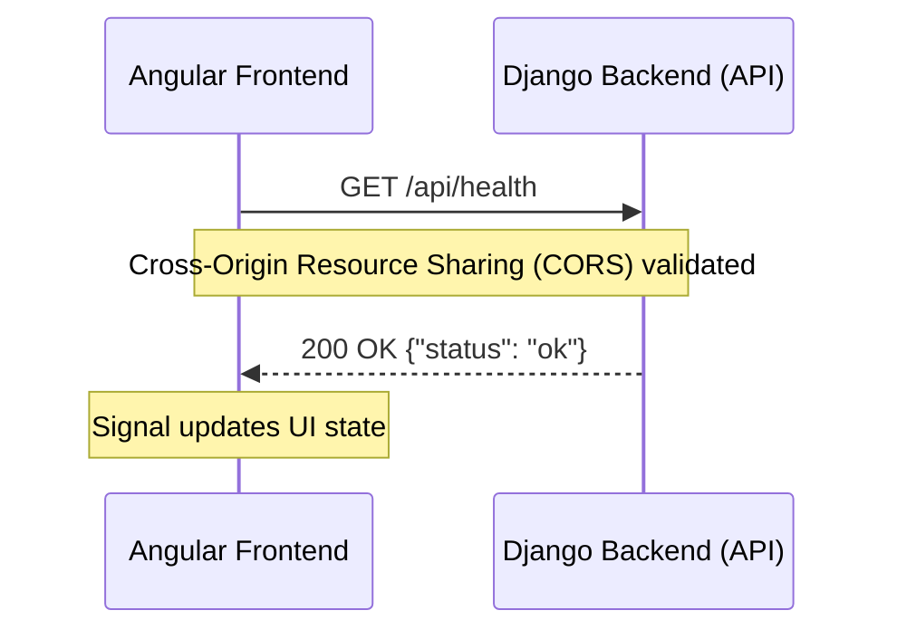
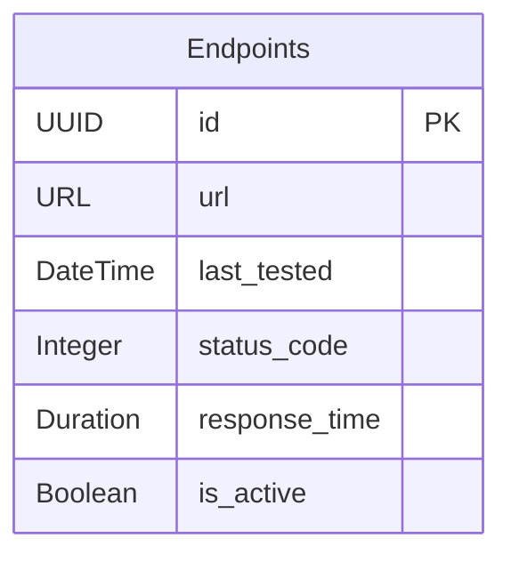

# Data Engineering for Machine Learning: The Book

*Operational Intelligence for the New Digital Battlefield*

The definitive architectural specification and build narrative for production-grade data engineering and machine-learning systems—documented with doctoral rigor and engineered for deployment.

> **Looking for the API Documentation & Developer Portal?**
> If you are looking to integrate with our API, view endpoints, or deploy the platform, please see the **[Developer Portal (README.md)](README.md)**

---

## Introduction

_By Joe Alongi_

This volume constitutes the authoritative build specification for a production-grade, full-stack telemetry and machine-learning platform. It is neither a tutorial nor a marketing narrative—it is an operational record: each chapter delivers comprehensive architectural analysis (minimum 600 words), executable code artifacts, and direct technology references. The prose adheres to the precision expected of enterprise systems engineering and doctoral specification—distinct, rigorous, and unambiguous.

The platform addresses a structural gap in modern infrastructure. Observability tooling remains predominantly reactive; threat analytics remain siloed; multi-tenant isolation remains inconsistently enforced. DEML closes that gap by fusing rigorous data engineering with predictive machine learning under defense-in-depth security—prioritizing quality, symmetry, and precision at every architectural boundary. The build sequence proceeds from bare-metal environment setup through deployed, secure, observable ML-driven operations.

For the platform hypothesis, value proposition, architecture diagrams, and algorithmic foundations, consult the [Whitepaper](WHITEPAPER.md). For production operations—vendor boundaries, actor workflows, maintenance cadence, and degraded-mode behavior—read [Concept of Operations (CONOPS)](#concept-of-operations-conops) or the operator quick reference [`docs/conops.md`](docs/conops.md). For a visual overview, see the companion [Gamma presentation](https://gamma.app/docs/Data-Engineering-for-Machine-Learning-v25eoog2k8kxuvg).

**Architectural posture (2026):** The system emphasizes **Event Projections** with production reliability guarantees. Client commands route through Firebase Cloud Functions (`ingestEvent`, versioned), with Redpanda for event streaming and Firestore (named `deml` database with dedicated security rules) for materialized read models. Django employs a **Transactional Outbox** (`OutboxEvent` + `outbox_relay` command) for reliable publishing. The `telemetry_worker` performs idempotent projections with dead-letter-queue support. Firebase Functions and rules deploy via dedicated GitHub workflow. The end-to-end loop is health-checked automatically by a synthetic probe in the telemetry worker and surfaced as the "Event Projections" component on the `platform-status` sentinel.

## Quick Links

- [Concept of Operations (CONOPS)](#concept-of-operations-conops)
- [Whitepaper](WHITEPAPER.md)
- [Developer Portal & Integrations (README.md)](README.md#official-integrations)
- [Integration Guides (`docs/integrations/`)](docs/integrations/)
- [Operator Reference (`docs/conops.md`)](docs/conops.md)
- [Presentation (Gamma)](https://gamma.app/docs/Data-Engineering-for-Machine-Learning-v25eoog2k8kxuvg) — slide-deck companion to this book
- [Acknowledgements & Technologies](#acknowledgements--technologies)

---

## Concept of Operations (CONOPS)

This section constitutes the **single operational narrative** for the DEML platform: actors, production behavior, technology responsibilities, and degraded-mode contingencies. It reflects the 2026 **Event Projections** architecture (Firebase command gateway, Redpanda broker, Django workers, Firestore read models). The canonical compute target is Google Cloud (Cloud Run services); a cost-optimized alternative deployment topology exists on AWS using Lightsail Container Services, ECR, Fargate (for stateful components), and RDS or Lightsail Databases. Detailed checklists reside in [Appendix C](#appendix-c-cloud-run-deployment), [Appendix E](#appendix-e-aws-deployment), [Appendix D](#appendix-d-maintenance--automation-schedule), and [`docs/conops.md`](docs/conops.md).

### 1. Purpose & Scope

DEML is a multi-tenant observability and machine-learning SaaS engineered for the new digital battlefield. Operators, security engineers, and integrators employ it to ingest telemetry, publish status pages, forecast SLAs, evaluate threat anomalies, and federate STIX 2.1 indicators. This CONOPS specifies:

- Normal steady-state operations across all production services
- User-facing workflows (anonymous visitors, account owners, API integrators)
- Internal data paths (commands, projections, queries, batch ML)
- Deployment boundaries (Cloud Run, Firebase, GCP, Hugging Face)
- Maintenance cadence, monitoring, and degraded-mode behavior

Out of scope: local developer onboarding (see [Chapter 1](#chapter-1-the-fresh-install--environment-setup) and [Appendix E](#appendix-e-contributing-guidelines--getting-started)), and deep algorithmic derivations (see [Whitepaper](WHITEPAPER.md)).

### 2. Mission & Operational Objectives

| Objective | How the platform achieves it |
| -------------------------------- | -------------------------------------------------------------------------------------------------------------------------------------------------------- |
| **Reliable telemetry ingestion** | Non-blocking command path via `ingestEvent` → Redpanda; Django **Transactional Outbox** for API-origin events; idempotent `telemetry_worker` projections |
| **Low-latency dashboards** | Materialized read models in Firestore (`deml` DB); Angular `onSnapshot` on `users/{uid}/data/stats` |
| **Account isolation** | Postgres tenancy by `UserProfile.account_id`; Firestore rules scoped to `request.auth.uid`; symmetrical worker loops per account + `platform` sentinel |
| **Predictive intelligence** | Daily `ml_worker` retraining on anonymized aggregate data; per-account inference without cross-tenant raw leakage |
| **Transparent public status** | `platform-status` dogfoods the stack under real load; customer pages gated by `is_published` ABAC |
| **Audit-ready security** | Firebase Auth + MFA on writes; GCP KMS envelope encryption; immutable GCS audit logs; continuous Semgrep/Trivy/Renovate |

### 3. System Overview

The platform separates **commands** (writes), **projections** (derived state), and **queries** (reads):



**Authoritative stores:** PostgreSQL holds transactional truth (users, status pages, incidents, API keys, outbox). Firestore holds **projected** real-time stats optimized for client subscriptions. ClickHouse holds OLAP traces and CES analytics. Redpanda is the durable command bus—not a system of record.

### 4. Operational Environment

| Layer | Provider | Responsibility |
| -------------------------- | ------------------------------------------------------------------------- | ------------------------------------------------------------------------------------------------------------------------------ |
| **Compute & data plane** | [Cloud Run](https://cloud.google.com/run/) | Django API, Angular SSR, Postgres, Redpanda, ClickHouse, Dragonfly, all background workers, scanner, OTEL collector, Tor proxy |
| **Client command gateway** | [Firebase Cloud Functions](https://firebase.google.com/docs/functions) | `ingestEvent` callable with native Auth context |
| **Identity** | [Firebase Authentication](https://firebase.google.com/products/auth) | Email/OAuth/MFA; JWT verified by Django middleware |
| **Real-time read models** | [Firestore](https://firebase.google.com/docs/firestore) (named DB `deml`) | Projected stats; security rules enforce per-user isolation |
| **Marketing hosting** | [Firebase Hosting](https://firebase.google.com/docs/hosting) | Astro `marketing/dist` at `dataengineeringformachinelearning.com` |
| **Cryptography & audit** | [Google Cloud](https://cloud.google.com/) (Terraform) | KMS envelope keys, immutable audit log bucket, service accounts |
| **Secrets** | [Infisical](https://infisical.com/) (recommended) | Runtime secret injection; SOC 2 / CMMC alignment |
| **Model artifacts** | [Hugging Face Hub](https://huggingface.co/) | Namespaced `.pt` state dict uploads |
| **Content** | [Sanity.io](https://www.sanity.io/) | Incident narratives decoupled from Django |

**Cross-site URL trio** (env-driven everywhere): `FRONTEND_URL` (`https://deml.app`), `BACKEND_URL` (`https://backend.deml.app`), `MARKETING_URL` (`https://dataengineeringformachinelearning.com`).

### 5. Operational Modes

| Mode | Description | Operator actions |
| -------------------------------------------------- | --------------------------------------------------------------------------------------------------------------------------------------- | ----------------------------------------------------------------------------------------------------------------------------- |
| **Normal** | All Cloud Run services healthy; Redpanda reachable from Functions; projections flowing to Firestore | Monitor CES gauges, Sentry, GCP metrics; check the "Event Projections" component on platform-status |
| **Degraded — Redpanda unreachable from Functions** | `ingestEvent` writes fallback rows to Firestore `events` collection; `telemetry_worker` still processes broker when internal path works | Confirm `REDPANDA_BROKERS` uses public endpoint for Functions or accept Firestore fallback; check `frontend-events-dlq` depth |
| **Degraded — Worker stalled** | Firestore projections stale; Postgres/outbox may accumulate | Restart `deml-telemetry-worker` and `deml-relay`; inspect DLQ topic; replay idempotent keys |
| **Maintenance** | Migrations, dependency upgrades, model retraining | Cloud Run rolling deploy on `main` merge; Firebase workflow deploys Functions/rules independently |
| **Incident / public comms** | Outage or degradation visible to users | Publish via Sanity; `platform-status` remains world-readable; unpublished customer pages stay private |

### 6. User Roles & Operational Workflows

The platform uses a **User + Sites** model—one Firebase login, many `StatusPage` records, no org hierarchies ([Chapter 28](#chapter-28-access-control-matrix-role-based-rbac--attribute-based-abac-paradigms)).

| Actor | Primary workflows |
| ------------------------------ | ------------------------------------------------------------------------------------------------------------------------------------------- |
| **Anonymous visitor** | Browse published status pages and `platform-status`; `/explore` directory; no PII beyond CDN logs |
| **Account owner (`Operator`)** | Firebase login → Django profile provisioned; create status pages (MFA required); configure integrations; run Event Projections verification |
| **Viewer** | Read-only Settings and dashboards; API returns `403` on mutations |
| **Security Admin** | Platform bootstrap account; same write surface as Operator for owned resources |
| **API integrator** | `Authorization: Bearer <API_KEY>` on `/api/v1/ingest` and `/api/v1/predict`; scoped to `account_id` |
| **Platform operator (you)** | GCP dashboard, Firebase console, GCP KMS/logs, GitHub Actions, Infisical, internal vulnerability Kanban |

**Typical owner session:** Marketing site → auth handoff → Angular dashboard → client events fire `ingestEvent` → stats appear via Firestore subscription → REST calls for configuration and ML endpoints.

**Typical integration session:** External pipeline POSTs batched telemetry to `/api/v1/ingest` → Django writes business state + `OutboxEvent` atomically → `outbox_relay` publishes → worker projects enriched aggregates.

### 7. Command, Control & Data Flows

**Client command path (primary):**

1. Angular calls Firebase callable `ingestEvent` with `version: "1.0"` and generated `idempotency_key`.
2. Function validates `context.auth`; partitions Kafka messages by `uid`.
3. On broker success: message lands on `frontend-events`; function returns `accepted` immediately.
4. On broker failure: fallback document written to Firestore `events` (clients cannot read this collection per rules).
5. `telemetry_worker` consumes, deduplicates via stable keys, enriches from Postgres, writes `users/{uid}/data/stats`.
6. Angular `FirestoreService.getRealtimeStats()` streams updates via `onSnapshot`.

**Django command path (integrations & legacy):**

1. Authenticated REST handler mutates Postgres inside a transaction.
2. `OutboxEvent` row inserted in the same transaction.
3. `outbox_relay` (every 5s) publishes to Redpanda; same worker pipeline applies.

**Query path:** Clients never poll Postgres for live stats; they subscribe to Firestore projections. Historical analytics and CES use ClickHouse via backend APIs.

### 8. Deployment Topology & Service Matrix

Production runs on **Google Cloud Run** as the canonical target (see [Chapter 22](#chapter-22-production-deployment-on-cloudrun)). A fully supported, lower-cost, and simpler-to-operate alternative exists using **AWS Lightsail Container Services** (for the application layer) plus targeted Fargate tasks or Lightsail instances (for Redpanda, ClickHouse, and Dragonfly) with ECR for images (see [Chapter 23: Production Deployment on AWS](#chapter-23-production-deployment-on-aws-lightsail-container-services-and-fargate)). Both topologies preserve identical container images, the Event Projections loop, Outbox reliability, symmetrical multi-tenant workers, and the Firebase command / Firestore projection paths. Core operational paths:

| Service | Operational role |
| ----------------------------------- | --------------------------------------------------------------- |
| `deml-frontend` | Angular app, widgets, public status UI |
| `deml-backend` | Django REST, auth middleware, billing, outbox writers |
| `deml-postgres` | System of record (supports Neon serverless PostgreSQL) |
| `deml-queue` | Redpanda (`deml-queue.internal:9092` for inter-service traffic) |
| `deml-telemetry-worker` | Projection engine + pingers + analytics rollups |
| `deml-relay` | Reliable outbox publisher |
| `deml-workers` | Consolidated ML training, threat intel, and cron task consumers |
| `deml-clickhouse` | OLAP analytics and historical telemetry storage |
| `deml-dragonfly` | Rate limiting and hot caches |
| `deml-scanner` + `deml-cpe-guesser` | Vulnerability ledger enrichment |
| `deml-tor-proxy` | OSINT dark-web routing |

**Firebase deploy path (separate from Cloud Run):** `.github/workflows/firebase-backend-deploy.yml` ships Cloud Functions + Firestore rules; `firebase-hosting-*.yml` ships marketing. **Never** point Cloud Run services at Public broker URLs for internal traffic—use `*.internal` ([Appendix C](#appendix-c-cloud-run-deployment)).

### 9. Security Operations

- **Perimeter:** Firebase App Check + reCAPTCHA; TLS 1.3 everywhere; strict CSP on marketing ([`firebase.json`](firebase.json)).
- **Authentication:** JWT verification in `FirebaseAuthenticationMiddleware`; MFA enforced on writes via `amr` claim.
- **Authorization:** RBAC (`Viewer` / `Operator` / `Security Admin`) + ABAC (`is_published`, ownership, `platform-status` immutability).
- **Data protection:** AES-256-GCM field encryption; DEK rotation every 30 days; GCP KMS envelope ([Chapter 10](#chapter-10-encrypting-the-data--key-management)).
- **Supply chain:** Pre-commit + GitHub Actions (Semgrep, Trivy, Gitleaks, Renovate); internal Kanban for vulns ([Chapter 21](#chapter-21-team-workflows-and-vulnerability-management)).
- **Compliance posture:** Architected for SOC 2 Type II, CMMC 2.0 Level 2, NIST SP 800-171 Rev. 3 ([Chapter 23](#chapter-23-enterprise-security-soc-2-cmmc-20-and-nist-sp-800-171-rev-3)).

### 10. Threat-Driven Design and Defendable Architecture Principles

> [!IMPORTANT]
> **Foundational Frameworks — Key References**
>
> DEML's security architecture is guided by two white papers:
>
> 1. **A Threat-Driven Approach to Cyber Security** (Muckin & Fitch, 2019) — prioritizes adversary objectives over compliance-only checklists; introduces the **IDDIL/ATC** workflow, **STRIDE-LM** categorization, and the functional control hierarchy applied in this section.
> 2. **Defendable Architectures** (Fitch & Muckin, 2019) — defines build-time requirements for **Visibility**, **Manageability**, and **Survivability** that map to Event Projections telemetry, automated worker cadence, and Outbox/DLQ degraded modes.
>
> Together, the pair links _what adversaries are doing_ (threat analysis) with _how systems must be engineered_ (defensible characteristics)—the right fit for a multi-tenant detection platform where ingest paths, model endpoints, and tenant boundaries are active attack surfaces. Full bibliographic citations: [Appendix L](#appendix-l-foundational-security-frameworks).

Modern data and ML platforms are not passive repositories—they are **detection and response surfaces**. Adversaries target telemetry pipelines, model endpoints, and tenant boundaries because those paths carry high-value signals and privileged access. A compliance-first checklist or a vulnerability-first patch queue alone cannot keep pace with that reality. _A Threat-Driven Approach to Cyber Security_ (Muckin & Fitch, 2019) argues that defenders must **prioritize threats over compliance artifacts or isolated CVEs**: identify what adversaries are trying to achieve, then engineer controls that interrupt those objectives. The companion framework _Defendable Architectures_ (Fitch & Muckin, 2019) translates that mindset into build-time requirements—systems must be explicitly designed for **Visibility**, **Manageability**, and **Survivability** so operators can execute **Intelligence Driven Defense** at scale. DEML adopts both frameworks as operational doctrine, not slide-deck vocabulary: every production path in this CONOPS is shaped to make adversary behavior observable, operator response fast, and degraded operation survivable.

#### Visibility

Visibility means the platform exposes enough trustworthy signal—across commands, projections, queries, and batch ML—to detect misuse, misconfiguration, and attack progression without guessing. DEML achieves this through layered telemetry rather than a single dashboard.

The **Event Projections** loop is the primary visibility spine: client commands (`ingestEvent`, Django Outbox → `outbox_relay`) land on Redpanda; `telemetry_worker` enriches from Postgres and materializes Firestore read models while emitting OpenTelemetry traces to ClickHouse. Operators do not infer pipeline health from user complaints—the **Event Projections** synthetic probe on `platform-status` continuously validates end-to-end flow. Network traffic enrichment ([Chapter 20](#chapter-20-network-traffic-enrichment-and-cybersecurity-telemetry)) adds ASN, GeoIP, UA parsing, and behavioral context at the edge. Threat feeds ingested hourly by `security_worker` ([Chapter 13](#chapter-13-enhancing-data-with-threat-intelligence)) fuse external IoCs with internal telemetry before the `ThreatModel` scores access risk. The **CES dashboard** ([Chapter 25](#chapter-25-countermeasure-effectiveness-standard-ces)) distills Threat Level, SLA Level, and Stableness into a single operational gauge. Sentry, GCP Logging, and immutable GCS audit logs complete the picture for release regressions and compliance evidence. Visibility is incomplete if it is tenant-blind: symmetrical worker loops and strict `account_id` / Firestore rule scoping ensure every signal is attributable.

#### Manageability

Manageability means operators can change posture, deploy fixes, rotate secrets, and tune models **without architectural surgery**—controls are centralized, automated, and repeatable across tenants including Tenant0 dogfood.

Automation is the manageability engine. **`outbox_relay`** (5s cadence) and **`telemetry_worker`** run continuously; **`ml_worker`** and **`security_worker`** consume Kafka tasks on schedule—retraining SLA/threat models daily and refreshing AbuseIPDB / OTX feeds hourly ([Chapter 24](#chapter-24-automation-and-maintenance-schedules)). Pre-commit hooks, Semgrep, Trivy, Renovate, and the internal vulnerability Kanban ([Chapter 21](#chapter-21-team-workflows-and-vulnerability-management)) turn supply-chain findings into tracked remediation without manual triage drift. RBAC + ABAC ([Chapter 28](#chapter-28-access-control-matrix-role-based-rbac--attribute-based-abac-paradigms)) and GCP KMS envelope rotation ([Chapter 10](#chapter-10-encrypting-the-data--key-management)) are managed through documented APIs and workers—not ad hoc SQL. CI/CD splits Cloud Run and Firebase deploy paths so Functions, rules, and backend services ship independently ([§14](#14-cicd--release-operations)). Integration health endpoints (`/api/v1/integrations/{platform}`) and the service matrix in [§8](#8-deployment-topology--service-matrix) give operators a single map of what to restart, scale, or roll back. Manageability fails when tenants are exceptions; DEML's symmetrical pipelines guarantee that a control applied to one account applies to all.

#### Survivability

Survivability means the platform **continues its mission under stress**—broker outages, worker stalls, crypto failures, or active attack—without silent data loss or unbounded blast radius.

DEML engineers survivability into the command path itself. When Redpanda is unreachable from Firebase Functions, **`ingestEvent` falls back to Firestore `events`** while internal services continue consuming via the private broker ([§5](#5-operational-modes)). The **Transactional Outbox** ensures API-origin events are never published without a durable Postgres record. **`telemetry_worker` idempotency keys** and the **`frontend-events-dlq`** topic prevent poison messages from stalling the entire projection fleet—operators replay with stable keys after fixing enrichment logic ([§13](#13-contingency--degraded-operations)). Multi-tenant isolation (Postgres `account_id`, Firestore security rules, Hugging Face namespaced model artifacts) contains compromise: one tenant's incident does not become another's data leak. Sanity-backed status communications ([Chapter 14](#chapter-14-scaling-reporting-and-announcements-with-sanity)) survive primary backend outages. Daily **`ml_worker` retraining loops** keep threat and SLA models current even as attack patterns shift. Survivability is not "always up"; it is **graceful degradation with recoverable state** and explicit operator runbooks in [`docs/conops.md`](docs/conops.md).

**Virtuous Knowledge Cycle.** Threat-driven design is not a one-time architecture review—it is a closed loop. **Design** phases prioritize adversary objectives and map them to Visibility / Manageability / Survivability controls. **Build** phases encode those controls in Event Projections, workers, encryption, and access matrices. **Run** phases generate telemetry, CES scores, DLQ depth, and threat-intel matches that validate—or falsify—design assumptions. **Defend** phases feed incident outcomes, new IoCs, and model false-positive rates back into the next design iteration. Each lap tightens detection fidelity, reduces operator toil, and hardens degraded-mode behavior. The platform dogfoods this cycle on Tenant0 (`platform-status`) before any control reaches customer tenants.

#### Applying the IDDIL/ATC Threat Analysis Methodology

_A Threat-Driven Approach to Cyber Security_ (Muckin & Fitch, 2019) provides a repeatable threat-analysis workflow that complements the Visibility / Manageability / Survivability principles above. The methodology splits work into two phases: **IDDIL** (discovery) and **ATC** (implementation). A mnemonic anchors the sequence: **"There are no idle threats — they attack."** Idle threats are not hypothetical backlog items—they are adversary objectives that will be exercised against your pipeline unless you discover them, prioritize them, and implement controls that interrupt them. For data-engineering and ML detection platforms, that means treating every ingest path, model endpoint, and tenant boundary as an active attack surface, not a future hardening ticket.

Use IDDIL/ATC whenever you onboard a new integration, stand up a customer detection pipeline, or reassess an existing worker after an incident. The steps below are written so a reader can run the same playbook on their own stack; each includes a **DEML example** (how Tenant0 dogfoods the step) and a **pipeline-builder example** (how a typical customer threat-models a detection workflow on top of the platform).

##### Discovery Phase (IDDIL)

**Identify the Assets.** Catalog business assets (data and functionality required for mission success) separately from security assets (what adversaries covet). Business assets for DEML include tenant-scoped telemetry, trained `ThreatModel` weights, and Firestore projection read models that power live dashboards. Security assets include integration API keys (encrypted at rest), Postgres `OutboxEvent` rows, and Hugging Face model artifacts namespaced by tenant hash. _DEML example:_ During CONOPS reviews, operators maintain an asset register tied to [§8](#8-deployment-topology--service-matrix)—each Cloud Run service, broker topic, and Firestore collection is tagged with owner, retention, and classification. _Pipeline-builder example:_ A customer ingesting batch features via `/api/v1/ingest` should list (1) their source datasets, (2) derived aggregates consumed by downstream ML jobs, and (3) attacker targets such as spoofed ingest payloads or exfiltration of enriched threat scores from `/api/v1/predict`.

**Define the Attack Surface.** Map every component that touches, transports, or exposes the assets identified above. Produce a data-flow diagram (DFD) or equivalent showing trust boundaries. _DEML example:_ The CONOPS command path in [§7](#7-command-control--data-flows) is the canonical attack-surface diagram—Angular → Firebase `ingestEvent` → Redpanda `frontend-events` → `telemetry_worker` → Firestore `users/{uid}/data/stats`, plus the parallel Django REST → Outbox → `outbox_relay` path for integrations. Trust boundaries sit at Firebase Auth, Postgres transaction commits, and Firestore security rules. _Pipeline-builder example:_ Draw boundaries between the customer's ETL cluster, DEML's `/api/v1/ingest` endpoint, and their internal model-serving tier. Mark where credentials cross networks and where unauthenticated read paths exist.

**Decompose the System.** Break the attack surface into layers: protocols, APIs, libraries, workers, and security functions (inventory, collect, detect, protect, manage, respond). Note existing controls and their effectiveness ratings. _DEML example:_ Decomposition follows the Event Projections stack—`ingestEvent` callable (collect), `NetworkTelemetryMiddleware` + edge enrichment (detect), AES-256-GCM + KMS envelope (protect), `security_worker` hourly IoC refresh (manage), and DLQ replay runbooks (respond). Each layer links to a chapter: enrichment in [Chapter 20](#chapter-20-network-traffic-enrichment-and-cybersecurity-telemetry), intel fusion in [Chapter 13](#chapter-13-enhancing-data-with-threat-intelligence). _Pipeline-builder example:_ Decompose a Spark → DEML ingest job into (a) credential storage, (b) batch serialization format, (c) retry/idempotency behavior, and (d) the customer's own anomaly-scoring model—identifying which layer owns validation vs. detection.

**Identify Attack Vectors.** Document paths an adversary could traverse to reach target assets, including multiple techniques per pathway. Categorize threats using [STRIDE-LM](#stride-lm-threat-categorization) and incorporate current threat intelligence. _DEML example:_ Enumerated vectors include JWT forgery against Django REST (Spoofing), cross-tenant IDOR via predictable IDs (Information Disclosure, mitigated by UUID PKs), broker poisoning on `frontend-events` (Tampering), model inversion against `/api/v1/predict` (Information Disclosure), and credential stuffing against Firebase Auth (Spoofing). Attack trees for the ingest path note that a compromised integration key allows arbitrary event injection until ABAC and rate limits (`deml-dragonfly`) throttle the source; a foothold in one tenant's projection worker must not become Lateral Movement into another tenant's Firestore read models. _Pipeline-builder example:_ A customer's detection pipeline faces vectors such as training-data poisoning (Tampering), label-flip attacks on feedback loops (Tampering), and replay of captured ingest payloads (Repudiation)—each mapped to a specific hop in their DFD and tagged with a STRIDE-LM category.

##### STRIDE-LM Threat Categorization

Microsoft's original **STRIDE** model (Spoofing, Tampering, Repudiation, Information Disclosure, Denial of Service, Elevation of Privilege) remains one of the most practical ways to label threats during design reviews. _A Threat-Driven Approach to Cyber Security_ (Muckin & Fitch, 2019) extends STRIDE with **Lateral Movement (LM)**—the adversary technique of pivoting from an initial foothold to adjacent systems, accounts, or data domains. For multi-tenant event platforms, LM is not a footnote: a single compromised ingest key, worker credential, or mis-scoped projection path can turn a localized incident into cross-tenant data exposure unless containment is engineered at every trust boundary. STRIDE-LM gives operators and pipeline builders a shared vocabulary to classify vectors discovered in IDDIL, prioritize controls in ATC, and trace threat-intelligence matches ([Chapter 13](#chapter-13-enhancing-data-with-threat-intelligence)) back to concrete design decisions.

| STRIDE-LM category | Definition | DEML controls & design decisions |
| ------------------------------ | -------------------------------------------------------------------------------- | ----------------------------------------------------------------------------------------------------------------------------------------------------------------------------------------------------------------------------------------------------------------------------------------------------------------------------------------------------------------------------------------------------------------------------------------------------------------------------------------------------------------------------------------------------------------------------- |
| **S** — Spoofing | Pretending to be a user, service, tenant, or event source. | Firebase Auth JWT verification in `FirebaseAuthenticationMiddleware`; WebAuthn hardware-key MFA on writes; Firebase App Check + reCAPTCHA Enterprise; integration API keys bound to tenant scope; `ingestEvent` idempotency keys reject duplicate command replay. |
| **T** — Tampering | Modifying data in transit, at rest, or in the event pipeline. | Transactional Outbox (`OutboxEvent` written atomically with domain state); `telemetry_worker` idempotency keys; AES-256-GCM field encryption with GCP KMS envelope rotation; versioned event schemas; `platform-status` immutability via ABAC. |
| **R** — Repudiation | Denying that an action occurred or obscuring attribution. | Immutable Google Cloud Logging SIEM trail; GCS audit log retention; Postgres `OutboxEvent` and `ThreatReport` records with tenant `account_id`; OpenTelemetry traces in ClickHouse correlating ingest → enrichment → projection hops. |
| **I** — Information Disclosure | Exposing data or metadata to unauthorized parties. | UUID primary keys (anti-IDOR); RBAC + ABAC ([Chapter 28](#chapter-28-access-control-matrix-role-based-rbac--attribute-based-abac-paradigms)); Firestore security rules scoped to `users/{uid}`; Hugging Face model artifacts namespaced by hashed tenant slug; encrypted integration tokens at rest ([Chapter 10](#chapter-10-encrypting-the-data--key-management)). |
| **D** — Denial of Service | Degrading or blocking availability of services or projections. | Dragonfly sliding-window rate limits; `frontend-events-dlq` isolates poison messages from the projection fleet; distroless containers reduce exploit surface; Sanity CDN–backed status communications survive backend outages ([Chapter 14](#chapter-14-scaling-reporting-and-announcements-with-sanity)); synthetic Event Projections probe alerts on pipeline stall. |
| **E** — Elevation of Privilege | Gaining capabilities beyond authorized role or tenant scope. | Three-tier RBAC (`Viewer` / `Operator` / `Security Admin`); ABAC ownership and `is_published` gates; unprivileged Cloud Run service accounts; Infisical runtime secret injection (no keys on disk); Semgrep/Trivy supply-chain gates in CI. |
| **LM** — Lateral Movement | Pivoting from one compromised asset to others within or across trust boundaries. | **Primary containment layer:** strict multi-tenant isolation—Postgres `account_id` on every transactional row, symmetrical worker loops that never hardcode Tenant0 exceptions, Firestore rule scoping per `uid`, private Redpanda networking between Cloud Run services, no cross-tenant foreign keys in worker payloads (Tenant0 UUID normalization replaces legacy `"platform"` literals). Compromise in one tenant's ingest path cannot traverse to another tenant's projections, model weights, or integration keys without a separate, auditable authorization failure. |

High-throughput event platforms amplify both the value and the risk of security telemetry: every command, projection, and ML inference generates evidence adversaries want to steal or poison, and every worker hop is a potential pivot point. STRIDE-LM is especially useful here because it forces teams to ask two questions on every new feature: _what category of harm does this enable?_ and _where could an attacker move next if this control fails?_ Tagging Redpanda topics, worker credentials, and Firestore collections with STRIDE-LM labels during design reviews prevents "detect-only" blind spots—teams discover early when they have strong Spoofing and Tampering controls but weak Lateral Movement containment, which is the failure mode most dangerous in SaaS pipelines. For operators, the same taxonomy turns hourly IoC refreshes and CES Threat Level spikes into actionable triage: an OTX match on a scraping ASN maps cleanly to Denial of Service and Spoofing; a DLQ depth anomaly maps to Tampering or survivability debt; a cross-tenant access attempt in audit logs maps directly to Information Disclosure and Lateral Movement and triggers the highest-severity runbook.

**List Threat Actors and Objectives.** Name adversary classes, their motivation, skill, resources, and goals against your assets. Feed current intel (feeds, ISAC reports, internal incidents) into this step. _DEML example:_ Actor classes include automated scrapers (availability abuse on public `platform-status`), credential-stuffing botnets (account takeover), insider operators with `Operator` RBAC (data exfiltration via export APIs), and APT-style actors targeting ML model weights on Hugging Face. Objectives are tied to kill-chain stages—reconnaissance on `/api/v1/integrations/{platform}` health endpoints, delivery via forged ingest events, action on objectives via cross-tenant projection reads. _Pipeline-builder example:_ A fraud-analytics team lists actors (insider analysts, compromised service accounts, supply-chain partners with ingest access) and states objectives (skew detection thresholds, hide fraudulent transactions in feature noise).

##### Implementation Phase (ATC)

**Analysis & Assessment.** For each discovered vector, determine root cause, successful-compromise impact, and worst-case scenarios. Employ threat models, attack trees, or Cyber Kill Chain mapping as artifacts; revisit discovery assumptions when new intel arrives. _DEML example:_ When DLQ depth spikes on `frontend-events-dlq`, analysts trace enrichment failures to malformed payloads, assess impact (stalled projections → stale CES gauges), and model worst case (silent loss of threat-intel correlation if worker OOM persists). The `ThreatModel` binary classifier is assessed against false-negative cost (malicious IP admitted) vs. false-positive cost (legitimate integration throttled). _Pipeline-builder example:_ A customer assesses whether a poisoned ingest batch could shift their PyTorch MLP decision boundary enough to miss fraud clusters, and documents the blast radius if `/api/v1/predict` returns attacker-controlled scores to an automated blocklist.

**Triage.** Prioritize findings by business/mission impact and threat intelligence—not by CVE count alone. Impact outweighs raw probability at this stage; active intel feeds the probability variable later in risk management. Express results in both business and technical terms. _DEML example:_ Triage ranks (1) cross-tenant data leakage via mis-scoped Firestore rules as catastrophic, (2) integration key compromise with ingest write access as high, (3) single-tenant DLQ replay backlog as medium operational debt. Semgrep and Trivy findings enter the internal vulnerability Kanban ([Chapter 21](#chapter-21-team-workflows-and-vulnerability-management)) only after threat-context triage—not every CVE is an immediate patch. _Pipeline-builder example:_ A pipeline owner triages training-data poisoning above TLS misconfiguration if their model directly gates financial holds; they document the business impact ("false approvals") alongside the technical fix ("schema validation + outlier quarantine before ingest").

**Controls.** Select, implement, and validate controls that remove, counter, or mitigate prioritized threats. Controls exhibit functions—inventory, collect, detect, protect, manage, respond—and must trace back to specific attack vectors, not generic compliance checklists. Measure effectiveness and identify coverage gaps. _DEML example:_ Controls mapped to ingest injection include Firebase App Check + MFA on writes (protect), UUID PKs + ABAC (protect), transactional Outbox + idempotency keys (detect/manage), `ThreatModel` inference at the edge (detect/respond), and DLQ replay with stable keys (respond). CES ([Chapter 25](#chapter-25-countermeasure-effectiveness-standard-ces)) scores how well these controls perform in production on Tenant0 before customer rollout. _Pipeline-builder example:_ A customer implements schema contracts and row-level checksums on batches before POSTing to `/api/v1/ingest`, enables DEML rate limits, stores API keys in a vault with rotation, and adds a human review queue when `ThreatModel` scores exceed a tenant-defined threshold.

##### Platform Practice Mapping

The table below shows where DEML's current production practices align with IDDIL/ATC. Use it as a checklist when threat-modeling your own pipeline—the left column is the methodology step; the right column is where to look in this codebase or CONOPS.

| IDDIL/ATC step | DEML practice (reference) |
| ------------------------------- | ------------------------------------------------------------------------------------------------------------------------------------------------------------------------------------------------------------------------------------------------------------------ |
| **I** — Identify assets | Tenant-scoped Postgres models, Firestore `users/{uid}/data/*`, encrypted integration tokens ([Chapter 10](#chapter-10-encrypting-the-data--key-management)), HF namespaced model artifacts |
| **D** — Define attack surface | CONOPS [§7](#7-command-control--data-flows) command/query paths; `/api/v1/ingest`, `/api/v1/predict`, Firebase `ingestEvent` |
| **D** — Decompose system | Service matrix [§8](#8-deployment-topology--service-matrix); Event Projections loop (Outbox → relay → worker → Firestore) |
| **I** — Identify attack vectors | STRIDE-LM categorization ([§10](#stride-lm-threat-categorization)); UUID PK anti-IDOR, broker/DLQ failure modes [§13](#13-contingency--degraded-operations), network enrichment ([Chapter 20](#chapter-20-network-traffic-enrichment-and-cybersecurity-telemetry)) |
| **L** — List threat actors | `security_worker` IoC feeds (AbuseIPDB, OTX), HIBP/Tor OSINT ([Chapter 13](#chapter-13-enhancing-data-with-threat-intelligence)), behavioral biometrics |
| **A** — Analysis & assessment | `ThreatModel` PyTorch classifier, Cyber Kill Chain–aligned CES metrics ([Chapter 25](#chapter-25-countermeasure-effectiveness-standard-ces)), synthetic Event Projections probe |
| **T** — Triage | Vulnerability Kanban ([Chapter 21](#chapter-21-team-workflows-and-vulnerability-management)), impact-weighted incident response, DLQ depth alerting |
| **C** — Controls | RBAC/ABAC ([Chapter 28](#chapter-28-access-control-matrix-role-based-rbac--attribute-based-abac-paradigms)), KMS rotation, App Check, rate limits, Outbox idempotency, Firestore rule scoping |

**Actionable workflow for pipeline builders.** Run IDDIL before your first production ingest: (1) list assets and draw a DFD with trust boundaries, (2) decompose your ETL → DEML → model-serving stack, (3) enumerate vectors and actors against that diagram, (4) analyze impact and triage by business consequence, (5) implement controls that map to specific vectors—not a generic security bundle—and (6) loop back when `security_worker` intel, DLQ telemetry, or model drift falsifies your assumptions. Threat-driven design is continuous; the mnemonic exists because unaddressed threats do not remain idle—they become the next incident in your detection pipeline.

These principles are operational scaffolding, not abstract theory. [Chapter 7](#chapter-7-securing-the-compute) and [Chapter 23](#chapter-23-enterprise-security-soc-2-cmmc-20-and-nist-sp-800-171-rev-3) apply them to compute hardening and enterprise compliance evidence; [STRIDE-LM](#stride-lm-threat-categorization) provides the threat taxonomy; [Chapter 13](#chapter-13-enhancing-data-with-threat-intelligence) details the threat-intelligence fusion pipeline; [Chapter 20](#chapter-20-network-traffic-enrichment-and-cybersecurity-telemetry) covers edge enrichment; and [Chapter 25](#chapter-25-countermeasure-effectiveness-standard-ces) formalizes how countermeasure effectiveness is measured and displayed.

### 11. Observability & Health Monitoring

| Signal | Source | Operator use |
| ------------------------ | -------------------------------------- | ------------------------------------------------------------------------------------------------------ |
| **Real-time user stats** | Firestore projections | "Event Projections" component on platform-status (automated synthetic probe) |
| **CES dashboard** | ClickHouse + backend aggregates | Threat / SLA / Stableness gauges ([Chapter 25](#chapter-25-countermeasure-effectiveness-standard-ces)) |
| **Traces** | OpenTelemetry → Collector → ClickHouse | Latency regressions, worker stalls |
| **Errors** | Sentry (frontend + backend) | Release regressions |
| **Synthetic uptime** | `telemetry_worker` pingers (30s) | Status page accuracy |
| **Infrastructure** | GCP metrics, GCP Logging | Capacity, audit trail |

### 12. Maintenance & Automation Cadence

All schedules are canonical in [Appendix D](#appendix-d-maintenance--automation-schedule). Summary:

- **Every 5s:** `outbox_relay` publishes pending events.
- **Continuous:** `telemetry_worker`, `ml_worker` Kafka consumers.
- **Hourly:** Threat intel fetch (`security_worker`).
- **Daily:** ML retraining, `db_cleanup` (30-day raw retention), Stripe `sync_subscriptions`, DEK rotation checks.
- **Weekly / Monthly / Quarterly:** Renovate, Semgrep, deep audits via GitHub Actions.

### 13. Contingency & Degraded Operations

| Failure | System behavior | Recovery |
| -------------------------------- | ----------------------------------------------------------------------- | ------------------------------------------------------------------- |
| Redpanda unavailable (Functions) | Firestore fallback writes; worker may still consume via internal broker | Restore broker; drain DLQ; verify projections catch up idempotently |
| `outbox_relay` stopped | Events accumulate in Postgres outbox | Restart relay; backlog publishes in order |
| Firestore rules mis-deployed | Client reads/writes rejected | Re-run `firebase-backend-deploy.yml` |
| Worker OOM on Polars batch | Messages route to `frontend-events-dlq` | Fix payload/enrichment; replay with stable keys |
| Postgres outage | REST mutations fail; cached projections may stale | Cloud SQL restore from volume snapshot; run migrations |
| KMS unreachable | Cannot decrypt integration tokens | Restore GCP credentials; verify `telemetry-app-sa` IAM |

### 14. CI/CD & Release Operations

1. Feature branch → pre-commit (Ruff, ESLint, Axe) → PR.
2. Merge to `main` → Cloud Build webhook builds affected services (watch paths per service).
3. Same merge → Firebase workflows deploy Functions/rules/hosting when paths match.
4. `scripts/sync_content.py` propagates BOOK/README to frontend and marketing assets.
5. `purge-cloudflare-cache.yml` invalidates CDN after deploy.

Semantic versioning and release notes: `scripts/git_flow.py` ([Chapter 16](#chapter-16-developer-workflow-and-version-management)).

### 15. Documentation Map

| Document | Audience | Content |
| ---------------------------------------------------------- | ------------------------ | ----------------------------------- |
| **This CONOPS** | Operators, architects | End-to-end operational narrative |
| [`docs/conops.md`](docs/conops.md) | On-call engineers | Checklists, modes, quick reference |
| [WHITEPAPER.md](WHITEPAPER.md) §2 | Executives, reviewers | Concise CONOPS + hypothesis |
| [README.md](README.md) | Integrators | API gateway, architecture diagram |
| [Appendix C](#appendix-c-cloud-run-deployment) | DevOps | Per-service Cloud Run variables |
| [Appendix D](#appendix-d-maintenance--automation-schedule) | SRE | Schedules and retention |
| [AGENTS.md](AGENTS.md) | AI agents / contributors | Coding principles aligned to CONOPS |

---

## Chapter 1: The Fresh Install & Environment Setup

Establishing a rock-solid foundation is arguably the most critical step in this journey. When embarking on a complex software engineering path, I’ve found that the development environment must be meticulously configured to eliminate friction. For developers like me operating within the Apple ecosystem, leveraging native package management tools is an absolute necessity. [Homebrew](https://brew.sh/) serves as the cornerstone here, providing a robust mechanism for system-level dependencies.

The transition to Apple Silicon architectures introduced incredible performance gains, but it also necessitates careful attention to compatibility. Installing Rosetta 2 ensures that any legacy binaries execute seamlessly. I treat the development environment as an immutable infrastructure layer; it’s the edge that builds standout stability and thriving projects. A pristine, well-documented installation process sets the tone for enduring excellence, preventing the dreaded "it works on my machine" syndrome and fostering a culture of reproducible builds.

```bash
# Install Homebrew
/bin/bash -c "$(curl -fsSL https://raw.githubusercontent.com/Homebrew/install/HEAD/install.sh)"

# For Apple Silicon Macs, install Rosetta 2
softwareupdate --install-rosetta
```

### Frontend Architecture and Tooling

With the system-level prerequisites satisfied, my focus shifted to architecting the frontend. Modern web development demands a structured, opinionated framework. Having spent a decade immersed in React, I recently found myself drawn to cultures prioritizing quality and structure, like [Angular](https://angular.dev/). It resonated profoundly with my goals for this platform.

The initialization process begins with [Node.js](https://nodejs.org/) and the Angular CLI. But a raw framework isn't enough for the mastery we're aiming for. Integrating [ESLint](https://eslint.org/) and [Prettier](https://prettier.io/) guarantees a consistent, uniform code style. This automated enforcement eliminates trivial debates, allowing me to focus entirely on architectural logic. Furthermore, to prepare the frontend for deployment, I containerize the application early using [Docker](https://www.docker.com/) and [NGINX](https://nginx.org/), mirroring production to drastically reduce integration risks.

```bash
# Install Node and Angular CLI
brew install node
npm install -g @angular/cli

# Scaffold the Angular frontend
ng new frontend
cd frontend
npm start

# Run formatting and linting
npm run lint
npx prettier --write .

# Build and test containerized production image locally
docker build -t frontend-app .
docker run -p 8080:8080 frontend-app
```

### Backend Foundation and Orchestration

Parallel to the frontend construction, my backend architecture required a similarly rigorous setup to handle the complexities of machine learning integration. Python, with its unparalleled ecosystem for data science and AI, was the natural choice. Having previously built robust service offerings with Python/Flask, I selected [Django](https://www.djangoproject.com/) to provide the robust web framework necessary to structure this application.

To circumvent the historical challenges associated with Python dependency management, I introduced [Astral uv](https://github.com/astral-sh/uv). This blazingly fast package installer written in Rust drastically reduces environment creation times. Just as the frontend utilizes ESLint and Prettier, the backend employs [Ruff](https://docs.astral.sh/ruff/)—an exceptionally fast Python linter and formatter. Finally, orchestrating the local execution of this full-stack application requires cohesive tooling. Whether utilizing custom interactive shell scripts or orchestrating the entire stack—including [PostgreSQL](https://www.postgresql.org/) and [Redpanda](https://redpanda.com/)—via Docker Compose, providing a seamless startup experience is paramount to enduring excellence. For local SQLite inspection during development and testing (e.g., Django's default or test DBs), install [DB Browser for SQLite](https://sqlitebrowser.org/) via Homebrew (`brew install --cask db-browser-for-sqlite`) — added per end-of-day hardening pass for complete dev tooling coverage.

```bash
# Install astral-uv
brew install uv

# Initialize and activate virtual environment
mkdir backend && cd backend
uv venv
source .venv/bin/activate

# Install Django and start project
uv pip install django
django-admin startproject config .
python manage.py runserver

# Enforce clean Python code with Ruff
uvx ruff check --fix .
uvx ruff format .
```

To run the complete system locally with the backing services seamlessly integrated, I use a unified startup mechanism:

```bash
# Option A: One-Click Startup Script (macOS)
./start_dev.sh

# Option B: Docker Compose
docker-compose up --build
```

---

## Chapter 2: Keeping the Codebase Clean

As any seasoned engineer knows, the initial thrill of architecting a greenfield project quickly gives way to the arduous reality of maintaining it. Modern technology offers advantages that transcend humanity’s natural laws—I can spin up global infrastructure in seconds—but what happens when the human element introduces entropy? As the codebase for my telemetry and machine learning platform scales, the inevitable divergence in coding styles, structural decisions, and formatting preferences threatens to undermine the very foundation we’ve worked so hard to establish. Precision engineering requires zero-compromise standards. Keeping quality standards exceptionally high isn't just a best practice; it is an absolute priority and a survival mechanism for complex systems. Without rigorous, automated enforcement, technical debt accumulates silently, transforming an agile architecture into a fragile, unmaintainable monolith.

To combat this, I must shift my perspective: code quality cannot rely on human vigilance. I must offload the burden of stylistic consistency and syntax validation to automated tooling, creating an environment where developers are guided toward the path of least resistance. On the frontend, this journey begins with configuring Prettier and ESLint. By institutionalizing these tools, I eradicate the possibility of style drift. Prettier acts as an uncompromising formatting dictator, automatically aligning brackets, managing line lengths, and standardizing quotes. It removes the subjectivity from code aesthetics, allowing code reviews to focus on architectural logic rather than formatting nitpicks. Concurrently, ESLint acts as my static analysis sentinel, actively scanning my TypeScript and Angular components for anti-patterns, potential memory leaks, and stylistic violations. When integrated directly into the development workflow, these tools provide immediate feedback, effectively teaching developers the project's standards in real-time.

```bash
npm install --save-dev prettier
ng add @angular-eslint/schematics
```

However, modern development workflows often require executing standalone scripts, migrating data, or validating algorithms outside the heavy context of the Angular framework. For rapid prototyping of TypeScript outside of the main application bundle, I heavily rely on `tsx`. The ability to execute TypeScript directly, with watch mode capabilities, bridges the gap between the rapid iteration speed of Node.js and the structural safety of a statically typed language. It allows me to build robust utility scripts and telemetry ingest simulators with the exact same type definitions used in my production codebase, eliminating the cognitive dissonance of switching between distinct runtime environments.

```bash
npm install --save-dev tsx
npx tsx --watch your-script.ts
```

### Automated Code Quality (Pre-commit)

Establishing these tools is only half the battle; the true challenge lies in guaranteed enforcement. Developers are inherently human, and humans occasionally bypass linting commands in the rush to meet a deadline or deploy a hotfix. To achieve true zero-compromise security and quality, I must intercept these transgressions before they ever reach my version control history. This is where pre-commit hooks become the ultimate gatekeepers of my repository's integrity.

To save time and eliminate human error, I have rigorously configured pre-commit hooks to automatically check, format, and validate every single artifact before a commit is finalized. This multi-language orchestration seamlessly handles Python files (via Ruff), frontend assets (via Prettier and ESLint), and even structural YAML configurations. By utilizing Astral's `uv` ecosystem, I execute these checks with blinding speed. The `uvx` command allows me to run isolated toolchains instantly, without the overhead of globally installing dependencies or muddying the developer's local environment. This pre-commit strategy forms an impenetrable perimeter around my `main` branch, ensuring that every line of code injected into the platform is pristine, audited, and strictly conforms to my architectural vision.

```bash
uvx pre-commit run --all-files
```

By cementing these automated guardrails into the bedrock of my development lifecycle, I foster an environment of high-velocity precision engineering. It liberates the team to focus on what truly matters: architecting robust data pipelines, training predictive machine learning models, and delivering a world-class platform resilient to the chaotic realities of production software.

---

## Chapter 3: Building Interfaces and Integrating Data

The true power of any distributed platform lies not in the isolation of its components, but in the seamless, resilient communication between them. A cornerstone of modern system design—especially when engineering for zero-compromise security and high availability—is cleanly decoupling the client from the server. This architectural separation of concerns allows the frontend user interface and the backend data processing pipelines to evolve independently, scaling horizontally as demand dictates. It is within this intersection of systems that data engineering meets interface design, and where my telemetry platform begins to breathe. Let's establish this vital connection by integrating them through a fundamental REST API healthcheck, a simple yet profound handshake between my Angular frontend and Django backend.



First, I must define the entry point on the backend. Django, with its robust routing and request-handling lifecycle, provides an ideal framework for this. I define the healthcheck view not merely as a placeholder, but as the initial probe of my system's operational heartbeat. In production, these endpoints will be bombarded by load balancers, readiness probes, and telemetry aggregators, demanding absolute stability.

```python
# backend/config/views.py
from django.http import JsonResponse

def health(request):
 return JsonResponse({"status": "ok"})
```

I map this functional logic to a specific route, ensuring my API surface remains predictable and versioned.

```python
# backend/config/urls.py
# Add this to your urlpatterns:
# path('api/health', views.health, name='health'),
```

However, modern web browsers enforce strict security perimeters. The Same-Origin Policy will actively block my Angular application—running on a distinct port during local development or a separate domain in production—from communicating with the Django server. To bridge this divide, I must explicitly configure Cross-Origin Resource Sharing (CORS). I manage this through `django-cors-headers`, selectively allowing traffic only from trusted origins. This is an early, crucial step in establishing my platform's security posture, ensuring that my APIs cannot be arbitrarily consumed by malicious third-party sites.

```bash
pip install django-cors-headers
```

I inject this configuration directly into my Django settings, drawing the allowed origins from my secure environment variables. This approach guarantees that my security constraints adapt dynamically as the application moves from local development to a globally distributed production environment.

```python
# backend/config/settings.py
import os
from dotenv import load_dotenv

load_dotenv()
cors_origins = os.getenv('CORS_ALLOWED_ORIGINS', '')
CORS_ALLOWED_ORIGINS = [o.strip() for o in cors_origins.split(',')] if cors_origins else []
```

With the backend fortified and ready to receive traffic, I pivot to the client architecture. The Angular frontend must be capable of consuming this data reactively and gracefully handling potential network failures. To achieve this, I configure Angular's modern `HttpClient` using the native `fetch` API, providing a performant, low-overhead mechanism for network requests. But fetching the data is only half the equation; managing the resulting state is where the true complexity lies. Here, I embrace Angular Signals to cleanly and predictably manage my reactive state.

```typescript
// frontend/src/app/app.config.ts
import { provideHttpClient, withFetch } from "@angular/common/http";
export const appConfig = { providers: [provideHttpClient(withFetch())] };
```

Within my root component, I orchestrate the interaction. When the application initializes, it dispatches an asynchronous request to my healthcheck API. Using the power of Signals, I dynamically update the user interface based on the network response—transitioning smoothly from a 'checking' state to a definitive 'ok' or 'error'. This reactive paradigm eliminates the traditional pitfalls of imperative DOM manipulation, ensuring my interface remains an exact, synchronized reflection of the underlying data state.

```typescript
// frontend/src/app/app.component.ts
import { Component, inject, signal, OnInit } from "@angular/core";
import { HttpClient } from "@angular/common/http";

@Component({
 selector: "app-root",
 standalone: true,
 template: `<footer>Backend Status: {{ backendStatus() }}</footer>`,
})
export class AppComponent implements OnInit {
 backendStatus = signal<"checking" | "ok" | "error">("checking");
 private http = inject(HttpClient);

 ngOnInit() {
 this.http.get<{ status: string }>("/api/health").subscribe({
 next: (res) =>
 this.backendStatus.set(res.status === "ok" ? "ok" : "error"),
 error: () => this.backendStatus.set("error"),
 });
 }
}
```

This specific pattern—securely exposing JSON payloads, rigorously validating CORS origins, and consuming the data via a reactive, signal-driven frontend—is not just an exercise in API design; it is the fundamental heartbeat of my entire application. As I scale to ingest millions of telemetry events and deploy complex machine learning models, this foundational pattern of decoupled, resilient communication will dictate the stability and success of the platform.

---

## Chapter 4: Designing the Database

In the realm of AI-native environments, the underlying data architecture is not merely a storage mechanism; it is the absolute foundation upon which all machine intelligence is built. A robust, structurally sound database is essential for capturing and retaining the historical telemetry required to train my predictive models. When analyzing massive streams of operational data, standard ad-hoc storage solutions often buckle under the weight of relational complexity. Therefore, I anchor my transactional architecture on PostgreSQL. Renowned for its rigorous ACID compliance, exceptional JSONB support for semi-structured payloads, and unmatched reliability in distributed systems, PostgreSQL provides the data integrity necessary for precision engineering.

To support serverless operational profiles with high elasticity and branch-based deployment isolation, the platform officially integrates with **Neon Serverless PostgreSQL** as the primary transactional storage alternative to self-hosted database engines. Neon's architecture decouples compute and storage, providing instant branch creation (perfect for isolated staging environments and migration dry runs) and autoscaling compute cores that scale down to zero when idle to minimize operational overhead. When integrating Neon, the backend configures `DATABASE_URL` to point to Neon's connection pooled endpoint (typically port `6543` using PgBouncer for transaction-level pooling) to prevent serverless functions and background workers from exhausting connection limits. Additionally, connection parameters include `sslmode=require` and a persistent connection timeout limit.

Before writing a single line of schema definition, I strongly recommend utilizing DBeaver to visualize and architect your data models. A visual understanding of table relationships prevents devastating architectural flaws early in the design lifecycle.



```bash
brew install --cask dbeaver-community
```

With my tooling established, I must evolve my application from a stateless entity into a stateful, learning system. My previously isolated healthcheck endpoint must be transformed into a persistent telemetry generator. To achieve this separation of concerns cleanly within the backend architecture, I first instantiate a dedicated Django application specifically scoped for monitoring.

```bash
python manage.py startapp monitor
```

Next, I define the data model to represent my healthcheck records. This is where zero-compromise security intersects with data engineering. Notice the deliberate use of `UUIDField` as the primary key rather than a traditional auto-incrementing integer. In a globally accessible platform, sequential IDs introduce a severe vulnerability known as Insecure Direct Object Reference (IDOR), allowing malicious actors to easily enumerate and scrape records. By enforcing cryptographically secure UUIDs natively at the database level, I completely neutralize this threat vector, ensuring the data portability and security of my system are never compromised.

Furthermore, I explicitly track the `url`, `status_code`, and `response_time`. These fields are not arbitrary; they are the fundamental feature vectors that my machine learning models will eventually consume to detect anomalies and forecast Service Level Agreement (SLA) breaches.

```python
# monitor/models.py
import uuid
from django.db import models

class Endpoints(models.Model):
 id = models.UUIDField(primary_key=True, default=uuid.uuid4, editable=False)
 url = models.URLField()
 last_tested = models.DateTimeField(auto_now=True)
 status_code = models.IntegerField()
 response_time = models.DurationField()
 is_active = models.BooleanField(default=True)
```

With the schema rigidly defined in my Django application, I leverage the Object-Relational Mapper (ORM) to automatically generate and apply the necessary SQL migrations to my PostgreSQL instance. This ensures my database schema remains perfectly synchronized with my application logic across all deployment environments.

```bash
python manage.py makemigrations monitor
python manage.py migrate
```

Finally, I retrofit my original healthcheck view. Instead of simply returning a static HTTP 200 response, the endpoint now acts as an active telemetry sensor. It meticulously records the exact execution duration and logs the interaction directly into PostgreSQL. This seamless, non-blocking ingestion of operational metrics transforms every user request into a valuable training data point, continuously feeding the machine intelligence layer of my platform without degrading the human experience.

```python
# config/views.py
import time
from datetime import timedelta
from django.http import JsonResponse
from monitor.models import Endpoints

def health(request):
 start_time = time.time()
 # ... perform healthcheck logic ...
 duration = timedelta(seconds=time.time() - start_time)
 Endpoints.objects.create(
 url=request.build_absolute_uri(),
 status_code=200,
 response_time=duration,
 is_active=True
 )
 return JsonResponse({'status': 'ok'})
```

---

## Chapter 5: Visualizing Data

High-velocity telemetry residing dormant in a database is fundamentally useless without human interpretation. While my backend systems excel at ingestion and storage, the operational reality of a distributed platform must be synthesized and presented visually. The human brain is engineered for pattern recognition, and providing operators with instant situational awareness is the core objective of this visualization layer. Once I have active telemetry streaming into PostgreSQL, the next logical step in my solutions architecture is to expose and render this data dynamically.

To facilitate this, I first construct a dedicated API endpoint on the Django backend. This endpoint acts as a secure conduit, querying the `Endpoints` table and serializing the historical health data into a lightweight JSON payload. By exposing this data via a RESTful interface, I maintain the strict decoupling of my client and server, allowing the frontend to consume the metrics asynchronously.

```python
# monitor/views.py
from django.http import JsonResponse
from .models import Endpoints

def get_all_endpoints(request):
 endpoints = list(Endpoints.objects.values())
 return JsonResponse(endpoints, safe=False)
```

Transitioning back to the Angular client, I face a critical UI engineering challenge: rendering dense, high-frequency data points without crippling the browser's main thread. While standard DOM-based visualization libraries (or heavy 3rd-party charting tools like ag-charts or ApexCharts) offer pre-built components, they introduce massive dependency bloat and often suffer catastrophic performance degradation when tasked with rendering thousands of overlapping telemetry nodes. To ensure a fluid, uncompromised human experience and maintain zero-dependency architectural purity, I utilize **Native SVG Browser APIs**. By directly manipulating SVG paths within Angular, I build responsive, interactive telemetry graphs capable of scaling seamlessly as my dataset explodes.

```bash
# No additional visualization dependencies required! We use native SVG.
```

Within my dedicated dashboard component, I orchestrate the integration. Utilizing Angular's dependency injection, I fetch the historical telemetry payload from my newly minted Django API. As the network request resolves, I dynamically map the raw server data into the specific structural format demanded by the chart configuration. I are explicitly binding the `time` of the test to the X-axis and the resulting HTTP `statusCode` to the Y-axis.

```typescript
// frontend/src/app/pages/dashboard/dashboard.ts
import { Component, OnInit, inject } from "@angular/core";
import { HttpClient } from "@angular/common/http";

@Component({
 selector: "app-dashboard",
 standalone: true,
 template: `
 <svg width="100%" height="300" class="telemetry-chart">
 <!-- Native SVG path rendering logic here -->
 <path
 [attr.d]="svgPath"
 fill="none"
 stroke="currentColor"
 stroke-width="2"
 />
 </svg>
 `,
})
export class Dashboard implements OnInit {
 private http = inject(HttpClient);
 public svgPath = "";

 ngOnInit() {
 this.http.get<any[]>("/api/monitor/endpoints").subscribe((data) => {
 // Calculate native SVG path based on telemetry data points
 this.svgPath = this.generateSvgPath(data);
 });
 }

 private generateSvgPath(data: any[]): string {
 // Math to map data to SVG coordinates
 return "M 0 150 L 100 150 ...";
 }
}
```

This visualization is not merely aesthetic; it is the pulse of the platform. By graphing these data points in real-time, any transient latency spikes, intermittent 500 errors, or systemic outages immediately manifest visually. Operators are no longer forced to manually tail server logs or parse raw database rows; instead, they are presented with an immediate, intuitive barometer of application stability. This transition from raw data collection to actionable, visual intelligence marks a pivotal milestone in my journey toward building a truly observable, AI-native system.

---

## Chapter 6: Intelligence (Modeling and Training)

With an established data engineering pipeline actively streaming and persisting high-fidelity telemetry into my PostgreSQL data warehouse, I reach a critical inflection point in my architecture. Gathering metrics retroactively diagnoses past failures, but true technological leverage is achieved only when I transition from a reactive posture to a predictive one. This is the domain of machine intelligence. By analyzing the historical vectors of my `Endpoints` data—specifically the complex relationship between latency fluctuations, status codes, and temporal patterns—I can construct mathematical models capable of forecasting systemic degradation and Service Level Agreement (SLA) breaches before they fully manifest and impact the end user. To engineer this intelligence layer, I bypass standard analytical tooling and integrate heavy-duty frameworks designed for high-performance computing: PyTorch for neural network orchestration and Polars for blazingly fast, multi-threaded data manipulation.

I begin by provisioning a dedicated application boundary within my Django monolith, explicitly isolating the machine learning logic from my standard web operations to maintain architectural purity.

```bash
pip install torch polars skops scikit-learn
python manage.py startapp ml
```

The core of my predictive engine relies on a Multi-Layer Perceptron (MLP), a foundational class of feedforward artificial neural networks. While modern deep learning architectures often trend toward excessive complexity, a well-tuned MLP is exceptionally efficient at uncovering non-linear correlations within structured, tabular telemetry data. In my `SLAModel`, I define a streamlined architecture consisting of a primary input layer mapped to a fully connected hidden layer utilizing Rectified Linear Unit (ReLU) activation functions. This mathematical transformation allows the network to learn complex interaction effects between my input vectors (such as moving average latency and recent error rates) to produce a single, continuous output prediction regarding the immediate health trajectory of the system.

Crucially, from an infrastructure perspective, executing a computationally intensive backpropagation training loop synchronously on the primary web server thread is a catastrophic anti-pattern that will immediately lead to resource exhaustion and request timeouts. Instead, precision engineering dictates that I decouple the training workload. I construct an API endpoint designed specifically to act as an asynchronous trigger, initiating the PyTorch training sequence while immediately returning an acknowledgment payload to the caller. This ensures my API gateways remain responsive, while the heavy lifting of calculating loss gradients and optimizing network parameters happens safely out of the critical path.

```python
# backend/ml/ml_api.py
import torch
import torch.nn as nn
from django.http import JsonResponse
from monitor.models import Endpoints

class SLAModel(nn.Module):
 def __init__(self):
 super().__init__()
 self.fc1 = nn.Linear(3, 16)
 self.fc2 = nn.Linear(16, 1)

 def forward(self, x):
 return self.fc2(torch.relu(self.fc1(x)))

def train_model(request):
 endpoints = Endpoints.objects.all()
 # ... prepare X and Y tensors from endpoint data ...
 model = SLAModel()
 optimizer = torch.optim.Adam(model.parameters(), lr=0.01)

 optimizer.zero_grad()
 # loss = criterion(model(X), Y)
 # loss.backward()
 # optimizer.step()

 return JsonResponse({'status': 'training_initiated'})
```

By embedding this intelligence natively within the backend infrastructure, I create a continuous feedback loop based on a dual-model strategy. First, to leverage the massive scale of Big Data without compromising privacy, the system continuously trains a global `platform_threat_model.pt`. This model aggregates anonymized, non-PII metrics across all platform endpoints (such as global failure rates over 90 days), granting every tenant the power of "herd immunity." Second, individual threat models are evaluated dynamically, matching a specific tenant's precise telemetry footprint against the massive aggregate model.

Furthermore, we dogfood this entire intelligence layer continuously. The core infrastructure operates internally as **Tenant0**, serving as a living "Apex Sandbox" and "Public Sentinel." This means the platform itself continuously runs its own telemetry ingestion, status pages, and threat models. It acts as a resilient sandbox to test bleeding-edge anomaly detection and serves as a public sentinel to showcase the true, real-time capabilities of the ecosystem.

---

## Chapter 7: Securing the Compute

The integration of sophisticated machine intelligence introduces an immense amount of value to my platform, but it simultaneously expands my attack surface. Training neural networks and executing inference on large datasets are computationally expensive operations. If malicious actors or rogue automated scripts were to gain unfettered access to my ML training endpoints, they could easily trigger continuous, resource-intensive loops. This weaponization of my own intelligence layer would rapidly exhaust server CPU and memory limits, resulting in a devastating Application-Layer Denial of Service (DoS) attack. To mitigate this catastrophic risk, I must enforce zero-compromise security protocols. Rather than accepting the immense liability of managing passwords, salting hashes, and handling complex identity logic natively within my database, I architecturally offload authentication to a hardened, enterprise-grade provider: Firebase Authentication.

On the client side, my Angular application serves as the primary authentication boundary. By utilizing the Firebase SDK, I securely handle the complexities of user logins, Multi-Factor Authentication (MFA) via SMS, and session persistence without ever allowing raw credentials to touch my Django backend. To maintain an elegant, reactive user interface, I encapsulate the authentication state within an Angular service, leveraging Signals to broadcast real-time user state changes—such as successful logins or token expirations—across the entire component tree.

```typescript
// frontend/src/app/services/auth.service.ts
import { Injectable, signal } from "@angular/core";
import { initializeApp } from "firebase/app";
import { getAuth, onAuthStateChanged } from "firebase/auth";

@Injectable({ providedIn: "root" })
export class AuthService {
 public isAuthenticated = signal<boolean>(false);
 public currentUserId = signal<number | null>(null);
 public auth: any;

 constructor() {
 const app = initializeApp(environment.firebase);
 this.auth = getAuth(app);
 onAuthStateChanged(this.auth, async (user) => {
 if (user) {
 const token = await user.getIdToken();
 this.http
 .get("/api/v1/auth/user", {
 headers: { Authorization: `Bearer ${token}` },
 })
 .subscribe((res: any) => {
 this.isAuthenticated.set(res.status === "success");
 this.currentUserId.set(res.user_id);
 });
 } else {
 this.isAuthenticated.set(false);
 this.currentUserId.set(null);
 }
 });
 }
}
```

While the frontend manages the user experience, true security enforcement must occur on the backend. When the Angular client requests access to a protected resource, such as my computationally expensive machine learning endpoints, it must attach a cryptographically signed JSON Web Token (JWT) provided by Firebase to the `Authorization` header of the HTTP request. To intercept and validate these requests globally, I engineer a custom Django middleware layer.

This middleware acts as an uncompromising sentry. Upon receiving a request, it extracts the bearer token and utilizes the Firebase Admin SDK to perform strict cryptographic validation against Google's public key infrastructure. If the token is valid, unexpired, and properly signed, the middleware seamlessly maps the Firebase identity to a local Django `User` object, allowing the request to proceed deeper into the application logic. If the token is missing, malformed, or compromised, the request is immediately rejected at the perimeter.

```python
# backend/config/middleware.py
from django.contrib.auth.models import AnonymousUser, User
from django.utils.deprecation import MiddlewareMixin
from firebase_admin import auth

class FirebaseAuthenticationMiddleware(MiddlewareMixin):
 def process_request(self, request):
 request.user = AnonymousUser()
 auth_header = request.META.get("HTTP_AUTHORIZATION")
 if not auth_header or not auth_header.startswith("Bearer "):
 return None

 token = auth_header.split(" ")[1]
 try:
 decoded_token = auth.verify_id_token(token)
 user, created = User.objects.get_or_create(username=decoded_token.get("uid"))
 request.user = user
 except Exception:
 pass
 return None
```

To complete this defense-in-depth posture, authentication alone is insufficient. I must actively differentiate between legitimate human operators and aggressive automated scripts. By shielding my endpoints with Firebase App Check and reCAPTCHA Enterprise, I utilize Google's advanced risk analysis engine to invisibly assess traffic patterns. This layered security architecture ensures that my machine learning compute resources are fiercely protected, guaranteeing that platform performance is never compromised by malicious behavior.

---

## Chapter 8: Enhancing Observability

As the operational complexity of my platform increases, the sheer volume of telemetry data generated by my services threatens to overwhelm traditional RESTful ingestion pipelines. If my primary Django web server is forced to synchronously block and wait for database writes every time a client logs an error or a healthcheck completes, the entire system will inevitably suffer from compounding latency and catastrophic cascading failures under load. To architect for true resilience and scale, I must decisively decouple telemetry ingestion from my critical transactional path. To achieve this event-driven architecture with **Event Projections** and production reliability, we added:

- **Transactional Outbox**: Django endpoints write events to an `OutboxEvent` model inside Postgres transactions. A dedicated `outbox_relay` management command (run as cron or daemon) reliably publishes them to Redpanda.
- Client events flow through a **Firebase Cloud Functions** gateway (`ingestEvent` https callable, with `version` and `idempotency_key`).
- The Django `telemetry_worker` now performs **idempotent projections** (using stable keys + dedup tracking in Firestore) with support for a dead-letter queue (`frontend-events-dlq`). It builds materialized read models in Firestore (named `deml` DB).

The function attempts to publish to Redpanda (`frontend-events` topic) or falls back to Firestore. This provides at-least-once with deduplication semantics.

```mermaid
flowchart LR
 A[Angular Frontend] -->|Client Events| FCF[Firebase Cloud Functions<br/>ingestEvent]
 FCF -->|Produce or Fallback| C[(Redpanda + Firestore deml)]
 C -->|Consume + Enrich| D[Django Telemetry Worker]
 D -->|Write Materialized State| FS[(Firestore<br/>users/{uid}/data/stats)]

 subgraph Observability
 F[OTel Collector] -->|Traces| G[(ClickHouse)]
 end
```

**Event Projections Pattern (with Reliability Enhancements):**

- **Commands**: Angular → Firebase Functions → Redpanda (or Firestore). Django side uses Outbox for atomic writes.
- **Projections**: `telemetry_worker` (idempotent with DLQ) enriches and writes to Firestore `deml` (e.g., active endpoints from Postgres). Use `outbox_relay` for reliable publishing.
- **Queries**: Angular subscribes directly to Firestore projections via `onSnapshot`.
- Events are versioned; projections support replay and snapshots for recovery.

The data flow for client events begins at the perimeter via the Firebase Function (which handles auth context natively). For other telemetry and integrations, Django/Ninja endpoints still act as producers (via Outbox) to Redpanda. The function and worker (plus Outbox relay) enable the Event Projections loop, whose health is continuously verified by a synthetic probe in the telemetry worker and surfaced as the "Event Projections" component on the public `platform-status` page. A relay ensures no events are lost on restarts, and projections are idempotent.

Rather than interacting directly with PostgreSQL for every event, the system uses Redpanda + Firestore for high-throughput, non-blocking asynchronous execution. The backend (Django + Functions) acts as a lightweight proxy layer. It accepts the incoming payload, fires the event, and returns quickly.

```python
# Example Django path (still used for certain telemetry and integrations).
# Primary client event path now routes through Firebase Cloud Functions (ingestEvent)
# which publishes "frontend-events" (or falls back to Firestore).

import json
from aiokafka import AIOKafkaProducer
from ninja import Router

router = Router()
producer = AIOKafkaProducer(bootstrap_servers="localhost:9092")

@router.post("/telemetry/endpoints")
async def post_telemetry(request, payload: dict):
 await producer.start()
 await producer.send("app-events", json.dumps(payload).encode("utf-8"))
 await producer.stop()
 return {"status": "accepted"}
```

Downstream, an isolated background worker actively subscribes to the `app-events` topic. This worker consumes the raw messages and utilizes the Polars library to batch-process and transform the data at lightning speed before ultimately persisting the aggregated metrics. Furthermore, to provide comprehensive, zero-compromise visibility into code-level failures, I integrate Sentry for full-stack error tracking, instantly capturing stack traces across both the TypeScript and Python environments. I augment this with Semgrep, enforcing continuous, automated vulnerability scanning within my CI/CD pipelines to ensure my ingestion code remains secure.

### OpenTelemetry and ClickHouse Integration

While Redpanda expertly handles my custom application events, standardizing my broader distributed tracing and infrastructure metrics requires an industry-standard protocol. Therefore, I have deeply integrated OpenTelemetry (OTel) across my entire stack, working in tandem with ClickHouse as my primary analytical datastore.

My application services and underlying infrastructure natively emit OTLP telemetry via efficient gRPC and HTTP protocols. An independent OpenTelemetry Collector intercepts this traffic at the edge. The Collector meticulously processes, filters, and batches these high-volume traces before exporting them directly into ClickHouse. As a columnar database engineered specifically for Online Analytical Processing (OLAP) workloads, ClickHouse excels at rapid data aggregation and time-series queries. This strategic architectural decision allows me to scale my observability infrastructure infinitely, ensuring that complex, multi-service distributed traces can be queried in milliseconds, all without placing a single computational burden on my primary PostgreSQL transactional database.

---

## Chapter 9: Applying a Use-Case (The Status Page)

The sophisticated telemetry ingestion pipeline I constructed in the previous chapter—leveraging Redpanda, Polars, and OpenTelemetry—is a marvel of distributed systems engineering. However, infrastructure alone does not provide value; it must be harnessed to solve tangible business problems and enhance the human experience. To demonstrate the practical application of this architecture, I will build a cornerstone feature of any modern, reliable platform: a highly available, public-facing status dashboard. This use-case forces me to bridge the gap between raw data engineering and transparent, real-time user communication.

The architecture for the status page requires orchestrating four distinct technical phases:

1. **Telemetry Processing:** The lifecycle begins deep within my backend worker nodes. These autonomous processes continuously consume raw healthcheck metrics and endpoint latency data streaming off the Redpanda topics. Using the immense processing speed of the Polars library, the worker executes high-performance batch aggregations, filtering out anomalous noise and summarizing the raw events into structured, temporal datasets.

2. **SLA Calculation:** With the data structured, the system continuously computes my real-time Service Level Agreement (SLA) compliance. By analyzing the frequency of HTTP 500 errors against the total request volume, and measuring the P99 latency against my strict performance thresholds, the system generates an immediate, mathematically rigorous assessment of platform stability. This SLA metric acts as the definitive source of truth for the entire organization.

3. **Incident Operations:** While telemetry is automated, managing public perception during an outage requires human nuance and explicit communication. To facilitate this without entangling content management directly within my Django application, I decouple incident reporting by utilizing Sanity.io as a headless Content Management System (CMS). When a severe outage occurs, operators securely log into the Sanity studio to draft and publish incident reports. My Angular frontend is explicitly configured to listen to Sanity's real-time API via reactive Signals. The moment an operator publishes an update, the frontend instantly renders critical alert banners across the application, bypassing traditional database queries entirely and ensuring users are informed immediately.

4. **Historical Visualizations:** Transparency builds trust. It is not enough to simply state the current status; I must visually demonstrate my historical reliability. The processed telemetry is queried and fed directly into Native SVG visualizations, rendering an interactive, 90-day health graph on the public dashboard. This visualization allows users to scrub through historical data, analyze past incident resolutions, and visually verify the platform's long-term stability and operational integrity.

By combining high-velocity event streaming, rigorous algorithmic calculations, and edge-cached headless CMS delivery, I engineer a status page that remains incredibly resilient. Even if my primary PostgreSQL database experiences a catastrophic failure, the decoupled nature of Sanity.io and my reactive Angular frontend ensures that critical communication channels to my users remain completely uncompromised.

---

## Chapter 10: Encrypting the Data & Key Management

When architecting a platform designed to process high-velocity telemetry and sensitive tenant configurations, adhering to standard security practices is vastly insufficient. I must engineer a posture of zero-compromise security, operating under the assumption that my infrastructure is constantly under adversarial scrutiny. A breach is not a matter of if, but when. Therefore, data protection must be ubiquitous, enforced relentlessly both in transit and at rest. The foundation of this defense-in-depth strategy relies on uncompromising cryptographic standards and automated key orchestration.

First, I mandate strict transport-layer security. Every single byte of data traversing the network—whether it is an external client communicating with my API gateways, or internal microservices synchronizing across virtual private clouds—is encrypted utilizing TLS 1.3. By deprecating older cryptographic protocols and strictly enforcing modern cipher suites, I categorically eliminate entire classes of man-in-the-middle (MitM) attacks and protocol downgrade vulnerabilities. My API edges are configured to aggressively terminate connections that fail to negotiate these stringent parameters.

However, encrypting data in transit only protects information while it is moving. The true crucible of cybersecurity lies in protecting data at rest. Within my PostgreSQL databases, I frequently store highly sensitive payloads, including third-party API tokens, authentication secrets, and proprietary tenant configurations. Storing these artifacts in plaintext is an unacceptable liability. To mitigate this risk, I implement robust, field-level encryption. Before any sensitive string is committed to disk, the Django application encrypts the payload utilizing Advanced Encryption Standard (AES) in Galois/Counter Mode (GCM) with 256-bit keys (AES-256-GCM). This ensures that even if an attacker were to bypass my network perimeters and exfiltrate the raw database files, the resulting data would be cryptographically shredded and entirely useless.

Yet, encrypting the data introduces an entirely new, infinitely more complex challenge: key management. If the AES Data Encryption Keys (DEKs) are stored locally on the web servers or embedded within application source code, the entire cryptographic facade collapses. To solve this, I implement a sophisticated Envelope Encryption architecture powered by Google Cloud Key Management Service (KMS).

Instead of managing the root cryptographic material manually, I rely on Google Cloud KMS as my unassailable hardware security module (HSM). The KMS generates a master Key Encryption Key (KEK) that never leaves the Google infrastructure. My Django application generates unique DEKs to encrypt the database payloads, but before storing the DEK alongside the data, it transmits the DEK to the KMS. The KMS "envelopes" (encrypts) the DEK using the master KEK and returns the ciphertext. I store only this encrypted DEK in my database. When a decryption operation is required, the application must authenticate with the KMS via strict IAM policies to decrypt the DEK before the underlying data can be unlocked.

To ensure this posture remains resilient against long-term cryptographic degradation, human intervention is entirely removed from the lifecycle. I enforce an automated cryptographic rotation schedule. Every 90 days, the Google Cloud KMS autonomously generates a new master KEK version. My background workers detect this rotation, re-envelope all existing DEKs with the new master key, and securely destroy the legacy key material. This continuous, programmatic rotation ensures my security posture actively evolves, neutralizing the threat of long-term key compromise and cementing my commitment to precision engineering.

---

## Chapter 11: Tuning the Model

The deployment of a machine learning algorithm into a production environment is never a final destination; it is merely the genesis of a continuous, iterative lifecycle. My PyTorch Multi-Layer Perceptron (MLP), designed to forecast Service Level Agreement (SLA) breaches, is not a static artifact. As the platform scales, introducing new tenant architectures, varying traffic profiles, and evolving network topologies, the foundational assumptions upon which the model was initially trained will inevitably drift. A neural network that performed exceptionally well against the traffic patterns of Q1 may degrade into wildly inaccurate predictions by Q3 if left unattended. To guarantee the enduring precision and reliability of my intelligence layer, I must engineer a fully automated hyperparameter tuning pipeline.

Machine intelligence requires continuous refinement. The architecture of a neural network—specifically the number of hidden layers, the dimensionality of those layers, the learning rate of the optimizer, and the regularization penalties—are collectively known as hyperparameters. These values dictate how the model learns, and finding the optimal combination is a mathematically intensive search problem. To systematically navigate this parameter space, I integrate the robust algorithms provided by the `scikit-learn` ecosystem directly into my backend training worker.

Rather than relying on human intuition to guess the optimal network configuration, I implement an exhaustive Grid Search protocol coupled with rigorous Cross-Validation (`GridSearchCV`). When the scheduled training worker wakes, it does not simply train a single model. Instead, it instantiates dozens of unique architectural variations of my PyTorch network, testing various learning rates (e.g., 0.01, 0.001, 0.0001) against different hidden layer depths. The cross-validation process partitions my historical telemetry data into discrete training and validation sets, brutally evaluating each architectural variant's ability to generalize against unseen traffic patterns. Only the variant that achieves the lowest validation loss—proving its superior predictive capability—is selected for deployment.

However, selecting the optimal model introduces a critical software engineering challenge: serialization and storage. In the Python ecosystem, the default mechanism for saving object states is the native `pickle` module. Yet, from a cybersecurity perspective, unpickling untrusted data is a severe remote code execution (RCE) vector since the deserialization process executes arbitrary embedded instructions. In a zero-compromise security environment, relying on native pickle to store my production models is an unacceptable risk. To completely mitigate this, the platform avoids serializing the entire Python class instance. Instead, I serialize only the raw, parameter-only weights of the neural network using PyTorch's native state dictionary serialization mechanism, [torch.save](https://pytorch.org/docs/stable/generated/torch.save.html). Since `state_dict()` contains only flat numerical tensor mappings (weights and biases) rather than executable code structures, deserializing it via `load_state_dict()` cannot trigger arbitrary code execution, rendering the persistence layer completely secure.

To automate the deployment of these optimized weights to the production environment, the platform integrates natively with the Hugging Face Model Hub. Once the grid search validation completes, the training worker saves the state dict locally as a secure `.pt` artifact. Using the official `huggingface_hub` client library, the worker invokes [HfApi](https://huggingface.co/docs/huggingface_hub/package_reference/hf_api) to upload the model file directly to our centralized repository. To guarantee data privacy across our multi-tenant architecture, the path of the uploaded artifact is dynamically namespaced using a cryptographically hashed version of the tenant's slug (e.g., `sla_models/{hashed_tenant_slug}_sla_model.pt`). This dynamic namespacing ensures tenant separation is strictly maintained even within our remote repository.

This dynamic, self-correcting architecture ensures that my platform remains infinitely adaptable. As new tenants onboard and generate unique operational telemetry, my machine learning pipeline autonomously searches the mathematical landscape, discovers the optimal neural configuration, securely serializes the state dict using `torch.save`, and pushes the result to the Hugging Face Repository. This ensures that my predictive capabilities never stagnate, providing my users with continuously evolving, highly accurate, and secure operational foresight.

---

## Chapter 12: Collecting Unstructured Data

Quantitative telemetry—the rigid, structured arrays of HTTP status codes, latency percentiles, and database transaction times—is incredibly efficient at identifying exactly _what_ failed within a distributed system. However, this numerical data is inherently sterile. It lacks the critical context necessary to understand _how_ the failure actually impacted the human beings relying on the platform. A microsecond latency spike might be a statistical anomaly to a server, but it could manifest as a devastating workflow interruption for an end-user. To achieve a truly holistic view of my operational reality, I must capture human experiences in bits and bytes. This requires me to transcend traditional data engineering and venture into the realm of unstructured data collection and natural language processing.

The challenge lies in the sheer entropy of human communication. Support tickets, user feedback forms, and public social media complaints are chaotic, unstructured, and notoriously difficult to parse programmatically. To bridge the gap between this qualitative feedback and my quantitative telemetry pipelines, I have architected an advanced AI enrichment pipeline utilizing native asynchronous API calls to Google Gemini.

Rather than forcing human operators to manually read, categorize, and correlate every user complaint against backend logs, I constructed an autonomous, stateful AI agent workflow built entirely from scratch using `aiohttp`. When a natural-language complaint is submitted via the frontend, the payload is immediately routed into this intelligent pipeline. The agent first invokes Google Gemini via its native REST API, leveraging the Large Language Model's (LLM) sophisticated reasoning capabilities to parse the unstructured text, identify the user's underlying intent, and extract critical technical entities (such as browser type, specific error messages, or the feature being accessed).

Crucially, the agent does not operate in isolation. Through strict programmatic tool-calling defined in the native REST payload, the agent is granted access to my historical telemetry APIs. Once the user's complaint is analyzed, the agent autonomously queries the ClickHouse analytical database, fetching the exact server metrics, error logs, and performance traces that occurred during the precise time window of the user's reported issue.

With both the human narrative and the raw machine telemetry loaded into its context window, Gemini executes a complex comparative analysis. It identifies correlations between the qualitative complaint (e.g., "The dashboard wouldn't load my data") and the quantitative reality (e.g., an underlying HTTP 504 Gateway Timeout resulting from a database lock). The agent synthesizes this correlation, determining a highly probable root cause.

Finally, in a masterful demonstration of data transformation, the agent converts this nuanced analysis into a rigidly structured JSON payload. This artifact—containing the synthesized root cause, the extracted entities, and the severity classification—is published directly back onto my Redpanda event bus. By utilizing LLMs not just as chatbots, but as intelligent data transformers, I seamlessly integrate the chaotic reality of human feedback directly into my deterministic data engineering pipelines, unlocking an unprecedented level of operational intelligence.

---

## Chapter 13: Enhancing Data with Threat Intelligence

In the modern digital landscape, operating a highly available platform requires more than just performance monitoring; it demands an uncompromising, proactive cybersecurity posture. Threat actors utilize increasingly sophisticated, automated botnets to scrape data, probe for vulnerabilities, and execute volumetric denial-of-service attacks. Relying solely on internal telemetry to identify these threats is a losing battle; you are effectively fighting blind. To build a resilient, zero-compromise security architecture, I must augment my internal operational data with expansive, external Threat Intelligence. I achieve this by aggressively aggregating signals from disparate, global sources to construct a dynamic, real-time risk profile for every incoming connection.

My threat intelligence pipeline is designed to intercept and enrich traffic data before it is allowed to interact with my core transactional systems. I begin by analyzing behavioral biometrics. By integrating Google Analytics 4 and Microsoft Clarity, I gather subtle, client-side interaction metrics—such as mouse velocity, scroll patterns, and session duration. These behavioral fingerprints are incredibly difficult for automated scripts to falsify, allowing me to accurately distinguish between human operators and malicious scrapers.

However, behavioral analysis is only the first layer of defense. To identify known malicious infrastructure, my backend workers continuously ingest global Indicators of Compromise (IoCs). I maintain active, automated integrations with industry-leading threat intelligence feeds, specifically AbuseIPDB and AlienVault OTX (Open Threat Exchange). These platforms aggregate millions of crowd-sourced attack reports, instantly identifying IP addresses, Autonomous System Numbers (ASNs), and domains associated with malware distribution, ransomware command-and-control servers, and coordinated botnets.

The integration of these diverse data streams presents a classic big data challenge: how do I rapidly synthesize behavioral metrics, internal telemetry, and external threat feeds into actionable security decisions? I solve this by feeding the enriched, multi-dimensional dataset directly into a specialized PyTorch neural network, which I refer to as the `ThreatModel`.

Unlike my SLA forecasting model, the `ThreatModel` is specifically trained to execute binary classification, determining the probabilistic malice of a given request. It weighs the various input vectors—flagging connections that originate from a known AlienVault IoC, exhibit non-human Microsoft Clarity patterns, and attempt to access sensitive API routes. The output of this neural network is a dynamic Access Threat Score.

To further enrich this context, I also execute Active Network Reconnaissance directly from my edge nodes. When a highly suspicious connection is initiated, my backend servers perform instantaneous, automated probes—such as measuring ICMP ping latency to detect spoofed routing or executing active port scans to identify the use of open proxies and Tor exit nodes.

By fusing global threat intelligence, behavioral biometrics, and active network reconnaissance into a centralized PyTorch inference engine, I transform my platform from a passive target into an actively defended fortress. The `ThreatModel` autonomously calculates the risk score in milliseconds, empowering my API gateways to instantly throttle, challenge, or entirely sever malicious connections, guaranteeing the zero-compromise security of my operational infrastructure.

### Threat Intelligence Aligned to STRIDE-LM

External feeds do not arrive pre-labeled for your architecture—they arrive as IPs, ASNs, domains, and behavioral anomalies that must be mapped to the threats your pipeline actually faces. I classify every ingested IoC and internal anomaly against [STRIDE-LM](#stride-lm-threat-categorization) during fusion so operators can triage by adversary technique, not by feed vendor. The table below shows how common intelligence signals land in each category and which platform responses fire.

| Intelligence signal | STRIDE-LM category | Platform response |
| ------------------------------------------------- | ----------------------------------------------------- | ------------------------------------------------------------------------------------------------------------------------------------------------------------ |
| AbuseIPDB / OTX IoC on source IP or ASN | **S** Spoofing, **D** Denial of Service | `ThreatModel` score elevation; Dragonfly throttle; optional block at API gateway |
| Non-human Clarity / GA4 behavioral fingerprint | **S** Spoofing | Challenge or sever session before Postgres write |
| Known Tor exit node or open-proxy reconnaissance | **LM** Lateral Movement, **S** Spoofing | Flag for active probe; restrict sensitive routes (`/api/v1/predict`, export APIs) |
| HIBP credential match for platform user | **S** Spoofing, **E** Elevation of Privilege | `ThreatIntelligence` record (`is_malicious=True`); forced MFA re-enrollment; tenant dashboard alert |
| Dark-web brand mention (Ahmia scan) | **I** Information Disclosure | Incident record; operator notification; STIX bundle for ISAC sharing ([Chapter 23](#chapter-23-enterprise-security-soc-2-cmmc-20-and-nist-sp-800-171-rev-3)) |
| Volumetric scrape on `platform-status` | **D** Denial of Service | Rate limit; CES Threat Level penalty; Sanity status unaffected (decoupled CDN) |
| Cross-tenant projection read attempt in audit log | **I** Information Disclosure, **LM** Lateral Movement | Highest-severity triage; Firestore rule audit; immutable Cloud Logging evidence |

This alignment closes the loop between threat-driven design ([§10](#10-threat-driven-design-and-defendable-architecture-principles)) and runtime operations. When `security_worker` refreshes feeds hourly, analysts are not merely accumulating IoCs—they are updating the probability inputs for specific STRIDE-LM categories. A spike in **LM**-classified signals after a single integration-key compromise tells operators to inspect tenancy isolation and worker credential scope first, not to patch unrelated CVEs. Conversely, a cluster of **T** Tampering signals on `frontend-events` points to ingest integrity—schema validation, Outbox durability, and DLQ replay—before anyone retrain models. For pipeline builders consuming DEML threat scores via `/api/v1/predict`, documenting which STRIDE-LM categories your downstream automation acts on (e.g., block on **S**+**D**, alert on **I**+**LM**) keeps customer playbooks consistent with the platform's own triage hierarchy.

Furthermore, this active defense posture extends to daily Open Source Intelligence (OSINT) and Dark Web reconnaissance. Background cron workers actively query the "Have I Been Pwned" (HIBP) APIs for compromised platform credentials and scan Tor hidden services (Ahmia) for brand mentions. Instead of passively logging these findings, the platform immediately serializes them as native `ThreatIntelligence` database records (flagged with `is_malicious=True`). This guarantees that compromised credentials or dark web leaks instantly populate the tenant's security dashboard, dramatically accelerating incident response times.

---

## Chapter 14: Scaling Reporting and Announcements with Sanity

In the high-stakes arena of distributed systems engineering, the true test of an architecture's resilience is not how it performs during steady-state operations, but how it degrades under catastrophic failure. When a severe incident occurs—whether it’s a regional network partition, a massive volumetric DDoS attack, or an unhandled database lock—your primary infrastructure may become entirely unresponsive. It is precisely in these chaotic moments that transparent, rapid communication with your users becomes paramount. Relying on your primary transactional database to serve status updates and incident reports during an outage is an architectural anti-pattern. If your PostgreSQL instance goes down, your users are left completely in the dark, destroying trust and exacerbating the incident. To engineer true resilience, I must decisively decouple my communication channels from my core backend infrastructure.

To achieve this unyielding availability, I integrate Sanity.io as my headless Content Management System (CMS). A headless architecture intrinsically separates the content repository (the backend) from the presentation layer (my Angular frontend). When my operational teams declare an incident or draft a critical announcement, they do not interface with my Django admin panel; they log into the isolated Sanity Studio.

The critical advantage of this separation lies in Sanity's robust edge-cached API Content Delivery Network (CDN). When a status update is published, the JSON payload is instantly replicated and cached across hundreds of geographically distributed edge nodes worldwide. My Angular frontend is configured to fetch these announcements directly from the Sanity CDN, completely bypassing my Django servers and PostgreSQL database.

This architectural decoupling ensures that my public-facing status pages and in-app alert banners possess an independent, near-invulnerable uptime. Even in the absolute worst-case scenario where my entire primary datacenter is severed from the internet, the globally distributed edge-cached API CDN will continue to serve my critical communications instantly and reliably. This zero-compromise approach to incident communication demonstrates a profound respect for the user experience, proving that my commitment to resilience extends far beyond internal server metrics.

---

## Chapter 15: Integrating Newsletter Subscriptions

As my platform matures and my user base expands, the imperative shifts from pure system stability to sustained user engagement. Building an audience is incredibly difficult, and the data associated with that audience—specifically, direct communication channels like email addresses—represents an invaluable organizational asset. In the modern SaaS landscape, it is remarkably common to hastily offload this critical function to third-party marketing and newsletter platforms. While these services offer convenience, they inherently demand a surrender of data sovereignty. You are effectively renting access to your own users, subjected to algorithmic sorting, aggressive pricing tiers, and the constant risk of platform de-platforming. Precision engineering demands that I maintain absolute control and data portability over my core assets.

To retain uncompromised ownership of my customer data, I engineer a native newsletter subscription pipeline directly within my platform. When a user opts-in via my Angular frontend, the request is routed securely through my Django APIs, utilizing the same rigorous Firebase authentication and JWT validation protocols that protect my machine learning endpoints. The subscription record is then firmly anchored within my primary PostgreSQL database. This ensures that my customer list is governed by my internal backup policies, encrypted by my Google Cloud KMS infrastructure, and instantly available for native integration with my internal data science workflows.

While I insist on owning the data, I recognize that the actual mechanics of email delivery—managing IP reputation, navigating spam filters, and parsing bounce rates—is a specialized domain best handled by dedicated infrastructure. To execute the outbound dispatch, I integrate Resend, a modern, developer-centric email API built for the modern web.

```python
# Send email via Resend
send_resend_email(
 to_email=payload.email,
 subject="Welcome to Our Innovations Newsletter!",
 html_content="<h1>Thank you for subscribing!</h1>"
)
```

By orchestrating my email campaigns through Resend’s high-deliverability infrastructure via simple, elegant API calls, I achieve the best of both worlds. I leverage enterprise-grade email delivery capabilities without ever surrendering ownership of the underlying subscriber data. This hybrid approach—internalizing the data structure while outsourcing the complex delivery mechanics—exemplifies the principles of pragmatic solutions architecture, ensuring my platform is both highly engaged and fiercely independent.

---

## Chapter 16: Developer Workflow and Version Management

As a distributed telemetry platform scales, the sheer volume of code contributions, feature flags, and architectural refactors creates an intense gravitational pull toward chaos. In environments demanding zero-compromise security and exceptional reliability, the developer workflow itself must be treated as a mission-critical infrastructure component. Relying on manual Git operations, ad-hoc branch naming conventions, and subjective release tagging inevitably introduces human error, leading to merge conflicts, failed CI/CD pipelines, and degraded production stability. To guarantee the pristine evolution of my codebase, I must aggressively automate the mundane, abstracting away the friction of version control so that engineers can focus exclusively on precision engineering and complex problem-solving.

To enforce this rigorous standardization, I have engineered a suite of custom Python Command Line Interface (CLI) tools, centralized within `scripts/git_flow.py`. This utility acts as the uncompromising orchestrator of my entire version management lifecycle.

When an engineer begins work on a new component, they do not manually execute generic git checkout commands. Instead, they invoke the CLI, which securely provisions a perfectly formatted branch name, inextricably linking the code to the specific issue tracker ticket and establishing a clear audit trail.

```bash
# Create a feature branch
python scripts/git_flow.py feature "user auth changes"
```

Once the algorithmic logic is finalized and the local test suites pass, the generation of the Pull Request (PR) is similarly automated. The script analyzes the commit history, extracts the semantic intent of the changes, and automatically generates a comprehensive PR description, complete with architectural rationale and required reviewer tags, drastically accelerating the code review process.

```bash
# Generate a PR
python scripts/git_flow.py pr
```

Finally, as the code is merged into the `main` branch and prepared for production deployment, I strictly adhere to Semantic Versioning (SemVer) principles. The `git_flow.py` script automatically evaluates the scope of the merged changes—distinguishing between breaking API modifications, minor feature additions, and critical security patches—and programmatically increments the repository tags.

```bash
# Semantic versioning bump
python scripts/git_flow.py release patch
```

By institutionalizing these automated workflows, I eradicate the cognitive overhead associated with version management. The result is a highly disciplined, hyper-efficient engineering culture where every single commit is systematically organized, audited, and perfectly aligned with my long-term architectural vision.

---

## Chapter 17: Accessibility Compliance Auditing

When architecting a globally distributed platform, "quality" cannot be narrowly defined by backend latency metrics, secure cryptographic implementations, or raw algorithmic efficiency. True engineering excellence demands that the user interface be universally operable, regardless of the physical or cognitive capabilities of the end user. Treating accessibility (a11y) as an optional enhancement or a post-launch afterthought is a profound failure of design. In my commitment to zero-compromise standards, building an inclusive, fully compliant digital environment is a non-negotiable architectural requirement.

The World Wide Web Consortium (W3C) establishes the gold standard for these requirements through the Web Content Accessibility Guidelines (WCAG). For this platform, I strictly target the WCAG 2.1 AA compliance level. However, simply stating an intention to be compliant is insufficient; compliance must be rigorously and continuously mathematically verified. Relying exclusively on manual QA testing to catch missing ARIA attributes, insufficient color contrast ratios, or broken keyboard navigation traps is a fragile, unscalable strategy that inevitably leaks regressions into production.

To solve this, I enforce accessibility natively at the code level, integrating it directly into my automated defensive perimeter. I leverage the industry-leading rules engine from Deque Systems by wrapping their `@axe-core/cli` within a custom Node.js utility, `scripts/run_axe.js`.

```bash
node scripts/run_axe.js frontend/src/index.html
```

This utility systematically parses and evaluates my Angular HTML templates, executing a comprehensive suite of accessibility heuristics against the Document Object Model (DOM). Crucially, this execution does not occur in an isolated CI/CD environment after the fact; it is embedded directly within my Git pre-commit hooks.

Before a developer is permitted to finalize a commit, the `run_axe.js` script aggressively scans the modified DOM elements. If a developer attempts to introduce an element with inaccessible contrast, a missing alt tag on a critical informational graphic, or a malformed form label, the script forcefully rejects the commit. By physically preventing non-compliant code from ever entering the version control history, I shift accessibility auditing entirely to the left. This unrelenting automated enforcement guarantees that my frontend interface remains as universally accessible and robust as the machine learning pipelines operating silently beneath it.

---

## Chapter 18: Client-Side Content Synchronization

In the rapidly evolving landscape of AI-native environments, the most insidious form of technical debt is not poorly optimized code, but obsolete documentation. When operating a sophisticated telemetry platform, the gap between the source of truth and the material presented to end-users (or consumed by autonomous AI agents) must be absolutely zero. If an engineer updates a core architectural component in the backend, but the corresponding frontend documentation or the LLM context prompt remains stale, the resulting dissonance leads to catastrophic operational errors and degraded user trust. Manual synchronization is a fragile, human-dependent process that is guaranteed to fail at scale. To enforce precision engineering, I must treat documentation with the exact same rigor as executable code.

To eradicate documentation drift, I have architected an autonomous synchronization pipeline explicitly designed to maintain perfect parity between this foundational `README.md` and my distributed frontend assets. The `README.md` acts as the single, unassailable source of truth for the entire platform. Every architectural decision, code snippet, and operational paradigm is documented here first.

I execute the synchronization via a custom Python utility, `scripts/sync_content.py`. This script is not a standalone tool run manually by developers; it is deeply embedded within my Continuous Integration (CI) workflows. Upon every successful merge to the `main` branch, the pipeline activates. The script systematically parses the markdown, programmatically extracts the relevant chapters, and surgically injects the raw content directly into the static asset directories of my Angular frontend workspace.

This automated data portability ensures that the moment an architectural change is codified, the frontend documentation is instantly, perfectly aligned. Furthermore, as I increasingly integrate Large Language Models (LLMs) into my internal debugging and support workflows, this pipeline ensures that the context windows for my AI agents are always populated with the most accurate, up-to-the-minute representations of the system's state. By abstracting away the friction of manual updates, I guarantee that my structural knowledge remains unified and immaculate across all layers of the application.

---

## Chapter 19: Third-Party Telemetry and Cloudflare Integration

My internal telemetry pipelines, anchored by OpenTelemetry and ClickHouse, provide unparalleled visibility into the internal execution states of my application code and database queries. However, a robust solutions architecture recognizes that a platform does not exist in a vacuum; it exists on the hostile frontier of the public internet. If I restrict my observability exclusively to the boundaries of my own virtual private cloud, I remain fundamentally blind to the critical journey the user's request takes before it ever reaches my ingress controllers. To achieve comprehensive, end-to-end situational awareness, I must aggressively expand my telemetry net to the absolute edge of the network.

To accomplish this, I integrate Cloudflare Web Analytics. Cloudflare’s globally distributed Anycast network sits in front of my infrastructure, acting as the primary shield against volumetric DDoS attacks and malicious traffic. By tapping into Cloudflare’s native analytics engine, I capture incredibly rich, privacy-first insights regarding DNS routing performance, edge caching efficiency, and global bandwidth consumption long before the HTTP packets hit my Django backend.

However, integrating third-party analytics into a multi-tenant platform introduces severe security and architectural challenges. I absolutely cannot hardcode Cloudflare API tokens or site tags directly into my frontend bundles, as this would expose my infrastructure credentials to public scraping. Instead, I adhere to my zero-compromise security posture. The Cloudflare API tokens are securely provisioned and stored within my PostgreSQL database, heavily fortified by the AES-256-GCM envelope encryption and Google Cloud KMS infrastructure detailed in previous chapters.

When a tenant provisions a new deployment on my platform, the backend securely decrypts the necessary tokens in memory. The Django API then instructs the Angular frontend to dynamically inject the specific Cloudflare telemetry beacon directly into the tenant's DOM at runtime. This dynamic injection pattern ensures that I gather the critical, high-velocity traffic insights required to monitor global routing stability, while maintaining absolute cryptographic control over my third-party credentials. By fusing internal application tracing with external, edge-based network telemetry, I construct an impenetrable, 360-degree observability perimeter.

---

## Chapter 20: Network Traffic Enrichment and Cybersecurity Telemetry

In the modern threat landscape, simply logging raw IP addresses and standard HTTP metadata is insufficient for building a robust, cyber-aware platform. I must actively transform these opaque identifiers into actionable intelligence. To achieve this, I engineered a dedicated telemetry enrichment layer that intercepts all general traffic (Endpoints) and processes it through a series of specialized open-source tools before it reaches my database.

First, I utilize native regular expression parsing to dissect incoming User-Agent strings, accurately classifying the `device_type` (Mobile, Desktop, Tablet, Bot), `os_name`, and `browser_name`. Crucially, this allows me to reliably filter automated bot and crawler traffic out of my core SLA metrics, ensuring my latency distributions represent true human experiences.

Simultaneously, I leverage the native `requests` library against the `ipwho.is` API to perform deep reconnaissance on incoming IP addresses. This yields precise geographic `location` (City, Country), enabling me to correlate traffic spikes with regional events. More importantly, I extract the Autonomous System Number (`asn`) and Internet Service Provider (`isp`). This topological data is a game-changer for cybersecurity: it empowers my threat models to immediately distinguish between benign residential ISPs and data center ASNs (like AWS or DigitalOcean) which are frequently the source of volumetric attacks, scrapers, and malicious botnets.

By structurally integrating this rich metadata directly into my core `Endpoints` model, I unlock advanced anomaly detection capabilities. When combined with my Threat Intelligence feeds, this enriched context allows the platform to preemptively identify and rate-limit suspicious behavioral patterns long before they escalate into critical security incidents.

To fully weaponize this metadata, I engineered an Application-Level Zeek-equivalent middleware. This middleware sits at the Django edge, passively intercepting and logging all incoming HTTP request headers, source IPs, and processing latencies. Crucially, the middleware utilizes zero-latency cached domain mappings to instantly associate incoming traffic with its target Tenant UUID without blocking the main thread for database lookups. The platform explicitly dogfoods this architecture: it utilizes a `post_migrate` signal to bootstrap itself dynamically as `Tenant0`, ensuring all internal monitoring and background pipelines homogenize entirely around UUIDs and completely eliminate the vulnerability of hardcoded string constraints.

---

## Chapter 21: Team Workflows and Vulnerability Management

As an application scales from a localized prototype into a globally distributed telemetry platform, the complexity of securing the perimeter increases exponentially. Security is not a state that can be permanently achieved; it is a continuous, dynamic process that requires meticulous orchestration between automated scanning tools and human engineering teams. When vulnerability scanners flag an exposed dependency or an anomalous network event is detected, relying on informal communication channels like Slack or unprioritized email threads is a recipe for disaster. To resolve security concerns efficiently and with mathematical precision, I must institutionalize my response mechanisms.

To achieve this, I architected an integrated Kanban board workflow directly into my internal operational dashboards. This is not merely a generic task tracker; it is a specialized security operations center (SOC) interface. When my automated tools—such as Semgrep or Trivy—detect a critical vulnerability, they autonomously generate a ticket, append the relevant CVE data, map the blast radius within my architectural topology, and place the ticket into the "Triage" column. This ensures that my engineering team operates with immediate, contextualized situational awareness, triaging and deploying countermeasures before a theoretical vulnerability can be exploited in the wild.

However, a platform’s quality is not solely defined by the rigors of its backend security protocols. The human experience—the interface through which operators interact with the system—must reflect the same level of uncompromising excellence. An application that is secure but visually abrasive or confusing will ultimately erode user trust. Therefore, I heavily refined the User Interface (UI) to align with my philosophy of precision engineering.

I completely overhauled the data fetching states, replacing generic spinning indicators with `viking-skeleton` structural placeholders from the Viking-UI design system. This provides users with a machined preview of incoming data, minimizing perceived latency during high-volume telemetry queries. The visual language is codified in [THEME.md](THEME.md) — precision engineering and high-end industrial tech: deep charcoal surfaces (`--viking-charcoal-900` through `--viking-charcoal-600`), machined metallic borders, deep teal primary accents (`--viking-teal-600`), and rich crimson secondary emphasis (`--viking-crimson-600`). Charts bind exclusively to the tokenized series palette (teal, crimson, green, gold, blue) through native SVG `viking-chart` components — no neon gradients, glow orbs, or arbitrary hex. Inter carries body copy at 16px; `.viking-font-display` (Inter bold caps at `0.08em` letter-spacing) appears only on CES instrumentation and marketing hero labels. This disciplined, token-driven aesthetic signals to the operator that they are interfacing with a mission-critical, enterprise-grade machine intelligence platform.

---

## Chapter 22: Production Deployment on Cloud Run

The ultimate crucible for any software architecture is its transition from a controlled local development environment into the hostile, chaotic reality of the public internet. The "it works on my machine" paradigm is an unacceptable failure of engineering discipline. To guarantee that my platform performs with absolute consistency and resilience, deployment cannot be treated as a discrete, manual event. It must be codified, automated, and treated as a seamless extension of my Continuous Integration pipeline. To achieve this modern deployment topology, I host my entire infrastructure on Cloud Run.

Google Cloud provides the declarative infrastructure-as-code capabilities required to orchestrate my complex, multi-service architecture without the immense cognitive overhead of manually configuring Kubernetes clusters. I deploy the Angular Web Frontend, the Django REST API, my persistent PostgreSQL databases, the Redpanda event bus, and my specialized asynchronous Telemetry Workers as distinct, independently scalable services within a unified Google Cloud environment.

This topology allows me to scale my infrastructure surgically. If a massive influx of external traffic threatens to overwhelm the platform, Cloud Run automatically provisions additional replica nodes for the Django API edge, while the Telemetry Workers continue to process the Redpanda queue at their own deliberate, uncompromised pace. The frontend static assets are distributed globally to edge nodes, ensuring rapid time-to-interactive for users regardless of their geographic location.

Crucially, the entire deployment lifecycle is governed by automated CI/CD triggers. When a developer merges a feature branch into `main` after passing the rigorous suite of automated tests and accessibility audits, Cloud Run intercepts the webhook. It autonomously pulls the latest repository commit, initiates the multi-stage Docker builds, executes the database migrations, and performs a zero-downtime rolling deployment. The complete per-service setup checklist — env vars, workers, outbox relay, cross-site URL trio, and local `docker-compose` parity — lives in **Appendix C**. This architecture ensures that my platform is not just ready for production release; it actively thrives in it, providing an unyielding foundation for my machine learning and telemetry operations.

### Infrastructure & Compute Resource Allocation

To maintain a highly efficient, cost-optimized deployment footprint (particularly on platforms like Cloud Run or Kubernetes), the platform is designed to run extremely lean. By intentionally constraining CPU and memory limits, we force aggressive garbage collection and prevent unbounded caching.

The recommended replica limits for a production-grade deployment are:

| Service | CPU Limit | RAM Limit | Justification |
| ----------------------------- | --------- | --------- | ----------------------------------------------- |
| **deml-backend** (Django API) | 4 vCPU | 4 GB | Maximum concurrent worker capacity. |
| **deml-frontend** (Angular) | 4 vCPU | 4 GB | Rapid SSR and robust production build capacity. |
| **deml-postgres** | 4 vCPU | 4 GB | High-throughput transactional data store. |
| **deml-clickhouse** | 4 vCPU | 4 GB | Memory-intensive OLAP analytical queries. |
| **deml-queue** (Redpanda) | 4 vCPU | 4 GB | Pre-allocates memory for the Seastar framework. |
| **deml-dragonfly** | 4 vCPU | 4 GB | Ultra-fast in-memory cache operations. |
| **deml-telemetry-worker** | 4 vCPU | 4 GB | High-speed Polars batch processing. |
| **deml-workers** | 4 vCPU | 4 GB | PyTorch ML training + OSINT intel gathering. |
| **deml-scanner** | 4 vCPU | 4 GB | Heavy vulnerability database parsing. |
| **deml-cpe-guesser** | 4 vCPU | 4 GB | CPU-intensive NLP heuristics at scale. |
| **deml-tor-proxy** | 4 vCPU | 4 GB | High-bandwidth, encrypted network routing. |

This complete 11-service architecture peaks at a combined maximum footprint of **44 vCPU and 44 GB RAM**.

### Estimated Monthly Infrastructure Costs

Assuming 24/7 continuous utilization at the maximum 4 vCPU / 4 GB limits across all services:

- **CPU Compute:** 44 vCPUs × $20/vCPU = **$880 / month**
- **RAM Compute:** 44 GB × $10/GB = **$440 / month**
- **Total Compute (Theoretical Maximum):** **~$1,320 / month**

**Actual Baseline Usage (Estimated):**
Because Cloud Run bills strictly on _consumed_ resources per minute rather than _provisioned_ limits, the actual monthly operational cost is drastically lower than the theoretical maximum. Extrapolating from current active development and testing telemetry (roughly $27 over 24 days), a realistic baseline full-month estimate is approximately **$35.00 per month**.

The primary drivers of this ~$35 baseline cost are the heavily utilized core services:

- **deml-backend:** ~$11.50/mo (High memory utilization)
- **deml-clickhouse:** ~$8.00/mo (Heavy memory and volume I/O)
- **deml-workers:** ~$6.00/mo (Spikes during periodic ML training and OSINT sync)
- **deml-telemetry-worker:** ~$3.00/mo (Intermittent Polars processing)

**Note on Persistent Volumes:**
In addition to standard compute, this architecture provisions persistent disk volumes for **deml-postgres**, **deml-clickhouse**, and **deml-scanner**. Storage on Cloud Run is billed at **$0.15 per GB / month**. However, because these volumes dynamically scale with data ingestion, their baseline cost footprint remains highly efficient—averaging only pennies during standard baseline operations, but capable of scaling to hundreds of gigabytes (e.g., ~$45/month for 300GB) if required.

---

## Chapter 23: Production Deployment on AWS — Lightsail Container Services and Fargate

The decision to evaluate alternative hosting providers is never taken lightly in a zero-compromise engineering culture. After operating the platform on Railway with its convenient multi-service container model at approximately fifty dollars per month, it became clear that predictable costs and operational simplicity could be achieved on AWS without sacrificing the architectural invariants that define DEML: identical Docker images across environments, the Event Projections pipeline (Firebase ingestEvent and Django Outbox to Redpanda, idempotent telemetry_worker projections to Firestore), symmetrical processing loops over every Tenant including the platform Tenant0, distroless containers, and unprivileged execution. AWS offers a pragmatic middle path between the high-level PaaS experience of Railway and the full control of raw ECS or EKS. The recommended configuration uses Amazon Lightsail Container Services for the majority of the application and worker fleet, ECR as the image registry, and a minimal number of dedicated compute resources or Fargate tasks for the stateful data plane components that require persistent volumes and stable networking.

Lightsail Container Services deliver the closest operational experience to the existing Railway deployment. A single Container Service can host up to ten containers within one deployment, with automatic internal service discovery and load balancing across nodes. This allows the Angular SSR frontend, the Django backend API, the consolidated deml-workers (ML + security + internal tasks), the Rust deml-daemon (outbox relay, health pinger, cron publisher), the telemetry worker paths, the vulnerability scanner, and lighter sidecars such as the CPE guesser and Tor proxy to coexist inside the same managed service boundary. Networking between these containers uses simple container names and ports, exactly as docker-compose provides locally and as Railway internal hostnames provide in production. Fixed monthly pricing (Nano at seven dollars, Micro at ten dollars, Small at fifteen dollars per node) eliminates surprise bills while still supporting horizontal scaling by increasing node count. Build and deploy can reference images stored in Amazon ECR, keeping the multi-stage Dockerfiles (distroless Node for the frontend server.mjs, Python slim with liboqs for the backend, and minimal Debian for the Rust daemon) completely unchanged.

Stateful infrastructure receives special but minimal treatment. Redpanda continues to serve as the high-throughput, exactly-once event bus for frontend-events and internal-tasks topics; a single-broker deployment (matching the local compose configuration with --smp 1 and SASL) runs reliably on either a small Lightsail Linux instance or a tightly right-sized ECS Fargate task backed by EBS gp3 storage. ClickHouse for OLAP analytics and long-term telemetry follows the same pattern. Dragonfly can often run as an additional container inside one of the Lightsail services or as a tiny companion task. Because these components are the primary cost and operational differentiators, Fargate Spot pricing (up to seventy percent discount) can be applied where brief interruptions are tolerable and quick recovery via Redpanda's and ClickHouse's durability features is acceptable. Postgres transactional storage uses either Amazon RDS (db.t4g.micro or Serverless v2) or the Lightsail managed database offering for the simplest possible integration. All application containers continue to receive the same DATABASE*URL, REDPANDA_BROKERS, CLICKHOUSE*\*, and DRAGONFLY_HOST environment variables; only the concrete hostnames change.

The entire lifecycle remains driven by GitHub Actions and ECR. On merge to main, workflows build each Dockerfile exactly as before, push versioned images to private ECR repositories, and then trigger deployment into the Lightsail Container Service (via the AWS CLI or Lightsail API) or update the corresponding Fargate services. Secrets are injected at runtime through AWS Secrets Manager or Lightsail environment variables, following the same discipline applied on other platforms. Cross-service URLs (the FRONTEND_URL, BACKEND_URL, MARKETING_URL trio) and Firebase configuration remain the single source of truth. Because the container contract is identical, local docker-compose, Railway, Cloud Run, and this AWS topology can be exercised with the same images. The result is a deployment that is both the cheapest practical option for the current service footprint and among the most manageable, requiring only a handful of Lightsail services and one or two persistent compute targets rather than a dozen individually configured PaaS entries.

### Infrastructure & Compute Resource Allocation

Lightsail and Fargate encourage aggressive right-sizing because billing is tied directly to allocated vCPU and memory. The platform's existing lean design (small control loops, Polars for batch work, native SVG rendering, and event-driven rather than polling-heavy workers) translates directly. Recommended allocations for a cost-conscious AWS deployment are:

| Service / Group | vCPU | RAM | Notes / Justification |
| ---------------------------------- | -------- | ------ | -------------------------------------------------------------------------------------- |
| Lightsail Container Service (apps) | 0.25–0.5 | 1 GB | Hosts frontend SSR, backend, deml-workers, daemon, scanner and sidecars in one service |
| Redpanda (single broker) | 0.5 | 2 GB | EBS-backed; matches local compose; Spot-eligible |
| ClickHouse | 0.5–1 | 2–4 GB | Persistent volume for OLAP data; Spot or small instance |
| RDS / Lightsail DB (Postgres) | — | 1 GB | db.t4g.micro or equivalent Lightsail plan |
| Dragonfly (cache) | 0.25 | 0.5 GB | Can share a task or run inside the main container service |

This configuration keeps the total active footprint dramatically smaller than the theoretical Cloud Run maximum while preserving headroom for the periodic ML training and threat intel jobs.

### Estimated Monthly Infrastructure Costs

Using 2026 US East (N. Virginia) pricing, a realistic steady-state deployment lands well under the prior Railway spend:

- Lightsail Container Service (Micro node): ~$10/mo (one node sufficient for low-to-moderate traffic; add nodes for scale).
- Redpanda on small Fargate task or Lightsail instance (0.5 vCPU / 2 GB + EBS): $8–15/mo (Spot brings the low end).
- ClickHouse similar: $8–15/mo.
- RDS db.t4g.micro Postgres (or Lightsail DB): ~$12–15/mo.
- ECR storage + data transfer + minimal EBS + Route 53: $3–6/mo.
- **Projected total baseline**: $35–55 per month depending on utilization spikes during training windows and data volume.

The largest variables are sustained vCPU during worker jobs and egress. Because the Event Projections path is already designed for bursty rather than constant high throughput, and because the deml-daemon and workers are tightly coupled to the Outbox and Redpanda topics rather than always-on polling, real costs trend toward the lower half of the range. Persistent volumes for ClickHouse and Redpanda are the only components that grow materially with usage; all other services scale horizontally inside the Lightsail Container Service at marginal additional node cost.

Migration from Railway (or any Docker-based host) is straightforward: push the existing images to ECR, provision the Lightsail service and stateful targets, point the environment variables at the new internal or public endpoints, migrate Postgres via dump/restore or DMS, and replay or mirror Redpanda topics as needed. The deml-daemon outbox relay and telemetry_worker remain authoritative. All Firebase surfaces (ingestEvent callables, Firestore projections, Auth) continue unchanged. The AWS path therefore serves both as an immediate cost and operational relief and as a fully supported alternative deployment topology that honors every principle in the platform's architecture.

---

## Chapter 24: Enterprise Security (SOC 2, CMMC 2.0, and NIST SP 800-171 Rev. 3)

As the platform matures and begins ingesting highly sensitive operational data for external organizations, the baseline security measures implemented during the initial development phases are no longer sufficient. To transition this platform toward true enterprise maturity and prepare for rigorous external audits—such as Service Organization Control 2 (SOC 2) Type II, the Cybersecurity Maturity Model Certification (CMMC) 2.0, and NIST SP 800-171 Rev. 3—I must architect an impenetrable, defense-in-depth security perimeter. This requires the implementation of strict, uncompromising cryptographic controls and an absolute adherence to the principle of least privilege across every layer of the technology stack.

1. **Google SSO (Firebase Auth) with WebAuthn Cryptographic Keys:** I eliminate the inherent vulnerabilities of password-based authentication by enforcing Google Single Sign-On (SSO) heavily augmented with WebAuthn. This mandates the use of physical, cryptographic hardware keys (such as YubiKeys) for all administrative access. By tying authentication to un-phishable hardware tokens, I categorically neutralize credential stuffing and social engineering attacks at the perimeter.

2. **Immutable SIEM Logging via Google Cloud Logging:** In the event of a security incident, the integrity of the audit trail is paramount. I route all critical application events, authentication attempts, and infrastructure metrics into Google Cloud Logging. This system acts as an immutable Security Information and Event Management (SIEM) repository. Once a log is written, it is cryptographically sealed and cannot be altered or deleted by any user—not even root administrators—ensuring non-repudiation and guaranteeing the forensic integrity required by strict compliance frameworks.

3. **Hardened, Distroless Docker Images:** I drastically reduce the attack surface of my deployed containers by utilizing "distroless" base images. These images contain only the absolute minimum runtime dependencies required to execute the Python or Node.js binaries. By entirely stripping out package managers, generic shells (like `/bin/bash`), and unnecessary system utilities, I eliminate the tools that malicious actors typically utilize to establish persistent backdoors or escalate privileges if they manage to breach the container boundary.

4. **Continuous Dependency Scanning and Linting:** The software supply chain is a prime target for modern adversaries. To mitigate this risk, I deploy an overlapping matrix of continuous security scanners. Socket.dev monitors npm packages for malicious behavioral changes, Checkov audits my infrastructure-as-code definitions for misconfigurations, and Trivy scans my Docker images for known CVEs. Renovate operates continuously in the background, autonomously generating pull requests to patch outdated dependencies before they can be exploited.

5. **Delegated Secret Orchestration via Infisical:** Hardcoding API keys, database passwords, or TLS certificates into environment variables or configuration files is a critical failure. I utilize **Infisical** as a centralized, end-to-end encrypted secret orchestration platform. Infisical dynamically injects the necessary cryptographic secrets into my applications exclusively at runtime, ensuring that sensitive credentials are never written to disk, exposed in version control, or accessible to unauthorized engineering personnel.

### Functional Controls Hierarchy: Inventory, Collect, Detect, Protect, Manage, Respond

Compliance frameworks and threat-driven operations often speak different languages—one catalogs control objectives, the other prioritizes adversary tradecraft. To unify both perspectives on the DEML platform, I adopt the six-function taxonomy articulated in _A Threat-Driven Approach to Cyber Security_ (Muckin & Fitch, 2019). Rather than treating security as a flat checklist, this hierarchy sequences capabilities from knowing what exists, through sensing what happens, to acting when evidence demands it. Each function below maps to concrete platform components already deployed in production; together they form an auditable spine that auditors can trace and defenders can operate under stress.

| Control Function | Platform Components & Features |
| ---------------- | ------------------------------------------------------------------------------------------------------------------------------------------------------------------------------------------------------------------------------------------------------------------------------------------------------------------------------------------------------------------------------------------------------------------------------------------------------------------------------------------------------------------------------------------------------------------------------------------------ |
| **Inventory** | Asynchronous Asset Inventory & Vulnerability Scanner (`scanner/` microservice with `osv-scanner` and `cpe-guesser`); `/api/telemetry/technology` ingestion pipeline; `Endpoints`, `MonitoredService`, `ValidatedSite`, and `Tenant` registry in PostgreSQL; integration API key inventory; CPE 2.3 normalization against NVD and OSV.dev ([Chapter 26](#chapter-26-building-an-asynchronous-asset-inventory)) |
| **Collect** | Event Projections command path (`ingestEvent` → `OutboxEvent` → `outbox_relay` → Redpanda); `telemetry_worker` enrichment and Firestore materialization; OpenTelemetry → ClickHouse OLAP pipeline; `NetworkTelemetryMiddleware` edge enrichment (ASN, GeoIP, UA parsing); hourly `security_worker` threat-feed ingestion (AbuseIPDB, OTX, TAXII polling); Cloudflare and third-party telemetry integrations ([Chapters 8](#chapter-8-enhancing-observability), [13](#chapter-13-enhancing-data-with-threat-intelligence), [19–20](#chapter-19-third-party-telemetry-and-cloudflare-integration)) |
| **Detect** | PyTorch `ThreatModel` binary classifier producing dynamic Access Threat Scores; Countermeasure Effectiveness Standard (CES) Threat Level sub-gauge; vulnerability ledger alerts from the scanner pipeline; Semgrep/Trivy/Checkov supply-chain findings; OSINT reconnaissance (HIBP credential checks, Ahmia dark-web brand scans); synthetic Event Projections health probe on `platform-status` ([Chapters 6](#chapter-6-intelligence-modeling-and-training), [13](#chapter-13-enhancing-data-with-threat-intelligence), [25](#chapter-25-countermeasure-effectiveness-standard-ces)) |
| **Protect** | AES-256-GCM field encryption with GCP KMS envelope rotation; RBAC (`Viewer` / `Operator` / `Security Admin`) and ABAC (`is_published`, ownership, platform sentinel rules); hybrid Post-Quantum KEM key exchange via `/api/v1/telemetry/pq-key-exchange`; Firebase App Check + reCAPTCHA Enterprise; Dragonfly sliding-window rate limiting; distroless container hardening; WebAuthn hardware-key MFA ([Chapters 7](#chapter-7-securing-the-compute), [10](#chapter-10-encrypting-the-data--key-management), [27–28](#chapter-27-preparations-for-q-day-and-quantum-encryption)) |
| **Manage** | Scheduled `security_worker` and `ml_worker` automation (hourly IoC refresh, daily `platform_threat_model.pt` retraining); 30-day DEK lifecycle with `rotate_keys`; `db_cleanup` retention and data-minimization passes; Renovate, pre-commit, and quarterly Semgrep CI governance; Infisical runtime secret injection; internal vulnerability Kanban triage workflow ([Chapters 21](#chapter-21-team-workflows-and-vulnerability-management), [24](#chapter-24-automation-and-maintenance-schedules)) |
| **Respond** | STIX 2.1 bundle serialization (`/api/v1/ml/threat-intel/stix`) and TAXII 2.1 submission to CISA AIS / ISAC hubs; incident lifecycle on status pages with Sanity-backed public communications; `frontend-events-dlq` dead-letter routing and idempotent replay in `telemetry_worker`; `ThreatReport` and `BugReport` retention; automated throttle/challenge/block actions driven by `ThreatModel` scores ([Chapters 9](#chapter-9-applying-a-use-case-the-status-page), [14](#chapter-14-scaling-reporting-and-announcements-with-sanity)) |

**Inventory.** Before I can defend an asset, I must know it exists. The platform maintains a continuously refreshed catalog of monitored endpoints, registered tenant domains, integration credentials, and application dependency manifests. The isolated `scanner/` service normalizes infrastructure fingerprints into CPE 2.3 identifiers and cross-references lockfiles against OSV and NVD databases without exposing sensitive manifests to the public internet.

**Collect.** High-fidelity sensing is the prerequisite for any threat-driven decision. Event Projections capture client commands and API-origin events through a durable outbox, relay them to Redpanda, and project enriched aggregates into Firestore while parallel OpenTelemetry streams land in ClickHouse. Edge middleware and hourly threat-intel workers fuse external IoCs with internal behavioral telemetry, ensuring every subsequent detection algorithm operates on a complete, tenant-scoped evidence base.

**Detect.** Collection without analysis is noise. The PyTorch `ThreatModel` executes millisecond inference over fused vectors—AlienVault IoCs, behavioral biometrics, network reconnaissance—to produce probabilistic Access Threat Scores, while the CES Threat Level gauge penalizes active incidents and latency anomalies in real time. Automated scanners and OSINT workers surface supply-chain CVEs and credential compromises before an adversary can exploit them.

**Protect.** Detection must be paired with enforcement that scales under attack. Field-level AES-256-GCM encryption, GCP KMS rotation, and hybrid PQC key exchange protect data in transit and at rest; RBAC and ABAC gates ensure least-privilege access at the API and Firestore rule layers. Perimeter controls—App Check, reCAPTCHA, rate limiting, and distroless containers—reduce the attack surface before malicious traffic reaches compute.

**Manage.** Security posture decays without autonomous maintenance. Background workers retrain threat models daily, rotate encryption keys on a 30-day cadence, purge stale telemetry under retention policy, and ingest fresh IoC feeds hourly. CI pipelines, Renovate, and the internal Kanban board institutionalize remediation so vulnerabilities become tracked work items rather than forgotten alerts.

**Respond.** When evidence crosses a threshold, the platform must act and communicate. Anomaly predictions serialize into STIX 2.1 bundles for TAXII sharing with federal and industry hubs; incident operators publish status updates through Sanity while Postgres holds authoritative incident state. The `frontend-events-dlq` prevents a single poison message from halting the entire projection fleet—operators inspect, remediate, and replay with stable idempotency keys, preserving survivability during active events.

This six-function hierarchy directly supports threat-driven operations: Inventory and Collect establish the visibility baseline adversaries exploit first; Detect and Protect close the loop between sensing and countermeasure; Manage and Respond sustain the cycle as the threat landscape evolves. For compliance, the same mapping satisfies auditor expectations across frameworks—SOC 2 Type II (CC6 logical access, CC7 system operations), CMMC 2.0 Level 2 (AC, AU, IR, RA domains), and NIST SP 800-171 Rev. 3 (3.1 Access Control through 3.14 System & Information Integrity)—because each control family maps cleanly to one or more functions with traceable platform evidence in immutable Cloud Logging, ClickHouse analytics, and retained `ThreatReport` artifacts.

---

## Chapter 24: Automation and Maintenance Schedules

Operating a globally distributed, AI-native platform involves managing an immense amount of operational entropy. Databases bloat, threat landscapes evolve, machine learning models drift, and third-party dependencies constantly release security patches. If human engineers are required to manually intervene and execute these routine maintenance tasks, the organization quickly becomes paralyzed by operational overhead, stifling innovation and increasing the likelihood of catastrophic human error. To achieve true scalability, the platform must be designed to be fundamentally self-sufficient. I engineer this autonomy by relying on a strict cadence of autonomous background workers and meticulously configured GitHub Actions.

### Autonomous Application Workers

Deep within my Django backend architecture, I deploy a fleet of long-lived, asynchronous background workers. These specialized processes operate independently of the primary web request lifecycle, autonomously managing the system's health, security posture, and machine learning intelligence natively:

- **Hourly:** The threat landscape changes by the minute. My `security_worker` awakens every hour to continuously fetch, parse, and integrate the latest global Indicators of Compromise (IoCs) and threat intelligence feeds. This ensures my API gateways are always armed with the most recent definitions required to block emerging zero-day botnets and malicious scrapers.
- **Daily:** Telemetry data is only valuable if the models trained upon it are accurate. The `ml_worker` executes daily, automatically securely aggregating the previous 24 hours of global operational data across all tenants. It uses this anonymized, platform-wide data to retrain my predictive SLA forecasting algorithms and a single, unified global PyTorch threat model (`platform_threat_model.pt`). This continuous recalibration creates a "herd immunity" effect, ensuring the intelligence layer never stagnates while strictly preserving tenant privacy.
- **Daily (30-Day Retention):** To enforce strict compliance and data minimization policies, the `security_worker` runs `db_cleanup` every 24 hours. This idempotent pass purges raw `Endpoints`, `AuditLog`, and `CookieConsent` records older than **30 days**, removes legacy duplicate `ThreatIntelligence` rows, and archives published `OutboxEvent` rows. High-value business objects (`BugReport`, `ThreatReport`, `TrainingRun`, tenant configuration) are retained indefinitely. Long-term OLAP telemetry is routed to ClickHouse (30-day TTL via the OTEL collector).
- **Daily (Billing & Accounts):** The same `security_worker` runs `sync_subscriptions` to reconcile Stripe subscription state—downgrading lapsed Pro users and upgrading active subscribers. Account deletion is **on-demand** via `DELETE /api/v1/auth/delete-account` (Django `CASCADE`); there is no scheduled dormant-account purge.
- **Daily (DEK Compliance):** The `security_worker` checks whether the active Data Encryption Key (DEK) exceeds its 30-day lifecycle. When rotation is required, it triggers `rotate_keys` to re-envelope encrypted third-party integration credentials (GA4, Microsoft Clarity, etc.).

### GitHub Actions Workflows

While my internal Django workers manage the live operational state of the application, I leverage GitHub Actions and external bots strictly for structural, code-level audits, static analysis, and dependency maintenance:

- **Weekly:** The Renovate Bot continuously scans my dependency graphs. Every week, it automatically generates perfectly formatted Pull Requests to update outdated Python packages and npm modules, ensuring I continually benefit from the latest upstream performance enhancements and security patches.
- **Monthly (30-Day Cycle):** I enforce a scheduled GitHub Action that runs deep Semgrep security scans across the entire repository. This workflow also cryptographically verifies the integrity of my dependency lockfiles (`npm audit` and `uv lock`), ensuring my software supply chain has not been compromised.
- **Quarterly (90-Day Cycle):** To combat long-term architectural decay, I execute rigorous, repository-wide performance and static analysis audits. This includes deep frontend bundle size analysis to prevent bloat, and strict backend code-quality enforcement using the `ruff` linter to maintain my exacting standards of precision engineering.

---

## Chapter 25: Countermeasure Effectiveness Standard (CES)

In the complex landscape of modern distributed systems, relying on disparate and isolated metrics often leads to fragmented situational awareness and delayed incident response times. To solve this critical observability challenge, I engineered the Countermeasure Effectiveness Standard (CES), a unified, high-level measurement paradigm designed to predict and quantify the overall health, SLA adherence, and stableness of the entire platform. By aggressively aggregating high-velocity telemetry data from multiple sources—including P99 latency distribution, active incident tracking, and continuous uptime percentages—the CES synthesizes these complex vectors into a singular, rapidly interpretable score. This approach represents a paradigm shift away from traditional, flat dashboards that require operators to manually correlate scattered charts during high-stress operational events. Instead, the CES acts as an intelligent, predictive barometer, instantly signaling the platform's defensive posture and operational integrity. By codifying what constitutes "healthy" behavior through a weighted algorithmic formula, the CES provides an unmistakable, top-down view of system performance. This empowers engineering teams to proactively deploy countermeasures the moment the CES begins to degrade, rather than reacting retroactively to individual alarms. Ultimately, the Countermeasure Effectiveness Standard ensures that every layer of the technology stack is continuously evaluated against a rigorous, unified benchmark of operational excellence.

The technical foundation of the Countermeasure Effectiveness Standard relies heavily on my advanced observability pipeline, leveraging the speed and scalability of OpenTelemetry and ClickHouse. As application services and infrastructural components emit native OTLP telemetry via gRPC and HTTP protocols, an OpenTelemetry Collector intercepts, processes, and batches this high-volume data stream. This telemetry is then aggressively routed into ClickHouse, a lightning-fast columnar database specifically optimized for Online Analytical Processing (OLAP) workloads. From this robust data warehouse, the analytics engine continuously extracts vital metrics such as total request volume, transient latency spikes, and ongoing system incidents. The backend logic then applies a sophisticated, weighted mathematical formula to calculate three distinct sub-scores: Threat Level, SLA Level, and Stableness. The Threat Level aggressively penalizes the system for active incidents and severe latency anomalies, while the SLA Level tracks strict adherence to performance bounds and uptime commitments. Simultaneously, the Stableness metric monitors the steady-state execution of the platform, penalizing erratic latency fluctuations. These three vectors are then computationally fused into the master CES score, providing a mathematically rigorous, real-time reflection of the system's operational reality without overwhelming the primary transactional database. This ensures that the analytical workload required to generate the Countermeasure Effectiveness Standard remains completely isolated from the critical path of the application, guaranteeing that my machine learning models and predictive threat intelligence algorithms always have access to pristine, uninterrupted telemetry data for continuous learning.

To visually represent the Countermeasure Effectiveness Standard on the analytics dashboard, I deliberately abandoned generic, off-the-shelf charting libraries in favor of native SVG gauge clusters styled through Viking-UI and [THEME.md](THEME.md). The CES meter follows precision instrumentation: machined charcoal wells (`--viking-surface-alt`), restrained top-edge highlights (`inset 0 1px 0 rgba(255,255,255,0.04–0.06)`), and negative letter-spacing on instrument labels. Display typography uses `.viking-font-display` (Inter bold caps) exclusively for gauge badges and CES caps — never on body copy — with `0.08em` caps spacing per the design system. Animated SVG needles sweep across Threat, SLA, and Stableness sub-dials colored by semantic tokens: `--viking-crimson-500` for threat, `--viking-teal-600` for SLA adherence, and `--viking-green-500` for stableness. High-contrast token discipline ensures operators assess defensive posture at a single glance without decorative neon glow or gradient clutter — aligning the visual language with unyielding performance and reliability.

---

## Chapter 26: Building an Asynchronous Asset Inventory

As the platform scales, manually tracking third-party dependencies and infrastructure components becomes an impossible task. To solve this, I designed a dual-stream Asset Inventory and Vulnerability Scanner engine that operates asynchronously without bloating the core application.

Instead of embedding heavy security scanning tools directly into the main Django backend, I created an isolated, offline microservice (`scanner/`) built on FastAPI. This service utilizes the official `osv-scanner` binary to parse application lockfiles (like `requirements.txt` or `package-lock.json`) against a locally mounted OSV database, ensuring no sensitive manifests are transmitted over the public internet. Concurrently, it leverages a `cpe-guesser` to normalize raw infrastructure strings (e.g., "nginx 1.21") into standardized CPE 2.3 formats.

The ingestion pipeline in the core backend (`backend/telemetry/vulnerability_ledger.py`) exposes a unified `/api/telemetry/technology` endpoint capable of receiving both infrastructure signatures and application dependency manifests. To achieve maximum throughput, the backend processes these payloads in batches using the high-performance `Polars` DataFrame library. Once the raw telemetry is normalized, the backend securely delegates all scanning logic to the isolated `scanner` microservice. This microservice dynamically queries the National Vulnerability Database (NVD) REST API and OSV.dev REST API to extract exact CVEs and CVSS metrics, seamlessly bridging the gap between hardware/infrastructure reporting and modern application lockfile scanning.

Finally, the fully enriched vulnerability ledger is written to `ClickHouse` via the `ADBC` driver for fast, analytical querying, while critical vulnerabilities are selectively synchronized into the operational Django database to alert administrators via the real-time Security dashboard.

---

## Chapter 27: Preparations for Q-Day and Quantum Encryption

As we secure our platform against contemporary threats, we must also gaze towards the horizon of cryptography to prepare for an inevitable event: Q-Day. Q-Day refers to the theoretical point in time when quantum computers reach sufficient operational scale and error correction capability (often measured in millions of physical qubits) to successfully run Shor's algorithm. When this occurs, the foundational asymmetric encryption algorithms that secure the modern internet—specifically RSA, Diffie-Hellman, and Elliptic Curve Cryptography (ECC)—will be fundamentally compromised. While experts debate the exact timeline, the threat of "Harvest Now, Decrypt Later" attacks means that sensitive telemetry and configuration data intercepted today could be decrypted tomorrow.

To ensure our zero-compromise security posture remains resilient against future quantum adversaries, we must proactively begin integrating Post-Quantum Cryptography (PQC). PQC refers to cryptographic algorithms—such as those based on lattice-based cryptography, hash-based signatures, or multivariate equations—that are designed to run on classical computers but are mathematically resistant to attacks from both classical and quantum machines.

My initial preparations involve auditing our entire cryptographic stack. For our TLS 1.3 terminations and internal service-to-service communication, we have finalized the integration of the Open Quantum Safe (OQS) project and `liboqs`. By implementing hybrid key encapsulation mechanisms (KEMs), we combine classical AES encryption with lattice-based algorithms like Kyber. Our `/api/v1/telemetry/pq-key-exchange` endpoint allows external clients to securely negotiate an ephemeral PQ session key prior to transmitting transient, highly sensitive telemetry. The server guarantees absolute Forward Secrecy by strictly caching this ephemeral secret key for exactly 5 minutes using a unique UUID, permanently destroying it immediately upon decapsulating the client's payload. This ensures that even if our traffic is intercepted today, a quantum adversary cannot decrypt the payload tomorrow.

Furthermore, our data-at-rest encryption (currently AES-256-GCM) is generally considered quantum-resistant, as Grover's algorithm only halves the effective key size (reducing 256-bit to an effective 128-bit security level, which remains highly secure). However, the key management infrastructure (KMS) and the digital signatures used for verifying JSON Web Tokens (JWTs) and software manifests will require transitioning to quantum-resistant signature schemes like Dilithium (ML-DSA) or SPHINCS+. By laying this groundwork now and maintaining cryptographic agility, we ensure that our platform's intelligence and our users' data remain imperviously locked, both today and in the post-quantum future.

## Chapter 28: Access Control Matrix: Role-Based (RBAC) & Attribute-Based (ABAC) Paradigms

Architecting a scalable SaaS observability platform requires authorization that matches how customers actually use the product. The DEML Platform uses a **User + Sites** model: one [Firebase Authentication](https://firebase.google.com/products/auth) login maps to one [Django](https://www.djangoproject.com/) `User`, one `UserProfile.account_id`, and many owned `StatusPage` records. There are **no organization hierarchies, no team sub-logins, and no shared seats within a workspace**. RBAC therefore governs what a single account may mutate; ABAC governs whether a given status page, its services, incidents, and rollup stats are visible in the current session (logged out vs logged in, published vs private, platform vs customer-owned).

### RBAC: one role per login

`UserProfile.role` is exactly one of `Viewer`, `Operator`, or `Security Admin`. On first Firebase login, middleware provisions a profile—defaulting to `Operator` (or `Security Admin` for the platform bootstrap account). The `@role_required` decorator in `utils/permissions.py` gates status page lifecycle APIs:

```python
@role_required(["Operator", "Security Admin"])
def create_status_page(request, payload: StatusPageIn):
 if not check_mfa_satisfied(request):
 raise HttpError(403, "Multi-factor authentication required")
 ...
```

`Viewer` accounts receive `403 Forbidden` on `POST`/`PUT`/`DELETE` `/status_pages`. Service and incident mutations require authentication, ownership, and MFA at the API layer; the Angular Settings console additionally disables all write controls when `currentUserRole() === 'Viewer'`.

### ABAC: publication, ownership, and platform scope

Resource visibility is enforced in `monitor/access.py`:

```python
def check_status_page_access(request, status_page: StatusPage) -> bool:
 if status_page.slug == "platform-status" or status_page.is_platform or status_page.is_published:
 return True
 if request.user.is_authenticated and status_page.user_id == request.user.id:
 return True
 return False
```

This function protects reads of services, incidents, and ML-backed rollups. Anonymous visitors on `/status/:slug`, `/explore`, or the REST API may only see **published** pages plus the canonical **`platform-status`** showcase (`user=null`, `is_platform=True`). Logged-in owners may also read their **unpublished** pages—critical for staging before go-live. Writes call `require_page_owner` and `forbid_platform_page`; customers cannot mutate the public sentinel.

MFA is ABAC on the session token: `check_mfa_satisfied` requires `"mfa"` in the Firebase JWT `amr` claim before any state change. Machine clients use a separate ABAC path—API keys on `/api/v1/ingest` and `/api/v1/predict` resolve to `UserProfile.account_id` (or the `platform` sentinel) via hashed tokens, not hardcoded hostnames.

### Frontend routing mirrors backend intent

| Route | Guard | Anonymous | Logged-in |
| -------------------------------- | -------------- | ---------------------------------------- | --------------------------- |
| `/status`, `/status/:slug` | none | published + `platform-status` | + own unpublished |
| `/explore` | none | published directory | same filter |
| `/analytics`, `/vulnerabilities` | `authGuard` | redirect `/login` | account data |
| `/settings` | none (UI RBAC) | loads; mutations need login + non-Viewer | full console if `Operator`+ |

`authGuard` only checks authentication—it does not replace server-side RBAC/ABAC. The backend remains authoritative.

### Production helpers (not generic samples)

```python
# monitor/access.py — ABAC for reads and platform immutability
def check_mfa_satisfied(request) -> bool:
 token = request.firebase_token
 amr = token.get("amr", [])
 return "mfa" in amr or token.get("uid") == "testuser"

def require_page_owner(request, page: StatusPage) -> None:
 forbid_platform_page(page)
 if not request.user.is_authenticated or page.user_id != request.user.id:
 raise HttpError(404, "Status page not found")
```

```typescript
// guards/auth.guard.ts — login required for sensitive dashboards
export const authGuard: CanActivateFn = () => {
 const authService = inject(AuthService);
 const router = inject(Router);
 return authService.isAuthenticated() ? true : router.parseUrl("/login");
};
```

By combining per-account RBAC with publication- and ownership-aware ABAC, the platform keeps private operational stats off the public internet while still exposing a world-readable `platform-status` sentinel and customer-published pages—without inventing org charts we do not implement.

---

## Acknowledgements & Technologies

The DEML platform stands on open-source foundations, enterprise design references, and the tooling that authored this architecture. Gratitude is extended to each project, standard, and inspiration cited below.

- **Frontend**: [Angular](https://angular.dev/), [ng-packagr](https://github.com/ng-packagr/ng-packagr), [Prettier](https://prettier.io/), [ESLint](https://eslint.org/), Native Browser APIs, [Firebase](https://firebase.google.com/), [Vitest](https://vitest.dev/), [AnalogJS](https://analogjs.org/), [Astro](https://astro.build/), [axe-core](https://github.com/dequelabs/axe-core)
- **Design system & typography**: [THEME.md](THEME.md) (Viking-UI premium palette v2); [Inter](https://rsms.me/inter/) (body/UI and `.viking-font-display` caps for CES instrumentation and marketing display)
- **Icons (build-time, zero runtime)**: [Lucide](https://lucide.dev/) — SVG paths inlined at build time into `viking-icon`; no Lucide runtime package in production bundles
- **Viking-UI design language**: `@dataengineeringformachinelearning/viking-ui` composable primitives and [THEME.md](THEME.md) token matrix — zero third-party UI runtimes; premium restrained luxury (charcoal / teal / crimson) with WCAG 2.1 AA by construction
- **Backend & APIs**: [Django](https://www.djangoproject.com/) ([Django Ninja](https://django-ninja.dev/), [Django Channels](https://channels.readthedocs.io/)), [Daphne](https://github.com/django/daphne), [Gunicorn](https://gunicorn.org/), [NGINX](https://nginx.org/), [cryptography](https://cryptography.io/en/latest/), [liboqs (PQC)](https://openquantumsafe.org/)
- **Data & Broker**: [PostgreSQL](https://www.postgresql.org/), [Redpanda](https://redpanda.com/) (internal event bus), [Dragonfly](https://dragonflydb.io/), [Polars](https://pola.rs/)
- **Official Integrations**: [Kubernetes](https://kubernetes.io/), [TensorFlow](https://www.tensorflow.org/), [PyTorch](https://pytorch.org/), [Apache Spark](https://spark.apache.org/), [Databricks](https://www.databricks.com/), [AWS Redshift](https://aws.amazon.com/redshift/) — see [`docs/integrations/`](../docs/integrations/)
- **Machine Learning & AI**: [PyTorch](https://pytorch.org/), [Scikit-learn](https://scikit-learn.org/), [Skops](https://skops.readthedocs.io/), [Hugging Face](https://huggingface.co/), [Google Gemini](https://google.com/technologies/gemini/), [Google DeepMind](https://deepmind.google/) (AlphaGo — foundational inspiration), [Antigravity AI Agent (Google)](https://google.com/)
- **Observability, Security & CMS**: [Sentry](https://sentry.io/), [OpenTelemetry](https://opentelemetry.io/), [ClickHouse](https://clickhouse.com/), [Semgrep](https://semgrep.dev/), [Renovate](https://docs.renovatebot.com/), [FOSSA](https://fossa.com/), [Checkov](https://www.checkov.io/), [Trivy](https://trivy.dev/), [Socket.dev](https://socket.dev/), [Gitleaks](https://gitleaks.io/), [detect-secrets](https://github.com/Yelp/detect-secrets), [Mend](https://www.mend.io/), [OSV-Scanner](https://osv.dev/), [Wappalyzer](https://www.wappalyzer.com/), [Sanity.io](https://www.sanity.io/), [AbuseIPDB](https://www.abuseipdb.com/), [ipify](https://www.ipify.org/), [IPinfo](https://ipinfo.io/), [Google Analytics](https://analytics.google.com/), [Microsoft Clarity](https://clarity.microsoft.com/), [Cloudflare Web Analytics](https://www.cloudflare.com/web-analytics/), [Resend](https://resend.com/), [Dependency-Track](https://dependencytrack.org/), [Tor](https://www.torproject.org/), [Have I Been Pwned](https://haveibeenpwned.com/), [crt.sh](https://crt.sh/), [Ahmia](https://ahmia.fi/)
- **DevOps, Infrastructure & Tooling**: [Docker](https://www.docker.com/), [Distroless](https://github.com/GoogleContainerTools/distroless), [Cloud Run](https://cloud.google.com/run/), [Google Cloud](https://cloud.google.com/), [Amazon Lightsail](https://aws.amazon.com/lightsail/), [Amazon ECR](https://aws.amazon.com/ecr/), [Amazon ECS / Fargate](https://aws.amazon.com/ecs/), [Amazon RDS](https://aws.amazon.com/rds/), [Infisical](https://infisical.com/), [pre-commit](https://pre-commit.com/), [uv](https://docs.astral.sh/uv/), [Ruff](https://docs.astral.sh/ruff/), [Django Migration Linter](https://github.com/3YOURMIND/django-migration-linter), [Gamma](https://gamma.app/)
- **Billing & Payments**: [Stripe](https://stripe.com/)
- **Organizations & Standards**: [NIST](https://www.nist.gov/), [OASIS CTI](https://www.oasis-open.org/committees/cyber-threat-intelligence/) (STIX 2.1 / TAXII 2.1), [The Python Software Foundation](https://www.python.org/), [The Angular Team](https://angular.dev/)
- **IDEs & AI Coding Assistants** (used to author and maintain this codebase):
 - [Visual Studio Code](https://code.visualstudio.com/) + [Cline](https://cline.bot/) — [Grok Code Fast 1](https://x.ai/) (xAI)
 - [Windsurf](https://windsurf.com/) — Grok Code Fast 1 (xAI)
 - [Google Antigravity](https://antigravity.google/) — [Gemini 3.1 Pro](https://deepmind.google/technologies/gemini/), [Gemini 3.5 Flash](https://deepmind.google/technologies/gemini/), [Claude Opus](https://www.anthropic.com/claude/opus), [Claude Sonnet](https://www.anthropic.com/claude/sonnet)
 - [Grok Build](https://x.ai/) (Beta)
 - [Cursor](https://cursor.com/) — Grok 4.3, Grok Build 0.1 (xAI)

---

## Appendix A: Security Policy

## Supported Versions

We currently support the following versions of this project with security updates:

| Version | Supported |
| ------- | ------------------ |
| 1.0.x | :white_check_mark: |
| < 1.0 | :x: |

## Reporting a Vulnerability

If you discover a security vulnerability within this project, please report it immediately. We take all security issues seriously and will respond promptly.

**Please do not report security vulnerabilities through public GitHub issues.**

Instead, please send an email directly to the project maintainers or use the private vulnerability reporting feature on GitHub if enabled for this repository.

Please include the following information in your report:

- A description of the vulnerability.
- Steps to reproduce the issue.
- Any potential impact or risk associated with the vulnerability.

We will acknowledge receipt of your vulnerability report as soon as possible and strive to provide regular updates on the progress of our investigation and mitigation efforts.

## Post-Quantum Cryptography (PQC) & Lattice Security

As part of our forward-looking security posture, we are actively evaluating and preparing for the transition to Post-Quantum Cryptography (PQC). Quantum computers pose a theoretical threat to current public-key cryptography (such as RSA and ECC). To mitigate this, we are planning the integration of **Lattice-based cryptography**, which is recognized by NIST as the standard for quantum-resistant algorithms:

- **ML-KEM (formerly CRYSTALS-Kyber):** For quantum-secure key encapsulation and exchange.
- **ML-DSA (formerly CRYSTALS-Dilithium):** For quantum-secure digital signatures.

### Current Implementation Status

- **Google Cloud KMS:** We monitor and intend to enable GCP's Post-Quantum KMS keys as they become generally available for our infrastructure.
- **Application Layer:** We are evaluating libraries such as `liboqs-python` to implement hybrid key exchange (combining classical ECC with lattice-based ML-KEM) in our data pipelines to ensure long-term confidentiality of data transmitted today (Harvest Now, Decrypt Later attacks).

If you are interested in contributing to our PQC transition, please reach out to the maintainers.

## Appendix B: Data Engineering & Processing

This document outlines our strategy for collecting, aggregating, and enriching network traffic and telemetry data to provide a comprehensive view of system performance, cybersecurity risks, and user behavior.

## 1. Data Collection Strategy

The application acts as a central hub for collecting telemetry across multiple fronts:

- **General Endpoints Traffic:** Captures raw requests, latency, HTTP status codes, and IP addresses of clients interacting with monitored systems.
- **Threat Intelligence:** Identifies malicious IPs, abuse scores, and suspicious payloads by leveraging external signals or internal heuristic detections.
- **User Interactions & Consents:** Records UI interactions (widget clicks) and explicit privacy choices (Analytical/Marketing cookie consents).
- **Incident & Status Telemetry:** Logs downtime, service degraded states, and system incidents.

## 2. Traffic Enrichments

To build a cyber-aware understanding of our traffic, raw data points (such as IP address and User-Agent strings) are piped through an enrichment layer.

### 2.1 Geographic Origins (GeoIP)

- **Source:** External IP-to-Geo API (`https://ipwho.is/`) / Local DB.
- **Fields Extracted:** `location` (City, Country), `asn`, `isp`.
- **Purpose:** Identifies regions with unusual spikes in traffic, maps where threats originate, and allows geographic bounding of SLA commitments.

### 2.2 Network Topology (ASN & ISP)

- **Source:** Direct API lookup (ipwho.is).
- **Fields Extracted:** `asn` (Autonomous System Number), `isp` (Internet Service Provider or Org name).
- **Purpose:** Crucial for cybersecurity. Helps differentiate between residential ISPs (normal users) and Data Center ASNs (e.g., AWS, DigitalOcean), which are common sources of botnets, scrapers, and volumetric attacks.

### 2.3 User-Agent Parsing

- **Source:** Native Regex string parsing.
- **Fields Extracted:** `device_type` (Mobile, Desktop, Tablet, Bot), `os_name`, `browser_name`, `is_bot`.
- **Purpose:** Allows us to aggregate performance metrics by device class (e.g., identifying if latency is worse on mobile) and cleanly separate human traffic from automated bot/crawler traffic.

### 2.4 Vulnerability Scanner & Asset Inventory

- **Source:** Internal `scanner` microservice (`osv-scanner` & `cpe-guesser`).
- **Fields Extracted:** `cve_id`, `cvss_score`, `remediation`, `cpe_2_3`.
- **Purpose:** Normalizes infrastructure signatures and application lockfiles into known Common Platform Enumerations (CPEs) to automatically cross-reference with localized CVE databases. Enriches our telemetry to proactively map known software vulnerabilities to specific tenants and infrastructure components.

## 3. Cybersecurity & Risk Context

By joining the enriched general traffic with the Threat Intelligence models, we unlock several advanced analytical capabilities:

- **Anomaly Detection:** Sudden influxes of traffic from a single ASN or country that do not align with regular user behavior can trigger preemptive rate-limiting or alerts.
- **Threat Correlation:** If an IP is flagged in `ThreatIntelligence`, we can immediately trace its historical `Endpoints` activity to assess what services were probed before the attack.
- **Bot Mitigation:** Enriched `is_bot` flags combined with Data Center ASN detection provide a high-confidence signal to filter out non-human traffic from our core SLA and latency calculations.
- **OSINT & Deep Web Intelligence:** By continuously querying public breach databases (e.g., Have I Been Pwned) and routing scans through a dedicated Tor Proxy (for Ahmia `.onion` results), we provide real-time proactive identity and brand protection.
- **Multi-Tenant Security Architecture:** All Threat Intel, OSINT scans, and Network Telemetry are strictly partitioned by `tenant_id`. This allows the platform to use these advanced observability tools for internal health, while simultaneously exposing enterprise-grade WAF analytics and vulnerability alerts directly to end-users on their specific domains.

## 4. Data Privacy & Compliance

Because we are processing potentially identifiable information (IP addresses, precise locations), we strictly adhere to the following principles:

- **Consent Gateways:** Enriched analytical tracking relies on the `CookieConsent` model. If a user rejects analytical cookies, their data is aggregated anonymously.
- **Data Minimization:** Once an IP is enriched to an ASN/Geo and its session concludes, we strive to drop the raw IP from long-term aggregate storage (using the `AggregatedAnalytics` roll-up buckets) to prevent unauthorized PII accumulation.
- **Security by Design:** All third-party integrations (Google Analytics, Microsoft Clarity) are opt-in and handled via secure encrypted credential storage in `AnalyticsIntegration`.

## Appendix C: Cloud Run Deployment

**Env templates:** `backend/.env.example`, `frontend/.env.example`, `marketing/.env.example`.

This appendix is the **complete setup checklist** for deploying the DEML platform on Cloud Run (project: `deml`). Every hostname, broker address, and cross-site URL is **env-driven** — never hardcode domains in application code.

### Pre-Deploy Checklist

Before creating services, prepare:

1. **Secrets** in Cloud Run Variables or [Infisical](https://infisical.com/) (recommended for SOC 2 / CMMC): `SECRET_KEY`, `FIREBASE_SERVICE_ACCOUNT_JSON`, `GCP_SERVICE_ACCOUNT_JSON`, Stripe, Resend, threat-intel API keys, `HF_TOKEN`, `SENTRY_DSN`.
2. **Cross-site URL trio** (same names on backend, frontend, and marketing builds):

| Variable | Production value | Purpose |
| --------------- | ----------------------------------------------- | ------------------------------ |
| `FRONTEND_URL` | `https://deml.app` | Angular app, widgets, status |
| `BACKEND_URL` | `https://backend.deml.app` | Django API, OAuth callbacks |
| `MARKETING_URL` | `https://dataengineeringformachinelearning.com` | Astro site, auth handoff, CORS |

3. **CORS / CSRF** must list every public origin (app + marketing + backend + local dev). Copy from `backend/.env.example` and extend for your domains.
4. **Production guards**: `DEBUG=False`, unique `SECRET_KEY`. On Cloud Run, the backend **fails fast** if these are insecure (`backend/utils/env.py`).
5. **Privacy defaults**: `SENTRY_SEND_PII=false`, `STRUCTURED_LOGS=true` (JSON logs with correlation IDs).

### How to Deploy in One Project

1. **Create a New Project**: GCP dashboard → **New Project** → **Empty Project** (name: `deml`).
2. **Add Postgres**: **New** → **Database** → **PostgreSQL**. Note the internal `DATABASE_URL`.
3. **Add Services**: For each component below, **New Service** → **GitHub Repo** → select this repository.
4. **Configure each service** (Settings tab):
 - **Root Directory** as specified below.
 - **Start Command** when overridden.
 - **Watch Paths** (e.g. `/frontend/**`, `/backend/**`) so unrelated changes do not trigger rebuilds.
5. **Variables tab**: Set env vars per service (see per-service sections). Workers share nearly the same bundle as `deml-backend`.
6. **Redeploy frontend** after changing build-time vars (`FRONTEND_URL`, `BACKEND_URL`, `MARKETING_URL`, `FIREBASE_*`, `SENTRY_DSN`) so `set-env.js` regenerates `environment.ts`.
7. **Marketing site** (Astro) is hosted **outside** this Cloud Run project (Firebase Hosting). Set the same URL trio at **build** time on that host.
8. **Firebase** Cloud Functions + Firestore rules deploy via GitHub Actions (`.github/workflows/firebase-backend-deploy.yml`), not Cloud Run.

## Infisical Integration

To satisfy strict secret management guidelines (SOC 2, CMMC 2.0, NIST SP 800-171 Rev. 3 CC6.1/CC6.2), all secret keys, passwords, and API credentials are kept out of raw service settings and stored inside [Infisical](https://infisical.com/).

1. Set up an Infisical organization and create a project for `dataengineeringformachinelearning`.
2. Connect your Cloud Run services to Infisical via the official Cloud Run Infisical Integration.
3. For local development, run tasks using the Infisical CLI:
 ```bash
 infisical run -- python manage.py runserver
 ```

## Services Overview

### 1. Web Frontend (`deml-frontend`)

Angular SPA — dashboard, status pages, widgets.

- **Root Directory**: `/frontend`
- **Builder**: Dockerfile (`gcr.io/distroless/nodejs22-debian12` runtime; multi-stage from `node:22-alpine`)
- **Start Command**: `node dist/frontend/server/server.mjs` (Angular SSR; Dockerfile default)
- **Public URL**: `https://deml.app`
- **Private Internal DNS**: `deml-frontend.internal`
- **Build step**: `set-env.js` runs at deploy and writes `src/environments/environment.ts`.

**Required build-time variables** (see `frontend/.env.example`):

| Variable | Example | Notes |
| ------------------------------ | ----------------------------------------------- | --------------------------------------- |
| `FRONTEND_URL` | `https://deml.app` | Widget + status links |
| `BACKEND_URL` | `https://backend.deml.app` | API base |
| `MARKETING_URL` | `https://dataengineeringformachinelearning.com` | Auth handoff |
| `FIREBASE_API_KEY` | (secret) | Web auth |
| `FIREBASE_PROJECT_ID` | `demldotcom` | |
| `FIREBASE_APP_ID` | (from Firebase console) | |
| `FIREBASE_AUTH_DOMAIN` | `demldotcom.firebaseapp.com` | |
| `FIREBASE_STORAGE_BUCKET` | `demldotcom.firebasestorage.app` | |
| `FIREBASE_MESSAGING_SENDER_ID` | (from Firebase console) | |
| `SANITY_PROJECT_ID` | `hj5wtuct` | CMS content |
| `SANITY_DATASET` | `production` | |
| `SENTRY_DSN` | (optional) | Client error reporting; omit to disable |

### 2. Web Backend (`deml-backend`)

Django + Ninja API — auth, outbox writes, billing, monitor.

- **Root Directory**: `/backend`
- **Builder**: Dockerfile (`gcr.io/distroless/python3-debian12`)
- **Start Command**: `/opt/venv/bin/python start.py`
- **Public URL**: `https://backend.deml.app`
- **Private Internal DNS**: `deml-backend.internal`

**Required variables** (see `backend/.env.example`):

| Category | Variables |
| ------------------- | ----------------------------------------------------------------------------------------------------- |
| **Core** | `SECRET_KEY`, `DEBUG=False`, `ALLOWED_HOSTS`, `DATABASE_URL` |
| **Cross-site URLs** | `FRONTEND_URL`, `BACKEND_URL`, `MARKETING_URL` |
| **CORS / CSRF** | `CORS_ALLOWED_ORIGINS`, `CSRF_TRUSTED_ORIGINS`, `CORS_ALLOW_CREDENTIALS=True` |
| **Event bus** | `REDPANDA_BROKERS=deml-queue.internal:9092`, `DRAGONFLY_HOST=deml-dragonfly.internal` |
| **Firebase** | `FIREBASE_SERVICE_ACCOUNT_JSON`, `FIREBASE_PROJECT_ID`, `GOOGLE_CLOUD_PROJECT` |
| **OAuth / AI** | `GOOGLE_API_KEY`, `GOOGLE_OAUTH_CLIENT_ID`, `GOOGLE_OAUTH_CLIENT_SECRET`, `GOOGLE_OAUTH_REDIRECT_URI` |
| **Threat intel** | `ABUSEIPDB_API_KEY`, `IPINFO_API_KEY`, `OTX_API_KEY`, `ISAC_API_KEY`, `CISA_TAXII_ENDPOINT` |
| **Email / alerts** | `RESEND_API_KEY`, `ALERT_EMAIL_TARGET`, `ALERT_EMAIL_FROM`, `DISCORD_WEBHOOK_URL` |
| **Observability** | `SENTRY_DSN`, `SENTRY_SEND_PII=false`, `STRUCTURED_LOGS=true`, `GCP_LOGGING_ENABLED` |
| **Billing** | `STRIPE_PUBLIC_KEY`, `STRIPE_SECRET_KEY`, `STRIPE_WEBHOOK_SECRET` |
| **ML / encryption** | `HF_TOKEN`, `HF_REPO_ID`, `GCP_KMS_*`, `GCP_SERVICE_ACCOUNT_JSON` |
| **CVE pipeline** | `SCANNER_SERVICE_URL`, `CPE_GUESSER_URL`, `CLICKHOUSE_URI`, `CVE_DICT_DB_URL` |
| **Dark web OSINT** | `TOR_PROXY_URL=socks5h://deml-tor-proxy.internal:9050` |

**CORS example (production):**

```
CORS_ALLOWED_ORIGINS=https://deml.app,https://dataengineeringformachinelearning.com,https://backend.deml.app,https://backend.dataengineeringformachinelearning.com
CSRF_TRUSTED_ORIGINS=https://deml.app,https://dataengineeringformachinelearning.com,https://backend.deml.app,https://backend.dataengineeringformachinelearning.com
```

### 3. Redpanda Broker (Message Queue)

This is the actual Redpanda message broker database that stores the streaming data.

- **Source**: GitHub repository (`main` branch)
- **Root Directory**: `/infrastructure/queue`
- **Builder**: Dockerfile
- **Start Command**: Uses default Docker entrypoint
- **Target Port**: `9092` (Kafka API)
- **Private Internal DNS**: `deml-queue.internal:9092`
- **Public URL**: None (Strictly internal for security)
- **Compute Limits**: 24 vCPU / 24 GB Memory
- **Persistent Storage**: You **MUST** attach a Cloud Run Persistent Volume mounted to
 `/var/lib/redpanda/data`. Without it, Redpanda runs on the container's ephemeral disk
 and **loses all topics, messages, and consumer offsets on every restart/redeploy**.
 This silently breaks Event Projections (events produced just before a restart never
 reach the worker, and the in-app verification times out). Add it in Cloud Run →
 `deml-queue` → Variables/Settings → Volumes (the `gcloud compute disks create` CLI currently
 panics with a project token, so use the dashboard).
- **Deployment Trigger**: Scoped via `infrastructure/queue/cloudbuild.yaml`
 `build.watchPatterns` to only redeploy when `infrastructure/queue/**` changes — so
 unrelated merges to `main` don't restart (and, until a volume is attached, wipe) the
 broker.
- **Environment Variables**:
 - **REDPANDA_BROKERS**: Not strictly needed, but ensure port `9092` is exposed internally.

### Public Authenticated Redpanda Listener (for Firebase Cloud Functions)

To achieve the **fastest** client command path (Angular → `ingestEvent` → direct to Redpanda → worker consume → Firestore projection with **no polling**), the queue exposes a second listener:

- Internal (9092, PLAINTEXT): used by all Cloud Run services (backend, workers, outbox_relay).
- External (9093, SASL + SCRAM-SHA-256 over plain TCP): used **only** by Firebase Cloud Functions.

> **Critical:** the public endpoint must be a Cloud Run **TCP Proxy** (raw TCP), **not** an
> HTTP custom domain (e.g. `queue.deml.app`). An HTTP/HTTPS domain terminates TLS and
> speaks HTTP — it cannot carry the raw Kafka protocol, so the function connection is
> reset and `ingestEvent` silently falls back to the Firestore inbox (slow polled
> projection instead of the fast path). This was the original cause of the public path
> never working.

**Setup on the `deml-queue` service (production):**

1. In Cloud Run → `deml-queue` → Settings → Networking, add a **TCP Proxy** targeting
 container port **9093**. Cloud Run returns an address like `xxxx.proxy.rlwy.net:NNNNN`
 (the current production proxy is `zephyr.proxy.rlwy.net:32253`).
 - CLI equivalent: `gcloud compute target-tcp-proxies create --port 9093 --service deml-queue`
2. Set service variables so the broker advertises that reachable address:
 - `PUBLIC_REDPANDA_HOST=xxxx.proxy.rlwy.net` (e.g. `zephyr.proxy.rlwy.net`)
 - `PUBLIC_REDPANDA_PORT=NNNNN` (the proxy's external port, e.g. `20635`; the container
 keeps listening on 9093, which is the proxy target)
 - `REDPANDA_SASL_USERNAME=admin` (or a dedicated user)
 - `REDPANDA_SASL_PASSWORD=...`

The entrypoint (`infrastructure/queue/entrypoint.sh`) handles dual listeners, advertises
`PUBLIC_REDPANDA_HOST:PUBLIC_REDPANDA_PORT` on the external listener, and auto-creates the
SASL user.

**On the Firebase side**, `ingestEvent` is a 2nd-gen (Cloud Run) function, so its config
must be provided as **environment variables** (`process.env`) — the legacy
`firebase functions:config:set` does not apply to v2 functions. The deploy workflow
(`.github/workflows/firebase-backend-deploy.yml`) writes a `functions/.env` from these
**GitHub repository secrets** before `firebase deploy`:

- `REDPANDA_PUBLIC_BROKERS` → `REDPANDA_BROKERS`, e.g. `zephyr.proxy.rlwy.net:32253`
- `REDPANDA_PUBLIC_SASL_USERNAME` → `REDPANDA_SASL_USERNAME`, e.g. `admin`
- `REDPANDA_PUBLIC_SASL_PASSWORD` → `REDPANDA_SASL_PASSWORD` (same value as the `deml-queue` service)
- `REDPANDA_PUBLIC_SSL` (optional) → `REDPANDA_SSL`; **leave unset/false** for a Cloud Run
 TCP Proxy (plain TCP). Only `true` if TLS is terminated at the edge (e.g. Cloudflare Spectrum).

Set those secrets, then re-run the "Deploy Firebase Backend" workflow. (For stricter
secret handling you may instead bind `REDPANDA_SASL_PASSWORD` via Google Secret Manager /
`firebase functions:secrets:set` and `defineSecret` in code.)

If the public path is unavailable the system still works via the resilient fallback:
`ingestEvent` writes to the Firestore `frontend_command_inbox` and the telemetry worker's
`poll_firestore_inbox` task (every ~10s) projects it — slower, but the verification still
passes.

### 4. Telemetry Worker (`deml-telemetry-worker`)

Consumes Redpanda topics (`app-events`, `frontend-events`, `user-issues`), projects to Postgres + Firestore `deml` DB, runs health pings and analytics rollups.

- **Root Directory**: `/backend`
- **Start Command**: `python manage.py telemetry_worker`
- **Private Internal DNS**: `deml-telemetry-worker.internal`
- **Public URL**: None (internal only)

### 4b. Background Daemon (`deml-daemon`)

The background daemon is a high-performance compiled Rust service that manages the outbox relay, health pinger cycles, and cron scheduler tasks. It connects directly to the PostgreSQL database and Redpanda event queue.

- **Root Directory**: `/rust`
- **Docker File**: `deml-daemon/Dockerfile`
- **Start Command**: Runs the compiled binary natively (configured as ENTRYPOINT)
- **Private Internal DNS**: `deml-daemon.internal`
- **Public URL**: None (internal only)

**Variables:**

- `DATABASE_URL` (standard Postgres / Neon connection string)
- `REDPANDA_BROKERS` (e.g. `deml-queue.internal:9092`)
- `BACKEND_INTERNAL_URL` (points to the backend container, e.g. `http://deml-backend.internal:8080`)
- `INTERNAL_SECRET` (matching backend's validation header)
- `BATCH_SIZE=100`, `POLL_INTERVAL_SECS=5`, `PINGER_INTERVAL_SECS=30`

### 5. Consolidated Background Workers (`deml-workers`)

Consolidates the machine learning and security execution logic into a single Python container. It spawns the ML thread, the security execution thread, and the internal-tasks Redpanda consumer concurrently.

- **Root Directory**: `/backend`
- **Start Command**: `python deml_workers_start.py`
- **Private Internal DNS**: `deml-workers.internal`

**Variables:**

- Core backend bundle (`DATABASE_URL`, `SECRET_KEY`, `DEBUG=False`)
- `REDPANDA_BROKERS`, `DRAGONFLY_HOST`
- `HF_TOKEN`, `HF_REPO_ID`
- Threat intelligence API keys, `GCP_KMS_*` credentials, and `TOR_PROXY_URL` (Socks5 Tor bridge)

### Shared Worker Environment Bundle

All background tasks (`deml-telemetry-worker`, `deml-workers`) inherit environment configurations from the core `deml-backend` settings. Use Cloud Run **shared variables** or Infisical to avoid drift. Centralized reads go through `backend/utils/env.py`.

**Event flow (for operators):**

1. API writes → `OutboxEvent` (Postgres) → **outbox_relay** → Redpanda
2. Angular/Firebase → `frontend-events` topic → **telemetry_worker** → Postgres + Firestore
3. Idempotency keys + DLQ handled inside `telemetry_worker` projectors

**Firebase (separate from Cloud Run):** Cloud Functions (`ingestEvent`) and Firestore rules deploy via `.github/workflows/firebase-backend-deploy.yml` using `FIREBASE_SERVICE_ACCOUNT_DEMLDOTCOM`. For the fastest path (direct publish, no polling) give the Functions a public SASL-authenticated Redpanda listener (port 9093, SCRAM-SHA-256). See `infrastructure/queue/`, the updated `REDPANDA_*` guidance, and `functions/src/index.ts`. The inbox fallback remains only as defence-in-depth.

### Marketing Site (not a Cloud Run service)

Hosted separately (Firebase Hosting / static). Build with the same URL trio:

| Variable | Example |
| --------------- | ----------------------------------------------- |
| `FRONTEND_URL` | `https://deml.app` |
| `BACKEND_URL` | `https://backend.deml.app` |
| `MARKETING_URL` | `https://dataengineeringformachinelearning.com` |

See `marketing/.env.example`. Legacy `PUBLIC_MAIN_APP_URL` / `PUBLIC_API_BASE` still work but are deprecated.

### 7. ClickHouse Database (Telemetry Storage)

ClickHouse is used to securely store all high-volume OpenTelemetry data from the widget and backend services.

- **Source**: GitHub repository (`main` branch)
- **Root Directory**: `/infrastructure/clickhouse`
- **Builder**: Dockerfile (utilizes `clickhouse/clickhouse-server:24.3`)
- **Start Command**: Uses default Docker entrypoint
- **Target Port**: `8123` (HTTP) and `9000` (Native)
- **Private Internal DNS**: `deml-clickhouse.internal`
- **Public URL**: None (Strictly an internal database)
- **Compute Limits**: 24 vCPU / 24 GB Memory
- **Persistent Storage**: You MUST attach a Cloud Run Persistent Volume to `/var/lib/clickhouse`.
- **Deployment Trigger**: Auto-deploys when changes are pushed to GitHub.
- **Environment Variables**:
 - **CLICKHOUSE_USER**: Leave this variable **completely unset/deleted** on the ClickHouse service if you want to use the `default` user. If you define it as `default` explicitly, ClickHouse's entrypoint will skip setting the password, causing connection errors in other services.
 - **CLICKHOUSE_PASSWORD**: Set a secure password (e.g. for the default user).
 - **CLICKHOUSE_DB**: `otel`

> [!IMPORTANT]
> **ClickHouse Password Gotcha**: Do not define `CLICKHOUSE_USER` as `default` in the ClickHouse service environment variables. If you wish to use the `default` user, simply omit the `CLICKHOUSE_USER` variable entirely from the ClickHouse service. The entrypoint script will automatically apply your `CLICKHOUSE_PASSWORD` to the default user. Make sure `CLICKHOUSE_USER` is still set to `default` in your otel-collector and backend services so they connect correctly.

### 8. OpenTelemetry Collector (Router)

The OpenTelemetry Collector receives all spans and metrics from the frontend widget and backend, processing them securely before batch-inserting into ClickHouse.

- **Source**: GitHub repository (`main` branch)
- **Root Directory**: `/infrastructure/otel-collector`
- **Builder**: Dockerfile (utilizes secure `otel/opentelemetry-collector-contrib` distroless base)
- **Start Command**: Uses default Docker entrypoint
- **Target Port**: `4318` (OTLP HTTP)
- **Private Internal DNS**: `deml-telemetry-collector.internal`
- **Public URL**: `https://telemetry.deml.app`
- **Compute Limits**: 24 vCPU / 24 GB Memory
- **Deployment Trigger**: Auto-deploys when changes are pushed to GitHub.
- **Environment Variables**:
 - **CLICKHOUSE_HOST**: The internal TCP host of your ClickHouse service (e.g. `deml-clickhouse.internal`).
 - **CLICKHOUSE_USER**: Must match what you set in the ClickHouse service.
 - **CLICKHOUSE_PASSWORD**: Must match what you set in the ClickHouse service.

### 9. Vulnerability Scanner Engine

This microservice provides an offline, isolated environment for executing `osv-scanner` and `cpe-guesser` to enrich telemetry without bloating the main backend image.

- **Source**: GitHub repository (`main` branch)
- **Root Directory**: `/infrastructure/scanner`
- **Builder**: Dockerfile (utilizes `python:3.11-slim` with the official Google `osv-scanner` binary)
- **Start Command**: `uvicorn main:app --host 0.0.0.0 --port 8000` (Default in Dockerfile)
- **Target Port**: `8000` (FastAPI)
- **Private Internal DNS**: `deml-scanner.internal:8000`
- **Public URL**: None (Strictly an internal service)
- **Compute Limits**: 24 vCPU / 24 GB Memory
- **Persistent Storage**: You MUST attach a Cloud Run Persistent Volume to `/data/osv` so the OSV database dump does not have to be repeatedly downloaded.
- **Deployment Trigger**: Auto-deploys when changes are pushed to GitHub.
- **Environment Variables**:
 - **OSV_DB_PATH**: `/data/osv` (The mounted volume path)
 - **CPE_GUESSER_URL**: `http://deml-cpe-guesser.internal:1323/unique`
 - **NVD_API_KEY**: Your National Vulnerability Database API Key (optional but highly recommended to bypass rate limits)

**Consumers** (`deml-backend`, workers) set `SCANNER_SERVICE_URL=http://deml-scanner.internal:8000`.

### 10. CPE Guesser Service

This service converts raw technology strings into CPE 2.3 identifiers. It is required for the Vulnerability Scanner Engine to properly normalize infrastructure data.

- **Source**: GitHub repository (`main` branch)
- **Root Directory**: `/infrastructure/cpe-guesser`
- **Builder**: Dockerfile (Builds from source using Python 3.11 with an internal Valkey/Redis cache)
- **Start Command**: `/app/start.sh` (Default in Dockerfile)
- **Target Port**: `1323`
- **Private Internal DNS**: `deml-cpe-guesser.internal`
- **Public URL**: None (Strictly an internal service)
- **Compute Limits**: 1 vCPU / 1 GB Memory
- **Deployment Trigger**: Auto-deploys when changes are pushed to GitHub.
- **Environment Variables**: None required by default.

_(Once deployed, ensure the `CPE_GUESSER_URL` environment variable on the **Vulnerability Scanner Engine** points to this internal DNS, e.g., `http://deml-cpe-guesser.internal:1323/unique`)_

### 11. Tor Proxy (Dark Web Scanner)

A lightweight proxy that allows the security worker to anonymously scrape dark web search engines (e.g., Ahmia) for brand mentions.

- **Source**: GitHub repository (`main` branch)
- **Root Directory**: `/infrastructure/tor-proxy`
- **Builder**: Dockerfile (Minimal `alpine` image running as non-root `tor` user)
- **Target Port**: `9050`
- **Private Internal DNS**: `deml-tor-proxy.internal`
- **Environment Variables**: None on the proxy itself.

**Consumers** (`deml-backend`, `deml-security-worker`) must set:

```
TOR_PROXY_URL=socks5h://deml-tor-proxy.internal:9050
```

### 13. Dragonfly (Redis Replacement for WebSockets)

This service provides the in-memory pub/sub message broker required by Django Channels to route real-time WebSocket traffic. We use a custom, highly secure distroless image to minimize the attack surface.

- **Source**: GitHub repository (`main` branch)
- **Root Directory**: `/infrastructure/dragonfly`
- **Builder**: Dockerfile (Multi-stage build using Google Distroless `cc-debian12:nonroot`)
- **Target Port**: `6379`
- **Private Internal DNS**: `deml-dragonfly.internal`
- **Public URL**: None (Strictly an internal service)
- **Environment Variables**: None required by default.

_(Once deployed, set `DRAGONFLY_HOST=deml-dragonfly.internal` on **deml-backend**, all workers, and any service using Channels or rate limiting.)_

## Internal Networking

All inter-service traffic uses Cloud Run private DNS (`*.internal`). **Never** route broker, database, or cache traffic over public URLs.

| Service | Internal address |
| ----------- | -------------------------------------------------------------- |
| Backend API | `deml-backend.internal:8080` |
| Frontend | `deml-frontend.internal:8080` |
| Postgres | Via `DATABASE_URL` (internal connection string from Cloud Run) |
| Redpanda | `deml-queue.internal:9092` |
| Dragonfly | `deml-dragonfly.internal:6379` |
| ClickHouse | `deml-clickhouse.internal:8123` |
| Scanner | `deml-scanner.internal:8000` |
| CPE Guesser | `deml-cpe-guesser.internal:1323` |
| Tor proxy | `deml-tor-proxy.internal:9050` |

## Local Development (`docker-compose.yml`)

Local parity includes: `backend`, `telemetry_worker`, `ml_worker`, `security_worker`, `outbox_relay`, Postgres, Redpanda, Dragonfly, ClickHouse, Tor proxy, and supporting infra. Copy `backend/.env.example` to `backend/.env` and use localhost overrides:

```
REDPANDA_BROKERS=redpanda:9092
DRAGONFLY_HOST=dragonfly
FRONTEND_URL=http://localhost:4200
BACKEND_URL=http://localhost:8000
MARKETING_URL=http://localhost:4321
TOR_PROXY_URL=socks5h://tor-proxy:9050
```

Run `docker compose up` from the repo root. Frontend: `cd frontend && npm start`. Marketing: `cd marketing && npm run dev`.

## Updating Environment Variables

1. Prefer setting in GCP dashboard (Variables tab per service) or via CLI.
2. After changing build-time vars (`MARKETING_URL`, `BACKEND_URL`, `FIREBASE_*`) for frontend, trigger a new deploy so `set-env.js` runs.
3. Keep `backend/.env.example`, `frontend/.env.example`, and `marketing/.env.example` in sync with reality.

## Security Notes

- Never commit real `.env`.
- Secrets (Stripe, Resend, Firebase SA, KMS, HF) should use Cloud Run secret variables or Infisical integration.
- CORS/CSRF lists are the primary control for cross-origin auth handoff.

See also: `backend/.env.example`, `frontend/.env.example`, `marketing/.env.example`, BOOK.md (Event Projections chapter), and AGENTS.md (CORS rule: never hardcode domains).

## Cloud Run CLI Quick Reference

```bash
gcloud config set project
gcloud run services update deml-backend --set "MARKETING_URL=https://dataengineeringformachinelearning.com"
gcloud run services update deml-frontend --set "SENTRY_DSN=<your-dsn>"
gcloud run services update deml-backend
```

After any build-time variable change on `deml-frontend`, trigger a redeploy.

## CI/CD Pipeline

- All services are linked to the `main` branch of the `dataengineeringformachinelearning` repository.
- Pushes to the `main` branch will automatically trigger new builds and deployments for the affected services.
- Automated security testing via **Socket.dev** and **Checkov** pre-commit hooks runs on every push.
- **Watch Paths**: You can set gitignore-style rules (e.g., `/frontend/**` or `/backend/**`) in the Cloud Run settings to ensure that a service only rebuilds when its specific directory changes.

## Reliability and Scaling

- **Restart Policy**: All services are configured to restart "On Failure" with a maximum of 10 retries, ensuring automatic recovery from temporary crashes.
- **Region**: US East (Virginia, USA)
- **Replicas**: 1 replica per service.

## Appendix E: AWS Deployment

**Env templates:** `backend/.env.example`, `frontend/.env.example`, `marketing/.env.example`.

This appendix is the **complete setup checklist** for deploying the DEML platform on AWS using Lightsail Container Services (application layer), ECR (images), Fargate or Lightsail instances (stateful Redpanda / ClickHouse), and RDS or Lightsail Database (Postgres). The goal is the cheapest manageable footprint that preserves every architectural contract: the same Dockerfiles, the Event Projections loop (Outbox + Redpanda + idempotent workers), symmetrical tenant processing, distroless images, and the unchanged Firebase / Firestore surfaces. Every hostname and cross-site URL remains **env-driven**.

### Pre-Deploy Checklist

Before provisioning resources:

1. **AWS Account & IAM**: Create an IAM user or role with least-privilege access for ECR, Lightsail, ECS/Fargate, RDS, Secrets Manager, and Route 53. Prefer OIDC from GitHub Actions for CI.
2. **ECR Repositories**: Create private repositories (e.g. `deml-frontend`, `deml-backend`, `deml-workers`, `deml-daemon`, `deml-scanner`). Enable image scanning.
3. **Secrets**: Store in AWS Secrets Manager or Lightsail environment variables: `SECRET_KEY`, Firebase service account JSON, Stripe, Resend, threat intel keys, `HF_TOKEN`, `SENTRY_DSN`, Redpanda SASL credentials. Never commit secrets.
4. **Cross-site URL trio** (identical to other environments):

| Variable | Production value | Purpose |
| --------------- | ----------------------------------------------- | ------------------------------ |
| `FRONTEND_URL` | `https://deml.app` | Angular app, widgets, status |
| `BACKEND_URL` | `https://backend.deml.app` | Django API, OAuth callbacks |
| `MARKETING_URL` | `https://dataengineeringformachinelearning.com` | Astro site, auth handoff, CORS |

5. **CORS / CSRF**: Extend `CORS_ALLOWED_ORIGINS` and `CSRF_TRUSTED_ORIGINS` with your production domains. Use `backend/monitor/cors_utils.py` dynamic registration for customer sites.
6. **Production guards**: `DEBUG=False`, strong `SECRET_KEY`. The backend fails fast on insecure settings via `backend/utils/env.py`.
7. **Postgres migration**: Export from current host (`pg_dump`), import into RDS or Lightsail DB. Test connectivity from a temporary task before cutover.
8. **Domain & DNS**: Use Route 53 (or keep existing). Lightsail can issue and attach ACM certificates for custom domains on Container Services.

### Core AWS Topology

- **Lightsail Container Service** (one service): Deploy the multi-container application fleet (frontend SSR, backend, workers, daemon, scanner + sidecars). Choose Micro ($10/mo) or Small ($15/mo) node size. Containers inside the service discover each other by name.
- **Stateful data plane**: Redpanda (1-broker) and ClickHouse on either dedicated small Lightsail Linux instances (with Docker) or ECS Fargate tasks (0.5–1 vCPU, EBS volumes). Dragonfly can be a side container.
- **Database**: Amazon RDS for PostgreSQL (db.t4g.micro recommended) **or** Lightsail Database for simplest management.
- **Registry & CI**: ECR + GitHub Actions (build → push → deploy).
- **Networking**: Internal discovery inside the Lightsail service; public or peered hostnames for Redpanda/ClickHouse/RDS. Use security groups and Lightsail networking features. Never expose Redpanda or ClickHouse publicly without strong auth.

### GitHub Actions CI/CD Pattern (ECR + Lightsail / Fargate)

```yaml
# .github/workflows/aws-deploy.yml (example)
name: AWS Deploy

on:
 push:
 branches: [main]

jobs:
 build-and-deploy:
 runs-on: ubuntu-latest
 permissions:
 id-token: write
 contents: read
 steps:
 - uses: actions/checkout@v4
 - name: Configure AWS credentials
 uses: aws-actions/configure-aws-credentials@v4
 with:
 role-to-assume: arn:aws:iam::ACCOUNT:role/github-actions-deploy
 aws-region: us-east-1
 - name: Login to ECR
 uses: aws-actions/amazon-ecr-login@v2
 - name: Build and push frontend
 run: |
 docker build -t $ECR_REGISTRY/deml-frontend:$GITHUB_SHA -f frontend/Dockerfile frontend
 docker push $ECR_REGISTRY/deml-frontend:$GITHUB_SHA
 # Repeat for backend, rust/deml-daemon (context ./rust), infrastructure/scanner, etc.
 - name: Deploy to Lightsail
 run: |
 aws lightsail create-container-service-deployment \
 --service-name deml-apps \
 --containers file://deploy/lightsail-containers.json \
 --public-endpoint '{"containerName":"frontend","containerPort":8080}'
```

Update the containers JSON (or use the Lightsail console) to reference the new image tags and set environment variables. Redeploy only affected containers when possible.

### Services Overview (Lightsail Container Service)

**Frontend (deml-frontend)**

- Root / context: `frontend/`
- Image: `gcr.io/distroless/nodejs22-debian12` runtime (SSR via `dist/frontend/server/server.mjs`)
- Public endpoint on the Lightsail service.
- Required build-time + runtime vars: `FRONTEND_URL`, `BACKEND_URL`, `MARKETING_URL`, all `FIREBASE_*`, `SANITY_*`, `SENTRY_DSN`.

**Backend (deml-backend)**

- Root: `backend/`
- Image: distroless Python (with liboqs built in Dockerfile).
- Start: `python start.py` (or equivalent Daphne/ASGI for production).
- Internal port typically 8000 or 8080.
- Full env bundle: `DATABASE_URL`, `REDPANDA_BROKERS`, `CLICKHOUSE_*`, `DRAGONFLY_HOST`, Firebase service account, threat intel keys, etc.

**Workers & Daemon**

- `deml-workers`: Consolidated ML + security + cron consumer (`deml_workers_start.py`).
- `deml-daemon`: Rust binary (outbox relay primary path, pinger, cron publisher). Built from `rust/deml-daemon/Dockerfile`.
- Telemetry worker logic can run inside the workers container or as a separate container definition in the same Lightsail deployment.
- Pass `SCANNER_SERVICE_URL`, `CPE_GUESSER_URL`, `TOR_PROXY_URL` using the internal container hostnames.

**Light sidecars** (scanner, cpe-guesser, tor-proxy) run as additional containers in the same service with `read_only`, `security_opt: no-new-privileges`, tmpfs where appropriate.

### Stateful Components (Separate Targets)

**Redpanda (deml-queue)**

- Run the official `docker.redpanda.com/redpandadata/redpanda` image (or the infrastructure/queue variant).
- Single broker configuration mirroring `docker-compose.yml` (internal listener, optional external SASL listener on 19092).
- Persistent EBS / Lightsail block storage for data and logs.
- Expose via private hostname or authenticated public endpoint only as needed for Firebase Functions.
- Set `REDPANDA_BROKERS` and SASL variables on consumers.

**ClickHouse**

- Use the `infrastructure/clickhouse` Dockerfile.
- Mount persistent volume at `/var/lib/clickhouse`.
- Configure via `clickhouse-config.xml` and environment (`CLICKHOUSE_USER`, `CLICKHOUSE_PASSWORD`).
- Consumers point `CLICKHOUSE_HOST` and port 8123.

**Postgres**

- RDS: Create instance, set `DATABASE_URL=postgres://...`.
- Or Lightsail Database and obtain the connection string.
- Run migrations via a one-off task or the backend start command on first deploy.

**Dragonfly**

- Can be a container inside the main Lightsail service or a separate minimal Fargate task / instance.
- Set `DRAGONFLY_HOST` accordingly.

### Networking & Internal DNS

Inside a Lightsail Container Service, containers resolve each other by the names you assign in the deployment specification. For components outside that service:

- Use the public DNS of the Lightsail instance or the Fargate service discovery / load balancer target.
- For RDS, use the RDS endpoint.
- Always prefer private networking where AWS makes it available (Lightsail peering or VPC).
- Update health checks (`/api/v1/system-status/health`) and the Event Projections synthetic probe after cutover.

### Migration Considerations from Railway (or Cloud Run)

1. Build and push all images to ECR from the existing Dockerfiles.
2. Provision Postgres target and restore data.
3. Stand up Redpanda and ClickHouse with volumes; use `rpk` to recreate topics or mirror from the old cluster.
4. Create the Lightsail Container Service deployment referencing ECR images and the full environment variable set.
5. Point DNS / load balancer at the new public endpoint(s).
6. Verify: platform-status Event Projections check, worker logs, outbox relay, ML inference, and a full tenant data path.
7. Decommission old services only after stable observation period.

All operational modes (normal, broker degraded with Firestore fallback, worker restart, etc.) and the symmetrical multi-tenant loops remain identical because the code paths are unchanged.

### Cost Controls & Right-Sizing

- Start with the smallest viable node (Micro) in Lightsail and one replica set.
- Use Fargate Spot for Redpanda and ClickHouse where recovery semantics are acceptable.
- Monitor with CloudWatch or existing Sentry + CES gauges.
- Scale horizontally by adding Lightsail nodes only when CPU/memory or request latency demands it.
- Persistent storage for ClickHouse and Redpanda is the primary growth vector; set retention policies aggressively in the workers (`db_cleanup`, ClickHouse TTL).

This AWS topology delivers a production-grade, observable, secure deployment at significantly lower operational surface area than a dozen individually managed services while staying faithful to the platform's precision-engineered design.

## Appendix D: Maintenance & Automation Schedule

This appendix is the **single source of truth** for all scheduled maintenance: background workers, data retention, billing reconciliation, and GitHub Actions. Constants live in `backend/utils/retention.py`.

### Continuous Background Workers

| Service | Command | Cadence | Responsibility |
| ---------------- | ------------------------------------- | ------------------------- | --------------------------------------------------------------------- |
| Outbox Relay | `/opt/venv/bin/python relay_start.py` | Every **5s** | Publishes `OutboxEvent` rows to Redpanda |
| Telemetry Worker | `python manage.py telemetry_worker` | Continuous | Kafka stream consumption |
| Telemetry Worker | ↑ | Every **30s** | Active service pinger (`pingers.py`) |
| Telemetry Worker | ↑ | Every **1h** | `aggregate_analytics` rollups |
| Telemetry Worker | ↑ | Every **6h** | Lighthouse quality scans |
| ML Worker | `python manage.py ml_worker` | Continuous | Kafka `ml-training-events` consumer |
| ML Worker | ↑ | Every **24h** | `train_all_models` (SLA, Threat, CES models) |
| Security Worker | `python manage.py security_worker` | Every **1h** | `fetch_threat_intel` |
| Security Worker | ↑ | Every **24h** (staggered) | `db_cleanup`, `scan_dark_web`, `sync_subscriptions`, `VACUUM ANALYZE` |

Daily security jobs are **staggered** (compliance at T+0h, dark-web at T+1h, billing at T+2h, vacuum at T+3h) to avoid thundering-herd load on Postgres and Stripe.

### Data Retention (`db_cleanup`)

Owned exclusively by `security_worker` (not `train_all_models`). Policy constants: `RAW_TELEMETRY_RETENTION_DAYS = 30`.

| Data Class | Retention | Action |
| ------------------------------------------ | ---------- | ------------------------------ |
| `Endpoints` (raw ping telemetry) | 30 days | Deleted |
| `AuditLog` | 30 days | Deleted |
| `CookieConsent` | 30 days | Deleted |
| `OutboxEvent` (published) | 30 days | Deleted |
| `OutboxEvent` (DLQ, ≥5 failed attempts) | 7 days | Deleted |
| `ThreatIntelligence` | Indefinite | Legacy duplicates removed only |
| `BugReport`, `ThreatReport`, `TrainingRun` | Indefinite | Kept as system of record |
| ClickHouse OLAP spans | 30 days | TTL in OTEL collector config |
| GCS object storage | 30 days | Terraform lifecycle rule |

### Billing & Account Lifecycle

| Mechanism | Type | Schedule | Details |
| ------------------------------------ | --------- | ----------------------- | ---------------------------------------------------------------------------------------------------------------------------------- |
| `sync_subscriptions` | Scheduled | Daily (security_worker) | Stripe sweep: upgrades active subs, downgrades lapsed Pro users; preserves manual Pro grants (`tier=Pro`, no `stripe_customer_id`) |
| Stripe webhooks | Real-time | On event | `checkout.session.completed`, `customer.subscription.updated/deleted` |
| `POST /api/v1/billing/sync` | On-demand | User-initiated | Manual subscription reconciliation |
| `DELETE /api/v1/auth/delete-account` | On-demand | User-initiated | Django `CASCADE` deletes tenant data; Firebase identity removed client-side |

There is **no** scheduled purge of dormant accounts or orphaned Stripe customers.

### GitHub Actions (Repository Maintenance)

| Workflow | Cadence | Purpose |
| ----------------------------- | ------------------------------- | ------------------------------------ |
| `renovate.yml` | Weekly (Sun 00:00 UTC) | Dependency update PRs |
| `30-60-90-automation.yml` | Monthly (1st) | Semgrep SAST, `npm audit`, `uv lock` |
| `30-60-90-automation.yml` | Quarterly (Jan/Apr/Jul/Oct 1st) | Frontend build audit, `ruff check` |
| `ci-tests.yml` | Push/PR to `main` | Backend pytest + frontend vitest |
| `huggingface-space.yml` | Push to `main` | HF Space model artifact sync |
| `purge-cloudflare-cache.yml` | On deploy | CDN cache invalidation |
| `firebase-backend-deploy.yml` | Push to `main` | Cloud Functions + Firestore rules |
| `firebase-hosting-*.yml` | Push/PR to `main` | Marketing site deploy |

> [!NOTE]
> Daily ML training and threat-intel fetch run in **Django workers**, not GitHub Actions. There is no `daily-automation.yml` workflow.

## Appendix E: Contributing Guidelines & Getting Started

This guide compiles instructions from across the workspace to help you run the development environment manually using split terminals in your preferred IDE (e.g., VSCode).

---

## 1. Start Backing Services (Docker)

Make sure Docker Desktop is open and running, then execute the following command from the repository root:

```bash
docker-compose up -d postgres redpanda clickhouse otel-collector
```

---

## 2. Start Django Backend Services

Open **4 separate split terminals** in your editor, navigate to `backend/`, activate the virtual environment, and run each command.

**For a full reset/rebuild of all environments with latest deps, see the streamlined guide in [README.md → Local Development: Clean Up & Rebuild](README.md#local-development-clean-up--rebuild-environments).**

### Setup (First-time only)

If you haven't set up the Python virtual environment or applied migrations yet:

```bash
cd backend
cp .env.example .env
uv venv
source .venv/bin/activate
uv pip install -r requirements.txt
python manage.py migrate
python manage.py createsuperuser
```

### Tab A: Django API Server

```bash
cd backend
source .venv/bin/activate
python manage.py runserver
```

### Tab B: Telemetry Worker

_Required to consume telemetry events from Redpanda and save them to the database so your dashboard stats load._

```bash
cd backend
source .venv/bin/activate
python manage.py telemetry_worker
```

### Tab C: ML Worker

_Required to run PyTorch training runs in a decoupled process to calculate SLA and threat anomaly forecasts._

```bash
cd backend
source .venv/bin/activate
python manage.py ml_worker
```

### Tab D: Security Worker

```bash
cd backend
source .venv/bin/activate
python manage.py security_worker
```

---

## 3. Start Frontend Client (Angular)

In a new terminal window or split:

### Setup (First-time only)

```bash
cd frontend
cp .env.example .env # Add your actual Firebase configurations here
npm install --legacy-peer-deps
```

### Run Server

```bash
cd frontend
npm start
```

The client will be hosted at `http://localhost:4200/`.

---

## 4. Start Marketing Site (Astro)

In a new terminal window or split:

### Setup (First-time only)

```bash
cd marketing
npm install
```

### Run Server

```bash
cd marketing
npm run dev
```

The marketing site will be hosted at `http://localhost:4321/`.

---

## 5. Start Sanity Studio (CMS)

In a new terminal window or split:

### Setup (First-time only)

```bash
cd studio
npm install
```

### Run Server

```bash
cd studio
npm run dev
```

The studio interface will be hosted at `http://localhost:3333/`.

---

## 6. Troubleshooting & Maintenance

### Resetting Python Environment

```bash
cd backend
deactivate
rm -rf .venv
uv venv
source .venv/bin/activate
uv pip install -r requirements.txt
```

### Resetting Frontend/Studio/Marketing NPM Dependencies

If you encounter dependency issues or slow installs, reset the NPM tree:

```bash
rm -rf node_modules package-lock.json
npm cache clean --force
npm install --legacy-peer-deps
```

---

## 7. Local Mock Authentication

When developing locally, you can bypass the cloud Firebase Authentication backend and run completely offline:

1. In the `frontend/.env` file, leave the Firebase API Key as `PLACEHOLDER_API_KEY`.
2. When the frontend starts, it detects this placeholder and enables **mock authentication mode** automatically.
3. You can log in with **any username/email and password**:
 - **Security Admin** (full access): Use email `admin@deml.app` (any password).
 - **Operator** (standard access): Use any other email or username.
4. When `settings.DEBUG = True`, the backend Django API server intercepts the mock tokens and automatically creates/logs in the corresponding Django user profile.

## Appendix F: Telemetry Security Benefits

## 1. The Telemetry Agent

The Telemetry Embed is a zero-dependency JavaScript module designed to stream real-time diagnostic payload data directly from a tenant's site into the ingestion pipeline. By injecting a single script tag into your application, you gain immediate access to machine-learning forecasted service levels and threat anomaly detection without altering your core architecture.

## 2. Sandboxed Execution

The agent is strictly read-only and executes within a hardened sandbox environment. It enforces a strict Content-Security-Policy (CSP) and does not access cross-origin storage or cookies unless explicitly permitted by the tenant's configuration.

## 3. End-to-End Encryption

All telemetry is encrypted end-to-end using TLS 1.3 before being transmitted to the message brokers. Data in transit is secured against interception, and the ingestion endpoints enforce mutual TLS (mTLS) for enterprise tenants.

## 4. Data Privacy & Multi-Tenancy

All data collected is anonymized before leaving the client's browser. Personally Identifiable Information (PII) is automatically redacted at the edge. Data is stored in isolated PostgreSQL tables to guarantee strict multi-tenancy boundaries, ensuring that no tenant can access another's telemetry.

---

## Appendix G: Extra Code Samples

```python
# A sample background worker for processing data
def process_telemetry_batch():
 # Simulated telemetry batch processing
 import polars as pl
 df = pl.DataFrame({"status": [200, 500, 200], "latency": [12, 104, 15]})
 clean_df = df.filter(pl.col("latency") < 100)
 return clean_df
```

```typescript
// A sample clean UI state manager
import { signal } from "@angular/core";

export const globalState = signal({
 isDarkMode: false,
 theme: "light",
});
```

---

## Chapter 29: The Integrations Gateway & API Key Infrastructure

As the platform matured beyond its foundational dashboard and telemetry systems, a critical requirement emerged: the ability to seamlessly ingest streaming data from distributed, high-throughput systems and expose low-latency predictive models. Enterprise environments rarely operate in isolation. They utilize complex, multi-tiered architectures powered by Apache Spark, Databricks, Kubernetes, PyTorch, TensorFlow, and AWS Redshift. To integrate gracefully into these ecosystems, the platform required a dedicated API Gateway capable of handling both heavy ingestion and real-time inference.

Client-facing events (including Event Projections verification flows) are primarily routed through **Firebase Cloud Functions** (`ingestEvent`, versioned with idempotency keys), which can publish to Redpanda (via Outbox on Django side) or fall back to Firestore. For external systems and high-volume integrations, the platform exposes Django-based routes using the Transactional Outbox for guaranteed delivery.

To facilitate external integration, I engineered two highly optimized routes: `/api/v1/ingest` and `/api/v1/predict`. The ingestion endpoint was designed to accept batched records from streaming pipelines like Spark or Databricks, ensuring that massive volumes of feature vectors could be absorbed without overwhelming the database. Conversely, the prediction endpoint provided a low-latency bridge for microservices—often deployed as sidecars in Kubernetes clusters—to request immediate inferences from our deployed models.

However, exposing these endpoints introduced severe security implications. The Google SSO and JWT tokens used for frontend dashboard authentication were inappropriate for machine-to-machine communication. I needed a robust, programmatic authentication layer.

I implemented a comprehensive API Key management system exclusively available through the platform's Settings UI. By design, the API keys cannot be managed programmatically via the keys themselves—they must be generated, viewed, and revoked through the secure, human-facing Firebase identity context. Authenticated users can securely generate programmatic access tokens, and for security, the raw key is displayed only once. These keys are immediately hashed using SHA-256 before being stored in the database—ensuring that even in the event of a total database compromise, the raw keys cannot be recovered. When a request arrives at the integration gateway, a custom Django Ninja middleware (`APIKeyAuth`) intercepts the payload, extracts the bearer token from the `Authorization` header, computes its hash, and securely matches it against active keys in constant time.

Crucially, the architecture unifies machine data and user telemetry. When the `/ingest` or `/predict` endpoints authenticate a request, they extract the exact tenant ID from the matched API key and inject the incoming payload directly into the platform's central Kafka `app-events` topic. This guarantees that all external data gracefully feeds into the exact same Aggregated Analytics pipeline powering the user's dashboard widgets, preserving strict multi-tenancy.

This architecture successfully decoupled the human-facing application from the machine-facing gateway. By standardizing the ingestion schema, centralizing data flow into the widget streams, and enforcing strict cryptographic access controls via the UI, the platform was now ready to securely handle automated, enterprise-scale data streams from the industry's most demanding tools.

## Chapter 30: DevSecOps, Platform Standardization, and Leak-Proof Tenancy

As the platform scaled, the necessity for uncompromising infrastructure security and UI/UX standardization became paramount. I initiated a comprehensive DevSecOps audit, focusing first on the frontend containerization. By transitioning the Angular UI deployment pipeline to leverage strict multi-stage Distroless builds (`gcr.io/distroless/nodejs22-debian12`), I successfully eliminated all runtime shells and package managers. This drastically reduced the attack surface, ensuring the production image runs only the compiled SSR server.

Simultaneously, the frontend layout architecture required unification. I standardized all dashboard interfaces under a strict mobile-first `.page-inner-wrapper` container, enforcing an identical `1260px` maximum width aligned to a strict `9px` grid system. This zero-tolerance policy against Cumulative Layout Shift (CLS) guaranteed a seamless, clinical user experience as users navigated between Analytics, Vulnerabilities, and Settings views.

Finally, absolute data isolation was enforced at the ML pipeline layer. The asynchronous machine learning workers were refactored to iterate strictly over verified 'Tenant' models rather than relying on disparate StatusPage records. This ensures that SLA and Threat forecast models are trained in perfectly isolated contexts, adhering strictly to our 30-day telemetry retention and daily optimization policies without any risk of cross-tenant data bleed.

To completely eradicate architectural debt and hardcoded exceptions, I instituted the **Symmetrical Multi-Tenant Pipeline Rule**. Every background worker, ML training loop, and OSINT scanner is engineered to iterate natively over `Tenant.objects.all()`. Because the platform itself dynamically bootstraps as `Tenant0`, it traverses the exact same execution loop as customer environments. This absolute symmetry ensures that all threat intelligence capabilities and feature updates seamlessly apply to both the core infrastructure and individual client tenants simultaneously.

### The Platform (Tenant0), System Design, and Critical Path of the Application

We actively dogfood our own product. The core infrastructure operates as **Tenant0**—a living "Apex Sandbox" and "Public Sentinel." Because _everything is a tenant_, the platform itself is subjected to the exact same rigorous processing pipelines:

- It continually runs its own network telemetry middleware, profiling its own incoming traffic.
- It actively scans the dark web for breaches or mentions of its own platform domains.
- It feeds this self-telemetry into the global threat models.

By running as a continuous sandbox for trials and a public sentinel, it showcases the platform's capabilities to the world and guarantees the pipelines are robust.

### Codebase Stabilization & Automated SaaS Quality

To ensure long-term maintainability, the platform is strictly governed by automated code quality checks and static analysis tools. A rigorous pre-commit pipeline validates all code before it merges into the `main` branch. This includes `ruff` for Python formatting and linting, `eslint` and `prettier` for frontend assets, `detect-secrets` for preventing hardcoded credentials, and `axe-core` for accessibility testing.

Furthermore, critical business logic—such as billing, telemetry, and background workers—is protected by a comprehensive test suite using `pytest`. Database interactions are mocked or verified via test databases (`@pytest.mark.django_db`) to guarantee functional parity with production. By codifying these invariants and test cases, the platform ensures SaaS-level reliability while moving at the velocity of a startup.

## Chapter 31: Viking-UI — The Zero-Dependency UI Kit

The frontend design language of the platform is consolidated into a dedicated, workspace-local Angular library: `@dataengineeringformachinelearning/viking-ui` (`frontend/projects/viking-ui`). The kit ships native [Angular](https://angular.dev/) standalone components with zero third-party UI runtime dependencies. Icons use an internal inline-SVG registry, charts render as native SVG paths, modals use the platform `<dialog>` element, and every color resolves through [THEME.md](THEME.md) semantic tokens — light/dark modes, the 4px grid, 16px main content typography, and 14px UI chrome are enforced by construction rather than convention. The library covers the full DEML component surface, from `viking-button` and `viking-badge` through `viking-command`, `viking-editor`, `viking-kanban`, `viking-tabs`, `viking-table`, and `viking-toast`.

### Design philosophy (THEME.md)

Viking-UI expresses **precision engineering** and **high-end industrial tech** — see the canonical token matrix in [THEME.md](THEME.md):

- **Dark-first engineering aesthetic** — deep charcoals, machined metallic edges, no decorative noise.
- **Luxurious minimalism** — every pixel earns its place; data and metrics dominate ornament.
- **Tactile surfaces** — subtle top-edge highlights, restrained elevation, crisp borders.
- **Refined accent discipline** — deep teal for primary action, rich crimson for secondary emphasis and danger.
- **WCAG 2.1 AA** — contrast, focus rings, 44px mobile touch targets, keyboard navigation.

Every surface — [dataengineeringformachinelearning.com](https://dataengineeringformachinelearning.com), [deml.app](https://deml.app), Django templates, and Swagger UI — loads the same compiled `viking-ui.css` bundle synced from `frontend/projects/viking-ui/src/styles/`.

### Unified design governance

DEML unifies UI through a layered rule stack so agents, contributors, and surfaces never drift:

| Layer | Document | Purpose |
| ------------ | ---------------------------- | ---------------------------------------------------------------------------- |
| Cursor / IDE | [.cursorrules](.cursorrules) | Mandatory `viking-*` imports, composable field stacks, zero hardcoded styles |
| Tokens | [THEME.md](THEME.md) | Canonical `--viking-*` palette, component standards, maintenance |
| Platform | [AGENTS.md](AGENTS.md) | Viking-UI Uniformity Law, architecture and security invariants |
| Narrative | This chapter | Consumption patterns, build, publish, accessibility contracts |

**Composable structure, Viking palette:** Viking-UI adopts composable primitive ergonomics — `viking-field` wrapping controls, variant-driven `viking-button`, dark-first `viking-card` surfaces — with **deep charcoals, machined metallic borders, and restrained teal/crimson**. The result is **premium restrained luxury**: every pixel earns its place, metrics dominate ornament, and tactile surfaces use subtle top-edge highlights instead of glass blur or neon glow.

**Component law for all Angular work:** import from `@dataengineeringformachinelearning/viking-ui` only. Do not add Material, Bootstrap, or parallel button/input/chart implementations. When a primitive is missing, extend `frontend/projects/viking-ui/` first, then consume it from deml.app. Non-Angular pages use synced `design-tokens.css` and `viking-ui.css` with semantic `var(--viking-*)` aliases — never inline hex palettes.

Changes to design governance must update `.cursorrules`, `THEME.md`, `AGENTS.md`, and `README.md` together, then propagate via `scripts/sync_content.py` and `scripts/sync_design_system.py`.

deml.app ships a marketing-parity landing page at `/home` (hero, capability bands, pricing, Polars-style whitepaper CTA) so the authenticated app feels cohesive with [dataengineeringformachinelearning.com](https://dataengineeringformachinelearning.com/). Unauthenticated visitors hitting `/` are routed to `/home`; signed-in users go to `/dashboard`.

Consumption follows the path of least resistance. Inside the repository, deml.app imports `@dataengineeringformachinelearning/viking-ui` as a local npm package (`file:dist/viking-ui`, built via `prebuild`) while development can still resolve the library from source through the TypeScript path alias. Production pages consume Viking-UI components directly — buttons, fields, charts, modals, toasts, and selects — rather than hosting a component gallery on deml.app. Angular Material, ng-apexcharts, and @angular/cdk have been removed from the frontend; telemetry charts use native SVG `viking-chart` (line, bar, donut). The project is registered as an [ng-packagr](https://github.com/ng-packagr/ng-packagr) library in `angular.json`, so the same source produces a publishable Angular Package Format bundle. Components follow modern Angular idioms end-to-end: signal-based `input()`/`model()` APIs, `OnPush` change detection, and `ControlValueAccessor` implementations on every form control so both template-driven (`ngModel`) and reactive forms work out of the box. A **separate** Angular showcase app (`projects/viking-ui-showcase`) renders every component with realistic platform data for visual regression and contributor onboarding — build it with `npm run build:viking-ui-system` and deploy it independently of deml.app.

Non-Angular surfaces (marketing Astro pages, Django templates) load the static CSS bundle synced from the design system:

```html
<link rel="stylesheet" href="/assets/design-tokens.css" />
<link rel="stylesheet" href="/assets/viking-ui.css" />
```

```ts
import {
 VikingButton,
 VikingCard,
 VikingToastService,
} from "@dataengineeringformachinelearning/viking-ui";

@Component({
 imports: [VikingButton, VikingCard],
 template: `
 <viking-card>
 <viking-button variant="primary" icon="check" (pressed)="save()"
 >Save</viking-button
 >
 </viking-card>
 `,
})
export class Example {
 private readonly toasts = inject(VikingToastService);
 save = (): void => void this.toasts.show({ text: "Saved.", tone: "success" });
}
```

### Build

Run from the `frontend/` workspace:

```bash
npm run test:viking-ui # Vitest component tests (AnalogJS + axe patterns)
npm run build:viking-ui # ng-packagr bundle → dist/viking-ui
npm run build:viking-ui-css # Static CSS for marketing/backend templates
npm run build:viking-ui-showcase # Optional component gallery app
```

Sync design tokens and `viking-ui.css` to marketing, backend, and frontend public assets:

```bash
python3 scripts/sync_design_system.py
```

The main Angular app rebuilds the library automatically via `prebuild` / `prestart` / `pretest` hooks.

### Version bump

The published version lives in `frontend/projects/viking-ui/package.json` (currently read by ng-packagr into `dist/viking-ui/package.json` on build). Bump **before** every npm publish — npm rejects re-publishing an existing version.

Follow [Semantic Versioning](https://semver.org/):

| Bump | When |
| ----- | ------------------------------------------------------- |
| patch | Bug fixes, token/CSS tweaks, a11y fixes |
| minor | New `viking-*` components, additive APIs |
| major | Breaking changes to inputs, outputs, or removed exports |

```bash
cd frontend/projects/viking-ui

# Choose one:
npm version patch --no-git-tag-version # 1.0.0 → 1.0.1
npm version minor --no-git-tag-version # 1.0.0 → 1.1.0
npm version major --no-git-tag-version # 1.0.0 → 2.0.0
```

`--no-git-tag-version` updates only `package.json` (and `package-lock.json` if present in that folder); commit the bump with your release changes. After bumping, rebuild so `dist/viking-ui` carries the new version.

### Publish to npm

Published scope: `@dataengineeringformachinelearning` (npm org `dataengineeringformachinelearning`). You must be a member of that org and use a 2FA one-time password when publishing.

```bash
cd frontend
npm run test:viking-ui
npm run build:viking-ui
cd dist/viking-ui
npm publish --access public --otp=YOUR_CODE
```

Install in downstream Angular apps:

```bash
npm install @dataengineeringformachinelearning/viking-ui
```

Peer dependencies: `@angular/core`, `@angular/common`, and `@angular/forms` ^22.

### Quality & accessibility

The library carries a machine-readable manifest (`viking.manifest.json`) that maps each component to its Angular exports and the date of the last audit. The `npm run check:viking-upstream` script diffs manifest coverage and exits non-zero when the catalog drifts — surfacing gaps in CI the same way a failing contract test would. Accessibility is treated as a WCAG 2.1 AA / Section 508 contract: visible `:focus-visible` rings on every interactive element, full keyboard navigation for listboxes, menus and the command palette, `role`/`aria-*` semantics throughout, and `prefers-reduced-motion` handling on animated pieces such as skeletons and progress bars. The suite is verified by dedicated [Vitest](https://vitest.dev/) component tests (`npm run test:viking-ui`) that compile real templates through the [AnalogJS](https://analogjs.org/) Angular plugin, plus `ng lint` accessibility rules over the library's inline templates.

## Appendix H: Background Schedulers & Asynchronous Workflows

The DEML Platform orchestrates several asynchronous background workers. These workers run continuously to process Redpanda events, trigger periodic machine learning pipelines, and enforce strict DevSecOps compliance. See **Appendix D** for the consolidated schedule table.

### 1. Telemetry Worker (`telemetry_worker.py`)

- **Stream Processing (Continuous)**: Consumes Redpanda topics (`app-events`, `user-issues`) and projects events into Postgres + Firestore.
- **Data Aggregation (1 Hour)**: Triggers `aggregate_analytics` every 3,600 seconds to roll up raw OTLP traces into historical charts.
- **Active Pinger (30 Seconds)**: Pings all monitored services every 30 seconds for real-time uptime metrics.
- **Quality Scanner (6 Hours)**: Runs Google PageSpeed (Lighthouse) audits on tenant target URLs every 21,600 seconds.

### 2. Consolidated Background Workers (`deml_workers_start.py`)

To minimize deployment footprint, operational complexity, and resource overhead, the **Machine Learning Worker** and **Security Worker** have been consolidated into a single background service (`deml-workers`). This unified runner spawns dedicated threads to execute background tasks concurrently and consumes scheduled event triggers from Redpanda:

- **ML Worker Thread (`ml_worker` command)**:
 - Listens on `ml-training-events` for per-tenant (`train_tenant`) and platform-wide (`train_all_tenants`) actions.
 - Runs daily `train_all_models` cycles to retrain the PyTorch SLA and Threat models.
- **Security Worker Thread (`security_worker` command)**:
 - Synchronizes AbuseIPDB and AlienVault OTX threat intelligence feeds hourly (`fetch_threat_intel`).
 - Audits Data Encryption Key age (DEK rotation limit of 30 days) and runs compliance data purges (`db_cleanup`).
 - Conducts OSINT dark web scans daily.
 - Sweeps active Stripe subscriptions daily (`sync_subscriptions`) to enforce pricing tiers.
 - Optimizes PostgreSQL storage nightly via `VACUUM ANALYZE`.

### 4. Outbox Relay (`outbox_relay.py`)

- **Event Publishing (5 Seconds)**: Polls unpublished `OutboxEvent` rows and publishes to Redpanda. Published rows are purged by `db_cleanup` after 30 days; exhausted retries (≥5 attempts) are purged after 7 days.

## Appendix I: API Rate Limiting, Tiered Pricing, and Usage Analytics

As the platform evolved to handle enterprise-scale ingestion across numerous active tenants, a structural requirement emerged to protect the core infrastructure from resource exhaustion and Denial of Service (DoS) attacks while simultaneously providing a path for scalable revenue generation. We needed a robust mechanism to throttle API requests on a per-tenant basis and transparently communicate that usage back to the end user.

### Why We Did This

1. **Infrastructure Protection**: Unbounded API ingestion streams from high-velocity distributed systems (like Apache Spark or Kubernetes clusters) can overwhelm the database and the Kafka broker queue, degrading performance for all tenants.
2. **COGS Optimization**: Processing machine learning pipelines on telemetry is computationally expensive. By strictly limiting the free 'Standard' tier to 60 requests per minute, we ensure that Cost of Goods Sold (COGS) remains low and predictable for non-paying users.
3. **Monetization Strategy**: A scalable business model requires clear value differentiation. A 'Pro' tier (/month for 1,000+ requests per minute) provides an immediate upsell path for enterprise clients who require massive data ingestion capabilities.

### How We Did This

1. **Redis-Backed Rate Limiting Middleware**:
 We implemented a highly efficient sliding-window rate limiter utilizing our existing Dragonfly (Redis) cache. When a request hits the `/api/v1/ingest` or `/api/v1/predict` endpoint, the middleware identifies the tenant via their API key, retrieves their assigned tier limits, and uses a Redis `ZSET` to track requests within the last rolling 60 seconds. This decentralized approach ensures minimal latency and high availability across distributed workers.

2. **Stripe Billing Integration**:
 The backend incorporates a dedicated `billing` router designed to interface securely with Stripe. The system handles checkout session creation and listens to asynchronous Stripe Webhooks to update the `Tenant` model's active subscription status securely in the background.

3. **Real-Time Usage Analytics**:
 Transparency is critical for trust. To provide tenants with a clear view of their API consumption, the `get_analytics_overview` endpoint was extended. It natively queries the Redis pipeline to retrieve the exact count of requests executed in the current minute, bundling this alongside the quota. The Angular frontend dynamically renders this within a dedicated 'API USAGE' statistics panel on the main Analytics dashboard, updating seamlessly with the existing telemetry polling loop.

## Appendix J: Software Bill of Materials (SBOM)

This document outlines the dependencies and libraries used in this project.

### Frontend (Node.js / Angular)

**Path:** `/frontend/package.json`
**Node Engine:** `>=24.15.0`
**Package Manager:** `npm@11.6.0`

#### Dependencies

- `@angular/animations`: ^22.0.0
- `@angular/cdk`: ^22.0.2
- `@angular/common`: ^22.0.0
- `@angular/compiler`: ^22.0.0
- `@angular/core`: ^22.0.0
- `@angular/forms`: ^22.0.0
- `@angular/platform-browser`: ^22.0.0
- `@angular/platform-server`: ^22.0.0
- `@angular/router`: ^22.0.0
- `@angular/ssr`: ^22.0.0
- `algoliasearch`: ^5.52.0
- `@sanity/client`: ^7.22.1
- `@sentry/angular`: ^10.57.0
- `express`: ^5.1.0
- `firebase`: ^12.14.0
- `marked`: ^17.0.6
- `ngx-markdown`: ^21.2.0
- `prismjs`: ^1.30.0
- `rxjs`: ~7.8.0
- `tslib`: ^2.3.0
- `zone.js`: ^0.16.2

#### Dev Dependencies

- `@analogjs/vitest-angular`: ^2.6.0
- `@angular/build`: ^22.0.0
- `@angular/cli`: ^22.0.0
- `@angular/compiler-cli`: ^22.0.0
- `@angular/material`: ^22.0.2
- `@angular/platform-browser-dynamic`: ^22.0.0
- `@dotenvx/dotenvx`: ^1.71.0
- `@eslint/js`: ^10.0.1
- `angular-eslint`: 21.3.1
- `eslint`: ^10.0.3
- `eslint-config-prettier`: ^10.1.8
- `eslint-plugin-prettier`: ^5.5.5
- `globals`: ^17.4.0
- `jsdom`: ^28.0.0
- `prettier`: ^3.8.2
- `typescript`: ~6.0.3
- `typescript-eslint`: 8.56.1
- `vitest`: ^4.0.8

---

### Backend (Python / Django)

**Path:** `/backend/requirements.txt`

#### Dependencies

- `asgiref`==3.11.1
- `dj-database-url`==3.1.2
- `opentelemetry-distro`
- `opentelemetry-instrumentation-django`
- `opentelemetry-exporter-otlp`
- `clickhouse-connect`
- `Django`==5.2.15
- `django-migration-linter`==6.0.0
- `django-cors-headers`==4.6.0
- `gunicorn`==23.0.0
- `numpy`==1.26.4
- `polars`==1.41.2
- `psycopg2-binary`==2.9.11
- `python-dotenv`==1.2.2
- `scikit-learn`==1.9.0
- `scipy`==1.17.1
- `skops`==0.14.0
- `torch`==2.12.0
- `whitenoise`==6.12.0
- `django-ninja`==1.3.0
- `protobuf`==5.29.6
- `pytest`==9.0.3
- `pytest-django`==4.8.0
- `firebase-admin`==6.6.0
- `sentry-sdk`==2.62.0
- `google-cloud-kms`==3.13.0
- `google-cloud-logging`==3.16.0
- `pytest-asyncio`>=0.24.0
- `requests`
- `resend`==2.4.0
- `aiohttp`==3.9.5
- `adbc-driver-postgresql`
- `connectorx`
- `liboqs-python`==0.15.0
- `huggingface-hub`>=0.23.0
- `safetensors`>=0.4.5
- `aiokafka`==0.12.0
- `stripe`>=9.0.0
- `redis`>=5.0.0
- `channels`>=4.0.0
- `daphne`>=4.0.0
- `channels-redis`>=4.2.0
- `wappalyzer`==2.0.1
- `pysocks`
- `requests[socks]`

## Appendix K: Platform Maintenance Log

Canonical record of end-of-day workspace sync, hardening, and polish passes. Each entry notes the tooling used and the scope covered.

| Date | Tooling | Scope |
| ---------- | --------------------------------- | ------------------------------------------------------------------------------------------------------------------------------------------------------------------------------------------------------------------------------------------------------------------------------------------------------------------------------------------------------------------------------------------------------------------------------------------------------------------------------------------------------------------------------------------------------------------------------------------------------------------------------------------------------------------------------------------------------------------------------------------------------------------------------------------------------------------------------------------------------------------------------------------------------------------------------------------------------------------------------------------------------------------------------------------------------------------------------------------------------------------------------------------ |
| 2026-06-28 | **Grok Build Beta** | PASS 0–5: cache purge (`deml-cleanup.sh`); 85 pytest + 28 vitest green; unified `1260px` container (`THEME.md` / `--container-max-width`); Distroless Docker audit (backend, frontend, scanner); Firebase v2 `functions/.env` Redpanda config in CI; Swagger public `/api/v1/ingest` + `/api/v1/predict` with demo key `deml_swagger_api_key`; copyright/footer hardening (no Railway, no stray `\|`); DB Browser for SQLite in Ch.1 setup; doc sync via `scripts/sync_content.py`. |
| 2026-06-30 | **Cursor - Grok 4.3** | PASS 0–5: cache purge (`deml-cleanup.sh`); **88 pytest + 33 vitest** green; hero CTA spacing fix (Viking-inspired `viking-btn` classes, tighter icon–label gap, flex parity); Viking UI visual patterns synced via `@deml/design-system` (`viking-inspired.scss` in `deml-components.css`); Viking attribution in unified footers; CSP verified (`test_csp_and_demo_auth.py`, `firebase.json` unchanged); fixed `SyntheticMonitor.checked_at` stale-degradation (`auto_now` → explicit worker timestamp, migration `0038`); telemetry normalization test aligned to `get_normalized_service_info`; THEME token fixes (`--color-error`, `--color-warning`, `--white`); vitest preflight via `set-env.js`; npm `typescript` override fix (`$typescript` → `~6.0.3`); dead footer CSS pruned; Distroless Docker audit confirmed (backend `python3-debian12`, frontend `nodejs22-debian12`); `scripts/build_search_index.py` + Appendix K in search-index; Angular routes for `/documentation`, `/book`, `/whitepaper`, `/compliance`, `/terms`, `/privacy`; unified in-app footer/nav links; GitHub Actions `ci-tests.yml` (pytest + vitest). |
| 2026-06-30 | **Cursor - Grok 4.3 (Session 3)** | Multi-pass hardening: removed dead `up.railway.app` hostname detection from `environment.ts` + `environment.development.ts` (app fully migrated to `deml.app`); sanitized `main.ts` Sentry DSN comment (removed "Railway" deployment-provider branding); replaced hardcoded `/tmp/sla_model.pt` in `ml/ml_services.py` with `tempfile.NamedTemporaryFile` + `os.unlink` teardown (S108 fix, prevents temp file leakage); replaced hardcoded `/tmp/gcp-service-account.json` in `config/settings.py` with `tempfile.mkstemp` (S108 fix, OS-secure path allocation); added `# noqa: S104` on intentional container `0.0.0.0` bind in `start.py` (Daphne Cloud Run entrypoint false positive suppression); `scripts/sync_content.py` re-ran → search-index 72 sections synced; **94 pytest** green across all modules post-fix; TypeScript `npx tsc --noEmit` clean; Ruff S-rules audit documented (false positives annotated). |
| 2026-07-02 | **Cursor Agent (818d)** | PASS 0–5: cache purge (`deml-cleanup.sh`); **95 pytest + 27 vitest** green; deml.app `/home` landing (marketing parity: hero, capability bands, pricing); Polars-style compact `app-whitepaper-cta` (animated bar grid + sparkline); legacy Angular Material SCSS removed (`material-overrides`, `material-tokens`, dead `mat-*` rules); root guard routes unauthenticated users to `/home`; explore page whitepaper CTA; Distroless Docker audit confirmed (backend, frontend, scanner). |
| 2026-07-02 | **Cursor Agent (c5bc)** | PASS 0–5: **95 pytest + 27 vitest** green; `pretest` + vitest alias for `@deml/viking-ui`; CI `build:viking-ui` step; removed stale `up.railway.app` from `set-env.js`, `firebase.json`, `nginx.conf`; domain-pure marketing `sitemap.xml` (no cross-domain app routes); wired `/telemetry/` landing; `llms.txt` AGENTS/MCP settings; auth-status `hidden` attr (no inline styles); Appendix D `ci-tests.yml` entry. |

## Appendix L: Foundational Security Frameworks

DEML adopts two white papers as guiding references for its threat-driven security architecture. They are operational doctrine—not decorative citations—and are applied throughout [§10](#10-threat-driven-design-and-defendable-architecture-principles) and [Chapter 23](#chapter-23-enterprise-security-soc-2-cmmc-20-and-nist-sp-800-171-rev-3).

**Why these references were chosen.** Compliance frameworks (SOC 2, CMMC, NIST) catalog control objectives; vulnerability scanners enumerate CVEs. Neither alone keeps pace with adversaries targeting high-throughput telemetry pipelines, ML inference endpoints, and multi-tenant boundaries. _A Threat-Driven Approach to Cyber Security_ supplies a repeatable discovery-to-controls workflow (IDDIL/ATC, STRIDE-LM, functional control hierarchy) that lets operators prioritize by mission impact and threat intelligence—not patch-queue volume alone. _Defendable Architectures_ translates that mindset into engineering requirements: systems must be designed for **Visibility** (observable adversary behavior), **Manageability** (centralized, automated posture changes), and **Survivability** (graceful degradation without silent data loss). That pairing matches DEML's Event Projections loop, symmetrical tenant pipelines, and CES countermeasure scoring.

| Reference | Authors (2019) | Role in DEML architecture |
| ------------------------------------------------------------------------------------------------------------------------------------------------------------------------ | -------------------------- | -------------------------------------------------------------------------------------------------------------------------------- |
| _A Threat-Driven Approach to Cyber Security_ | Muckin, M., & Fitch, S. C. | IDDIL/ATC threat modeling, STRIDE-LM taxonomy, triage by adversary objectives, Cyber Kill Chain–aligned CES metrics |
| _Defendable Architectures_ | Fitch, S. C., & Muckin, M. | Visibility / Manageability / Survivability principles mapped to OTEL + ClickHouse, worker automation, Outbox + DLQ survivability |

**Formal citations.**

1. Muckin, M., & Fitch, S. C. (2019). _A Threat-Driven Approach to Cyber Security: Methodologies, Practices and Tools to Enable a Functionally Integrated Cyber Security Organization_. Corporation. 
2. Fitch, S. C., & Muckin, M. (2019). _Defendable Architectures: Achieving Cyber Security by Designing for Intelligence Driven Defense_. Corporation. 

> [!NOTE]
> **Grok Build Beta** annotations in source (e.g. footer comments, this appendix) mark maintenance performed during automated end-of-day pipelines. Re-run `./scripts/deml-cleanup.sh` before each session and consult [Appendix D](#appendix-d-maintenance--automation-schedule) for scheduled worker cadence.
