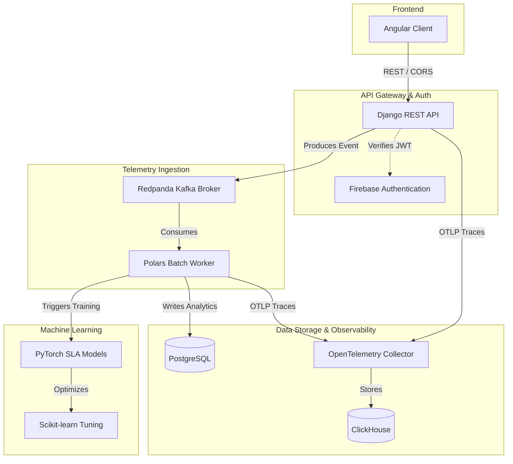

# Data Engineering for Machine Learning: Developer Platform


Welcome to the **Data Engineering for Machine Learning** Developer Platform. This repository hosts a comprehensive ecosystem designed to seamlessly bridge the gap between complex data pipelines and high-performance machine learning models.

> **Looking for the Book/Whitepaper?**
> The philosophical, educational, and narrative deep dives into data engineering, MLOps, and the architecture of this system can be found in our comprehensive whitepaper: **[Read the Whitepaper (BOOK.md)](BOOK.md)**

> [!NOTE]
> **arXiv Endorsement Request:** We are currently seeking an arXiv endorsement to formally publish the architectural whitepaper to `cs.CR` (Cryptography and Security). If you are a qualified arXiv author and find this work valuable, we would greatly appreciate your endorsement! You can endorse the author [here](https://arxiv.org/auth/endorse?x=ZISEYL) using code **ZISEYL**.

---

## Core Features

- **High-Throughput Ingestion**: Broker-based telemetry pipelines via Redpanda and Polars.
- **Tenant Isolation**: Absolute database-level isolation ensuring data and widget intake align precisely with your tenant workspace.
- **Big Data Aggregate Threat Modeling**: Models train on global anonymized data to leverage "herd immunity" for catching anomalies based on vast datasets.
- **Tenant-Specific Evaluation**: Threat reports map and evaluate your specific telemetry against the massive platform model.
- **Predictive SLAs**: Deep learning models dynamically forecasting service level agreements.
- **Hugging Face Integrations**: Automated ecosystem for model Hub sharing and Spaces deployment.
- **Next-Gen SIEM/SOAR**: Automated AI anomaly serialization into STIX 2.1 payloads for TAXII sharing.

### The Platform (Tenant0) as a Sentinel

We actively dogfood our own product. The core infrastructure operates as **Tenant0**—a living "Apex Sandbox" and "Public Sentinel." This tenant continually runs its own telemetry, status widgets, and threat models. It acts as a continuous sandbox for trials and a public sentinel to showcase what the platform is capable of to the world.

---

## Solution Architecture



---

## The Integration Gateway

Our platform is not just a standalone application; it is designed to be the central nervous system for your MLOps workflows. We provide a robust API Gateway to allow external systems to stream data to our models and request predictions securely.

### API Key Management

To interact with the integration gateway, you must authenticate using API keys.

1.  **Create an Account:** Register via the web dashboard.
2.  **Generate a Key:** Navigate to your User Profile -> API Keys and click "Generate New Key".
3.  **Authentication:** Pass the key in the `Authorization` header of your requests:
    ```http
    Authorization: Bearer YOUR_API_KEY
    ```

### Rate Limits

To ensure platform stability, we enforce the following default rate limits:

- **Standard Tier:** 100 requests / minute
- **Pro Tier:** 1,000+ requests / minute

---

## API Endpoints

### Data Ingestion: `/api/v1/ingest`

High-throughput endpoint optimized for receiving batched or streaming data from pipelines like Apache Spark or Databricks.

**Example Request:**

```bash
curl -X POST https://your-domain.com/api/v1/ingest \
  -H "Authorization: Bearer YOUR_API_KEY" \
  -H "Content-Type: application/json" \
  -d '{"batch_id": "123", "records": [{"feature1": 1.0, "feature2": "A"}]}'
```

### Inference: `/api/v1/predict`

Low-latency endpoint for real-time model inference, ideal for Kubernetes sidecars or PyTorch/TensorFlow direct calls.

**Example Request:**

```bash
curl -X POST https://your-domain.com/api/v1/predict \
  -H "Authorization: Bearer YOUR_API_KEY" \
  -H "Content-Type: application/json" \
  -d '{"model_version": "v2", "inputs": [0.5, 0.2, 0.9]}'
```

---

## Official Integrations

We provide native support and documentation for integrating with the industry's leading tools:

- **[Kubernetes](docs/integrations/kubernetes.md):** Connect via Custom Resource Definitions (CRDs) or sidecar proxies. _(Primary target)_
- **[TensorFlow](docs/integrations/tensorflow.md):** Stream data directly using `tf.data.Dataset`.
- **[PyTorch](docs/integrations/pytorch.md):** Integrate with custom DataLoaders.
- **[Apache Spark](docs/integrations/apache-spark.md):** Write streaming DataFrames directly to our ingestion endpoints.
- **[Databricks](docs/integrations/databricks.md):** Seamless notebook integration and cluster connectivity.

---

## Getting Started

Welcome to the platform! Getting your infrastructure connected and streaming data takes less than five minutes.

### 1. Account Setup

- **Registration**: Sign up for a secure account via the web dashboard.
- **Organizations**: Create an Organization for your team to enable Role-Based Access Control (RBAC) and shared dashboards.
- **Billing**: Select your tier. The free tier provides up to 100 API requests per minute for sandbox testing and development.

### 2. Connect Your Services

To start analyzing data and building models, you need to route telemetry and pipeline logs to our ingestion endpoints.

- Navigate to the **Integrations** tab in your dashboard.
- Generate a secure ingestion token for your specific application.
- Follow the native integration guides for your specific tech stack (e.g., Kubernetes, Apache Spark, TensorFlow).

### 3. API Authentication

For custom integrations or direct programmatic access, generate a dedicated API key from the **API Keys** section in your user profile. Always pass this key in the `Authorization` header:

```http
Authorization: Bearer YOUR_API_KEY
```

---

## Hugging Face Integrations & Global Threat Intelligence

The DEML Platform natively integrates with Hugging Face to automate the sharing of PyTorch models and static assets. We employ a privacy-first, aggregated architecture to share threat intelligence globally without exposing user data.

- **Global Platform Models**: Background workers securely aggregate anonymized telemetry across the entire platform to train a single global `platform_threat_model.pt`. This model benefits from "herd immunity" without exposing any single tenant's data.
- **Model Hub**: The global PyTorch threat models and SLA models are automatically pushed to the Hugging Face Hub using the `huggingface_hub` API.
- **Spaces Deployment**: GitHub Actions are configured to automatically sync the Whitepaper and UI to a Hugging Face Space upon commits to `main`.

**Requirements:**

- Add `HF_TOKEN` and `HF_REPO_ID` to your backend environment variables (e.g., in Railway).
- Add `HF_TOKEN` and `HF_SPACE_REPO` as GitHub Repository Secrets to enable the Spaces sync action.

---

## Alerting & Notifications

The platform supports automated email alerts for system events and model training completion. To configure these notifications:

- Set `RESEND_API_KEY` to your Resend API Key in your backend environment variables.
- Set `ALERT_EMAIL_TARGET` to the destination email address for system alerts.
- (Optional) Set `ALERT_EMAIL_FROM` to customize the sender address (defaults to `notifications@dataengineeringformachinelearning.com`).

---

## Enterprise Security & Compliance

We take data security seriously. As a multi-tenant SaaS platform, we employ strict isolation protocols to protect your data.

- **Data Isolation:** All tenant data is cryptographically isolated using strict multi-tenancy rules and dedicated encryption keys.
- **Continuous Auditing:** Our infrastructure undergoes continuous vulnerability scanning to ensure your models are safe.
- **Compliance:** We are actively pursuing SOC 2 Type II and GDPR compliance certifications. You can review our full security posture and architecture in our Whitepaper.

## Support & SLA

We provide dedicated support for our users:

- **Support Tickets:** Open a support ticket directly from your dashboard for any technical assistance or integration help.
- **System Status:** Monitor our real-time API uptime on the global Status page.

---

[](https://railway.com/deploy/deml?referralCode=BpTk0g&utm_medium=integration&utm_source=template&utm_campaign=generic)

[](https://app.fossa.com/projects/git%2Bgithub.com%2Fdataengineeringformachinelearning%2Fdataengineeringformachinelearning?ref=badge_large&issueType=license)

[](https://doi.org/10.5281/zenodo.20778532)

[](https://semgrep.dev)


