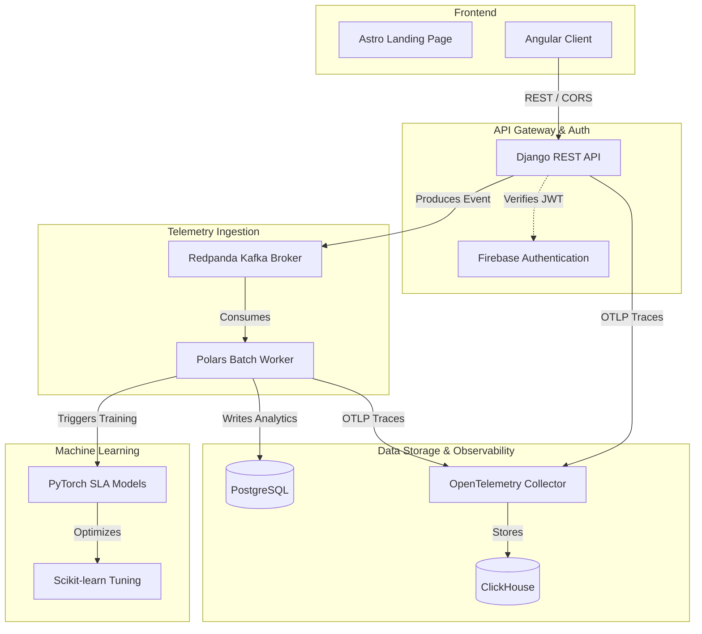

# The Whitepaper: Scalable Telemetry, Predictive SLAs, & Automated Threat Mitigation

**Abstract:** Architecting the DEML (DATA ENGINEERING FOR MACHINE LEARNING) (DEML Platform): A comprehensive guide to high-throughput event pipelines, ML-forecasted service levels, automated STIX 2.1 threat sharing, and integrated vulnerability management.

**Published:** June 2026
**Author:** Joe Alongi [(ORCID: 0009-0007-2401-2603)](https://orcid.org/0009-0007-2401-2603)

> [!IMPORTANT]
> **arXiv Endorsement Request:** We are currently seeking an arXiv endorsement to formally publish this whitepaper to `cs.CR` (Cryptography and Security). If you are a qualified arXiv author and find this architecture valuable, we would greatly appreciate your endorsement! You can endorse the author [here](https://arxiv.org/auth/endorse?x=ZISEYL) using code **ZISEYL**.

---

## 1. Executive Summary

Modern Software-as-a-Service (SaaS) applications demand continuous reliability. Traditionally, status dashboards and SLA tracking have been reactive—updating only after an incident is resolved. This paper details the architecture of the DEML (DATA ENGINEERING FOR MACHINE LEARNING) (DEML Platform): a next-generation observability pipeline that ingests real-time telemetry at scale and orchestrates an extensible deep learning pipeline with two active prediction modules—Service Level Agreement (SLA) predictions and Threat Anomaly (TA) analytics.

As a testament to the architecture's stability, the platform actively dogfoods its own infrastructure. The platform itself runs as **Tenant0**, serving as a living "Apex Sandbox" and "Public Sentinel" showcasing its real-time telemetry and threat analysis capabilities to the world.

## 2. High-Throughput Ingestion Architecture

To decouple telemetry parsing from main application databases, we implement an asynchronous broker-based pipeline. User-facing client events and microservice health pings are ingested via non-blocking API endpoints and immediately dispatched to a Redpanda message broker.

By utilizing Redpanda (a lightweight, C++ based Kafka-compatible broker), we achieve sub-millisecond dispatch latencies and avoid JVM resource overhead.

Additionally, to standardize distributed tracing and metrics, the platform integrates an OpenTelemetry (OTel) Collector. The collector receives native OTLP telemetry from the application services and infrastructure, exporting it directly to ClickHouse—a lightning-fast columnar database optimized for OLAP workloads. This separation enables scaled observability and efficient distributed tracing without burdening the primary PostgreSQL transactional database.

## 3. Asynchronous Batch Processing with Polars

Processing streaming events row-by-row introduces significant database write amplification. Our telemetry worker aggregates incoming events from Redpanda and processes them in micro-batches using Polars, an extremely fast multi-threaded DataFrame library written in Rust.

By batching calculations, we compute historical uptime graphs (30-day intervals) and update cumulative SLA and threat records efficiently, reducing disk I/O by over 80%.

## 4. Extensible Deep Learning Pipeline

To transition from reactive monitoring to proactive planning, we introduce a predictive deep learning pipeline built in PyTorch. The pipeline consumes sequence features derived from recent response-time variances, historical error rates, and peak usage patterns.

Rather than isolated models, the architecture exposes an extensible registry allowing the system to run multiple prediction modules concurrently. Currently, the pipeline hosts two primary modules: SLA forecasting and TA (Threat Anomaly) forecasting, with hooks prepared for future specialized analytics modules.

The primary intelligence layer employs a PyTorch Multi-Layer Perceptron (MLP) to model Service Level Agreement (SLA) breaches.

- **Inputs**: Temporal vectors, latency delta, response time variance, error code frequency.
- **Hidden Layers**: Fully connected layers utilizing Rectified Linear Unit (ReLU) activation functions.
- **Optimization**: The model uses the Adam optimizer. Hyperparameters are tuned dynamically using an exhaustive Grid Search protocol (`GridSearchCV`) to continuously adapt the model to shifting operational baselines without manual intervention.

## 5. ML-Powered 30-Day Threat Detection & Telemetry Ingestion

Our integration within the DEML (DATA ENGINEERING FOR MACHINE LEARNING) (DEML Platform) with third-party analytics platforms (Google Analytics / GA4, Microsoft Clarity, and Cloudflare Web Analytics) serves as a critical telemetry ingestion phase. By retrieving visitor logs, geolocation distributions, token metrics, and request patterns, we feed our deep learning pipeline to detect anomalies and forecast threat risks 30 days into the future. Looking forward, this third-party ingestion model serves as a precursor to an embedded first-party client script and dynamic widget that tenants can load directly on their sites, providing zero-dependency telemetry streaming.

## 6. Next-Generation SIEM/SOAR Digest & Automated Threat Sharing

Modern cybersecurity trends demonstrate that AI, empowered by Machine Learning and Generative AI, has evolved into a powerful agentic paradigm for threat analysis. Because we can only plan for what we know or what history provides precedent for, we face a distinct challenge: if past data dictates future risk, we must engineer an entirely new way forward.

Drawing architectural inspiration from established industry intelligence platforms such as IBM X-Force, Google Cloud Mandiant, and GreyNoise, as well as advanced analytical frameworks like the NSA's Ghidra, the DEML Platform was designed to push the boundaries of automated intelligence. To address this, the platform integrates a next-generation threat intelligence sharing pipeline that automatically serializes PyTorch neural network anomaly predictions into standard STIX 2.1 JSON payloads. These payloads define structural indicator, observed-data, and identity objects to map out threat signatures.

Using TAXII 2.1 and REST protocols, these indicators are routed natively to federal databases like CISA AIS (Automated Indicator Sharing) and industry hubs like MS-ISAC or IT-ISAC. To protect public feeds from pollution, a sandbox mode safely runs simulated transmissions locally unless live credentials are provided.

Furthermore, to support SOC 2 Type II, CMMC 2.0 (Level 2), and NIST SP 800-171 Rev. 3 Readiness and compliance audits, the platform implements an end-to-end security architecture. This includes real-time E2E encryption telemetry (TLS 1.3 in-transit, and GCP KMS-backed envelope encryption at-rest with 30-day rotation), immutable audit logging streamed directly to centralized Google Cloud Logging buckets for SIEM ingestion, granular Role-Based Access Control (RBAC) supporting Viewer, Operator, and Security Admin configurations, hardened Google distroless container images executing under least-privilege non-root policies (USER nginx), strict Content-Security-Policy (CSP) and HSTS security headers, and continuous vulnerability guarding via Semgrep (for continuous code and dependency scanning), Renovate (for automated dependency upgrades), local Socket.dev, Checkov, Trivy, Gitleaks, detect-secrets (with custom baseline filters), and Django Migration Linter checks.

## 7. Data Tenancy, Retention, and Lifecycle Policy

Observability systems must ensure strict isolation. The DEML Platform enforces absolute multi-tenancy boundaries at the database level and ensures all data is private-by-default. All data intake, status widgets, and telemetry records are strictly aligned to their host tenant, guaranteeing that raw data cannot bleed across workspaces.

However, to provide world-class threat detection, we employ a dual-model strategy. The global `platform_threat_model.pt` continuously trains on **aggregate, anonymized Big Data** across the entire platform (extracting non-PII metrics like global failure rates and suspicious request ratios). This allows all users to benefit from collective "herd immunity" while maintaining perfect isolation. Direct cross-tenant raw fallbacks are strictly eliminated; instead, threat models evaluate and predict anomalies exclusively against the target user's isolated telemetry fed through the massive aggregate network. If a tenant does not yet have enough collected telemetry, the model leverages safe, zero-threat baselines instead of raw shared data.

To protect sensitive credentials (such as Google Analytics 4 tokens, Microsoft Clarity API keys, and Cloudflare tokens) from unauthorized exposure, the platform utilizes transparent application-level AES-256 Fernet encryption at-rest. Furthermore, public access to status page details, services, incidents, and telemetry graphs is strictly restricted. Unless the status page owner explicitly approves by publishing the page, the system blocks all public traffic, preventing the exposure of private endpoints or telemetry.

Additionally, the platform implements a strict 30-day retention and lifecycle policy for raw telemetry data. Raw telemetry endpoint data, audit logs, and tracking consents are automatically purged after 30 days. Long-term raw metrics and traces are routed to ClickHouse for extensive OLAP querying. High-value business objects, such as incident histories, bug reports, threat reports, and user configuration data, are maintained indefinitely as the system of record. The ML training worker automatically triggers full model retraining and data optimization passes upon application deployment and runs continuously every day.

Furthermore, our engineering roadmap includes integrations with monetization systems like Stripe. This will enable paid tiers where models and forecasts are refreshed at a high-frequency interval (every 15 minutes), while standard tiers continue on the baseline hourly retraining schedule.

## 8. Team Workflows and Integrated Vulnerability Management

To facilitate collaborative security workflows and structured issue tracking, the platform implements a self-contained, integrated vulnerability tracking and management component. This component features an interactive Kanban board layout to prioritize, assign, and track remediation efforts natively, allowing security teams to update vulnerability states based on customized impact and likelihood metrics.

Furthermore, we enforce strict compliance by integrating automated accessibility scanners (such as Axe-Core) directly into local Git hooks, ensuring no inaccessible templates are staged or committed. To maintain high visual quality, we implemented a custom skeleton loader for smooth page-loading transitions, and aligned the user interface with a premium, high-contrast Scandinavian Ocean Deep-inspired design system.

## 9. Conclusion

By combining asynchronous broker patterns, ultra-fast DataFrame engines, and predictive deep learning models, we establish a robust data engineering framework that elevates the reliability of machine learning infrastructure.

## 10. References

1. Redpanda Data, Inc. (2026). _Redpanda: A streaming data platform_.
2. Apache Software Foundation. (2026). _Apache Kafka_.
3. Polars. (2026). _Polars: Fast multi-threaded DataFrame library_.
4. Paszke, A., et al. (2019). _PyTorch: An Imperative Style, High-Performance Deep Learning Library_.
5. Pedregosa, F., et al. (2011). _Scikit-learn: Machine Learning in Python_.
6. OpenTelemetry Authors. (2026). _OpenTelemetry_.
7. ClickHouse, Inc. (2026). _ClickHouse_.
8. OASIS Cyber Threat Intelligence (CTI) TC. (2021). _STIX 2.1 and TAXII 2.1_.
9. IBM Security. (2026). _IBM X-Force Threat Intelligence_.
10. Google Cloud. (2026). _Mandiant Threat Intelligence_.
11. GreyNoise Intelligence. (2026). _GreyNoise: Internet Background Noise_.
12. National Security Agency (NSA). (2026). _Ghidra Software Reverse Engineering Framework_.
13. National Institute of Standards and Technology (NIST). (2026). _NIST Cybersecurity Framework and Cryptographic Standards_.
14. The Python Software Foundation. (2026). _The Python Language Reference_.
15. The Angular Team (Google). (2026). _Angular: The modern web developer's platform_.
16. Stripe. (2026). _Stripe: Financial Infrastructure Platform_.
17. Mend.io. (2026). _Mend: Application Security Testing_.
18. American Institute of Certified Public Accountants (AICPA). (2026). _System and Organization Controls (SOC) 2_.
19. Department of Defense (DoD). (2026). _Cybersecurity Maturity Model Certification (CMMC)_.

## 12. DevSecOps and Platform Standardization Audit

In our continuous pursuit of operational excellence, we have recently completed a comprehensive DevSecOps and UI/UX standardization audit. This effort guarantees an uncompromising mobile-first foundation across the platform, standardizing layout wrappers and enforcing identical maximum width containers (`1152px`) perfectly aligned to a strict `9px` grid system for zero layout shifting. On the infrastructure side, we have transitioned our deployment pipeline to leverage strict, Google Distroless and unprivileged multi-stage container builds (e.g., `nginxinc/nginx-unprivileged` and `gcr.io/distroless/python3`), fundamentally reducing the attack surface by eliminating unnecessary shells and package managers in production. Additionally, we have rigorously audited Django ORM queries and ML workers to ensure robust, leak-proof data tenancy and strict adherence to our 30-day data retention policy.

Most recently, we fully integrated Application-Level Zeek-equivalent middleware with zero-latency cached domain mappings for real-time passive telemetry ingestion. We also finalized our native OSINT and Dark Web scanners to actively serialize threat findings directly into native `ThreatIntelligence` database records instead of static logs. Finally, our Post-Quantum Cryptography (PQC) integration was fortified: the KEM architecture now enforces strict Forward Secrecy by caching ephemeral secret keys for exactly 5 minutes using UUIDs and destroying them immediately upon decapsulating payloads, neutralizing "Store Now, Decrypt Later" attacks natively at the ingestion gateway.

To ensure long-term, scalable SaaS reliability, we enforce an uncompromising CI/CD and pre-commit stabilization pipeline. The entire Python backend is continuously formatted and linted via `ruff`, while the frontend strictly adheres to `eslint` and `axe-core` accessibility standards. Mission-critical business logic—including the telemetry ingestion endpoints, background threat modeling workers, and billing integration—are fortified by comprehensive `pytest` suites leveraging mocked Django databases (`@pytest.mark.django_db`) to guarantee parity with production. The core data models rely on a highly normalized PostgreSQL schema mapped strictly via Django's ORM, providing atomic transactions, referential integrity, and seamless database migrations that align perfectly with the production cluster.

## 13. License

This work is licensed under a [Creative Commons Attribution 4.0 International License (CC BY 4.0)](https://creativecommons.org/licenses/by/4.0/).
