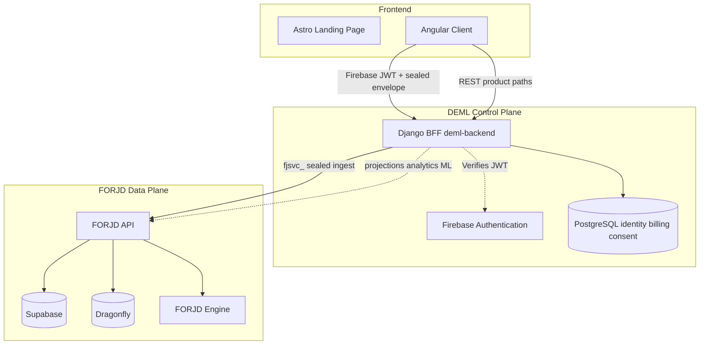

# The Whitepaper: Operational Intelligence for the Digital Battlefield

> **Platform boundary:** DEML owns the Firebase-authenticated user control plane,
> Angular product, learning state, billing, consent, credentials, and
> account-lifecycle UI. FORJD is the exclusive universal secure streaming engine:
> sealed intake, processing, projections, analytics, replay/DLQ, threat processing,
> and machine learning. Native FORJD requests use tenant-bound opaque `fjsvc_`
> credentials and sealed payloads; Firebase tokens, OAuth client credentials,
> Supabase `service_role`, and direct storage access are outside the trust boundary.
> Integration contract: [docs/FORJD_INTEGRATION.md](docs/FORJD_INTEGRATION.md).
> Production operations: [docs/PRODUCTION_DEPLOY.md](docs/PRODUCTION_DEPLOY.md) and
> [docs/PRODUCTION_CHECKLIST.md](docs/PRODUCTION_CHECKLIST.md).

**Abstract:** This paper specifies the architecture of the Data Engineering for AI Engineering and Cybersecurity (DEML) platform—a multi-tenant observability, AI intelligence, and threat-analytics system engineered for the new digital battlefield. The design unifies sealed high-throughput ingest through FORJD, AI/ML-forecasted service levels, automated STIX 2.1 indicator federation, model lifecycle management, and integrated vulnerability management under a single defendable operational fabric. Command ingress is non-blocking; projections are durable and idempotent; tenant isolation is symmetrical and UUID-scoped throughout.

**Published:** July 2026
**Author:** Joe Alongi [(ORCID: 0009-0007-2401-2603)](https://orcid.org/0009-0007-2401-2603)

> [!IMPORTANT]
> **arXiv Endorsement Request:** The authors seek an arXiv endorsement to formally publish this whitepaper to `cs.CR` (Cryptography and Security). Qualified arXiv authors may endorse using code **ZISEYL** [here](https://arxiv.org/auth/endorse?x=ZISEYL).

---

## 1. Executive Summary

The operational tempo of modern SaaS infrastructure has outpaced traditional observability. Status dashboards and SLA trackers remain predominantly reactive—recording failure only after user impact materializes. In adversarial network environments, that posture is tactically untenable.

This paper presents DEML: a next-generation observability, AI intelligence, and cybersecurity pipeline that ingests real-time telemetry at scale and orchestrates an extensible AI/ML stack with active prediction modules—Service Level Agreement (SLA) forecasting, Threat Anomaly (TA) analytics, and adversarial detection—alongside secure model serving and compliance controls. The architecture embodies _Defendable Architectures_ principles—Visibility, Manageability, and Survivability—across every operational plane.

As operational proof, the platform dogfoods its own infrastructure continuously. The public **`platform-status`** sentinel (`user=null`, `is_platform=True`) functions as a living Apex Sandbox and Public Witness—streaming real-time telemetry and threat analysis to anonymous observers without requiring a separate organizational login.

## 2. Concept of Operations (CONOPS)

This section specifies how the DEML platform is **operated** in production: vendor boundaries, steady-state data paths, actor workflows, and degraded-mode behavior. The full operational narrative, service matrix, and contingency tables reside in [BOOK.md § Concept of Operations](BOOK.md#concept-of-operations-conops) and [BOOK.md § Appendix N](BOOK.md#appendix-n-concept-of-operations-operator-quick-reference).

### 2.1 Mission

Deliver account-isolated observability, predictive SLA forecasting, and threat analytics through two clear planes:

- **Control plane (DEML)** — Firebase Auth, Django BFF, Postgres identity/billing/consent/learning, Angular UI
- **Data plane (FORJD)** — sealed ingest, workflows, durable projections, analytics, ML, replay/DLQ via tenant-bound `fjsvc_` tokens

### 2.2 Operational environment

| Plane             | Technology                          | Role                                                                |
| ----------------- | ----------------------------------- | ------------------------------------------------------------------- |
| Product UI        | Vercel (`deml.app`)                 | Angular SPA; calls Django only                                      |
| Control plane API | Fly.io `deml-backend`               | Django BFF: auth, billing, consent, learning, FORJD adapters        |
| Data plane        | FORJD on Fly + Supabase + Dragonfly | Sealed ingest, projections, analytics, ML, replay/DLQ, tenant erase |
| Identity          | Firebase Auth                       | JWT perimeter at Django; MFA-verified session on site mutations     |
| Marketing         | Astro marketing site                | Landing and documentation                                           |
| Security controls | AES-256-GCM + platform audit sinks  | Field encryption for secrets; sealed envelopes on the wire to FORJD |
| Billing           | Stripe                              | Standard → Pro checkout, webhooks, reconciliation                   |
| Artifacts         | FORJD ML surfaces                   | Training and scoring execute in FORJD                               |

Production hosts are Vercel + Fly Django + FORJD. Symmetrical account → FORJD tenant mapping is invariant. See [BOOK.md CONOPS](BOOK.md#concept-of-operations-conops), [docs/FORJD_INTEGRATION.md](docs/FORJD_INTEGRATION.md), and [BOOK.md § Appendix Q](BOOK.md#appendix-q-deml-glossary).

Every production transport is cryptographically authenticated: HTTPS/HSTS at public app boundaries and verified TLS for Postgres and FORJD API calls. Sealed ingest payloads use AES-256-GCM envelopes bound to routing metadata; plaintext lesson content, PII, scores, and learner identifiers never appear in metadata.

### 2.3 Actors & workflows

- **Anonymous visitors** read published status pages and the world-readable `platform-status` sentinel only (ABAC).
- **Account owners** (`Operator` / `Security Admin`) authenticate via Firebase, manage status pages and integrations (MFA-verified session required for writes); may upgrade to **Pro** via Stripe; dashboards read FORJD projections/analytics through the Django BFF.
- **API integrators** stream data through DEML `/api/v1/ingest` using hashed API keys scoped to `account_id`; Django maps the account to a FORJD tenant and forwards sealed envelopes with `fjsvc_`.
- **Platform operators** manage Vercel, Fly `deml-backend`, FORJD readiness, Firebase, Infisical/Fly secrets, and the internal vulnerability Kanban.

### 2.4 Operational modes

| Mode             | Trigger                       | Behavior                                                                                                  |
| ---------------- | ----------------------------- | --------------------------------------------------------------------------------------------------------- |
| Normal           | All services healthy          | Angular → Django (Firebase JWT) → FORJD (`fjsvc_` + sealed envelope); projections and analytics available |
| Degraded (FORJD) | FORJD unreachable / auth fail | Control plane stays up; data-plane calls fail closed or return empty-stable responses                     |
| Degraded (auth)  | Firebase/MFA issues           | Settings mutations locked until fresh MFA; identity repair via Firebase console                           |
| Maintenance      | `main` merge / FORJD deploy   | Rolling Vercel/Fly deploys; FORJD deploys independently                                                   |

### 2.5 Maintenance cadence (summary)

Continuous sealed forward via the Django BFF, FORJD workflow and projection materialization, hourly threat-intel runs in FORJD, daily ML retraining in FORJD, DEML retention cleanup for identity-adjacent hot data, weekly Renovate, and monthly/quarterly security audits. See [BOOK.md Appendix D](BOOK.md#appendix-d-maintenance--automation-schedule).

## 3. Defendable Architecture Principles

> [!IMPORTANT]
> **Foundational Frameworks — Key References**
>
> DEML's security architecture is guided by two white papers: **A Threat-Driven Approach to Cyber Security** (Muckin & Fitch, 2019), which supplies IDDIL/ATC threat analysis and STRIDE-LM categorization; and **Defendable Architectures** (Fitch & Muckin, 2019), which defines the Visibility / Manageability / Survivability characteristics below. See [BOOK.md Appendix L](BOOK.md#appendix-l-foundational-security-frameworks) for full citations and rationale.

_Defendable Architectures_ framework (Fitch & Muckin, 2019) defines three strategic characteristics—**Visibility**, **Manageability**, and **Survivability**—that networked systems must exhibit to support intelligence-driven defense rather than static compliance alone. DEML is engineered to embody each characteristic across its operational planes.

**Visibility** enables defenders to observe activity across network, application, and data layers and to reconstruct events over time. DEML forwards sealed telemetry to FORJD; FORJD owns processing, durable projections, and analytics retention. Edge enrichment (user-agent parsing, geolocation, ASN/ISP mapping) augments signals at the DEML perimeter before sealed forward. Django BFF adapters surface FORJD projections and analytics to Angular, while the public `platform-status` sentinel provides continuous operational witness. Immutable audit records support SIEM correlation. Threat findings and neural anomaly outputs serialize to STIX 2.1 for federated indicator sharing—preserving the time-series depth required for campaign reconstruction.

**Manageability** ensures that security posture can be sustained and updated in response to emerging threats. Automated vulnerability management (Semgrep, Trivy, Renovate) feeds an integrated Kanban workflow; secrets are governed through Infisical with GCP KMS envelope encryption and 90-day key rotation. RBAC/ABAC (Viewer, Operator, Security Admin) with MFA on mutations segregates administrative traffic from end-user sessions. ML hyperparameters adapt via GridSearchCV without manual intervention, and durable Postgres-backed schedule buckets provide a repeatable rhythm for model retraining, key-policy checks, retention, and dependency maintenance without restart-driven duplicates.

**Survivability** allows essential services to persist during attack, compromise, and recovery. The sealed FORJD path decouples DEML control-plane transactions from data-plane processing: Angular seals envelopes, Django terminates Firebase Auth and forwards with `fjsvc_`, and FORJD materializes durable projections with replay/DLQ for poison or failed work. When FORJD is unreachable, identity and billing remain available while data-plane calls fail closed. UUID-scoped multi-tenancy, distroless least-privilege containers, and rolling Vercel/Fly deploys constrain lateral movement and support graceful degradation. Explicit degraded operational modes defined in Section 2.4 keep the control plane operable while operators restore FORJD.

## 4. High-Throughput Ingestion Architecture

The platform implements a **sealed FORJD ingest** architecture for client telemetry with production-grade reliability:

- **Commands** (event ingestion): Angular seals AES-256-GCM envelopes and calls Django with a Firebase JWT. Django verifies auth, resolves `account → forjd_tenant → secret_ref`, rewrites product-local workflow ids when needed, and forwards to FORJD `POST /api/v1/ingest` with `Authorization: Bearer fjsvc_…`.
- **Data plane**: FORJD owns workflows, sealed pipeline execution, durable `stream_results` projections, analytics, ML, and replay/DLQ. Independent failure domains prevent processing pressure from stalling DEML identity or billing.
- **Projections**: FORJD materializes idempotent read models; DEML surfaces them through BFF adapters on established Angular paths.
- **Queries**: Angular never calls FORJD or FORJD storage directly—product reads go Angular → Django → FORJD API.



This design provides non-blocking client feedback on the control plane while FORJD guarantees durable processing semantics. Sealed metadata is a routing-tag allowlist only; plaintext belongs inside ciphertext. See [docs/FORJD_INTEGRATION.md](docs/FORJD_INTEGRATION.md).

FORJD’s sealed pipeline and engine roles achieve high-throughput dispatch without a DEML-local broker. Observability and OLAP-style analytics retention live in FORJD so the DEML Postgres transactional database remains focused on identity, billing, consent, and learning.

## 5. Asynchronous Batch Processing with Polars

Row-by-row processing of streaming events introduces significant database write amplification. DEML forwards sealed telemetry to FORJD; FORJD owns stream processing and may aggregate finite batches with Polars—a multi-threaded DataFrame engine written in Rust—for offline transforms and reports.

Batched computation of historical uptime graphs (30-day intervals) and cumulative SLA and threat records reduces disk I/O by over 80% compared to per-event persistence.

## 6. Extensible Deep Learning Pipeline

Transitioning from reactive monitoring to proactive planning requires a predictive deep-learning pipeline built in PyTorch. The pipeline consumes sequence features derived from recent response-time variances, historical error rates, and peak usage patterns.

Rather than isolated models, the architecture exposes an extensible registry allowing multiple prediction modules to execute concurrently. The pipeline currently hosts two primary modules: SLA forecasting and TA (Threat Anomaly) analytics, with hooks prepared for future specialized analytics modules.

The primary intelligence layer employs a PyTorch Multi-Layer Perceptron (MLP) to model Service Level Agreement (SLA) breaches.

- **Inputs**: Temporal vectors, latency delta, response time variance, error code frequency.
- **Hidden Layers**: Fully connected layers utilizing Rectified Linear Unit (ReLU) activation functions.
- **Optimization**: The model uses the Adam optimizer. Hyperparameters are tuned dynamically using an exhaustive Grid Search protocol (`GridSearchCV`) to continuously adapt the model to shifting operational baselines without manual intervention.

## 7. ML-Powered 30-Day Threat Detection & Telemetry Ingestion

Third-party analytics integrations (Google Analytics / GA4, Microsoft Clarity, and Cloudflare Web Analytics) constitute a critical telemetry ingestion phase. Visitor logs, geolocation distributions, token metrics, and request patterns feed the deep-learning pipeline to detect anomalies and forecast threat risk 30 days forward. This ingestion model serves as precursor to an embedded first-party client script and dynamic widget that account owners deploy directly on status pages—providing zero-dependency telemetry streaming.

## 8. Next-Generation SIEM/SOAR Digest & Automated Threat Sharing

Machine learning and generative AI have evolved into agentic paradigms for threat analysis. When historical precedent alone cannot bound future risk, the architecture must engineer forward-looking intelligence.

Drawing architectural inspiration from established industry platforms—IBM X-Force, Google Cloud Mandiant, GreyNoise, and analytical frameworks such as the NSA's Ghidra—DEML integrates a threat-intelligence sharing pipeline that automatically serializes PyTorch neural-network anomaly predictions into standard STIX 2.1 JSON payloads. These payloads define structural indicator, observed-data, and identity objects to map threat signatures.

Using TAXII 2.1 and REST protocols, indicators route natively to federal databases such as CISA AIS (Automated Indicator Sharing) and industry hubs including MS-ISAC and IT-ISAC. A sandbox mode safely executes simulated transmissions locally unless live credentials are provisioned—protecting public feeds from indicator pollution.

To support SOC 2 Type II, CMMC 2.0 (Level 2), and NIST SP 800-171 Rev. 3 readiness, the platform implements end-to-end security architecture: TLS 1.3 in-transit and GCP KMS-backed envelope encryption at-rest with 30-day rotation; immutable audit logging streamed to centralized Google Cloud Logging buckets for SIEM ingestion; granular RBAC (Viewer, Operator, Security Admin); hardened Google distroless container images under least-privilege non-root policies; strict Content-Security-Policy (CSP) and HSTS headers; and continuous vulnerability guarding via Semgrep, Renovate, Socket.dev, Checkov, Trivy, Gitleaks, detect-secrets, and Django Migration Linter.

## 9. Role-Based & Attribute-Based Access Control (RBAC & ABAC)

Access control is implemented as defense-in-depth: **RBAC** (what a logged-in user may do) plus **ABAC** (whether a specific resource is visible or mutable in the current session context). The platform uses a **User + Sites** model—one Firebase login maps to one Django `User` and one `UserProfile.account_id`, and that account maps to a FORJD tenant that may own many status pages. There are **no organization hierarchies, sub-users, or shared team logins per workspace**. Status pages, services, incidents, and uptime projections are **FORJD-owned**; Django authenticates the session and proxies product paths through `backend/forjd/` adapters. Authorization therefore hinges on four axes rather than org charts:

1. **Session** — logged out (anonymous) vs logged in (Firebase JWT terminated at Django).
2. **Tenant binding** — every FORJD call resolves `deml_account_id → forjd_tenant_id → secret_ref` and fails closed on mismatch.
3. **Publication** — FORJD publication flags expose a status page (and its services, incidents, and rollup metrics) to anonymous visitors via the BFF.
4. **Platform scope** — the canonical `platform-status` sentinel remains world-readable and is never mutable by customers.

### RBAC (per-account roles)

Each `UserProfile` carries exactly one role: `Viewer`, `Operator`, or `Security Admin`. Roles apply to the **single login** behind that profile—not to nested org members. Django enforces role gates before proxying mutating status, playbook, and administration actions to FORJD.

| Role             | Typical capability                                                                                                                              |
| ---------------- | ----------------------------------------------------------------------------------------------------------------------------------------------- |
| `Viewer`         | Read dashboards, published status pages, and FORJD analytics via the BFF; Settings UI is read-only.                                             |
| `Operator`       | Create/update/delete owned status pages through FORJD status APIs (BFF-enforced); manage services, incidents, and integrations when UI-enabled. |
| `Security Admin` | Same write surface as Operator plus elevated FORJD administration actions; reserved for platform bootstrap (`admin@…`).                         |

**API enforcement:** Stable DEML paths such as `/api/v1/system-status/status_pages` adapt to FORJD `/api/v1/status/pages`. Mutating verbs require `Operator` or `Security Admin` plus MFA; Viewers receive `403 Forbidden`. New Firebase users are provisioned as `Operator` on first login; `Viewer` is assigned when an account is deliberately restricted.

**UI enforcement:** The Angular Settings console disables all mutation controls when `currentUserRole() === 'Viewer'`. Routes `/analytics` and `/vulnerabilities` require `authGuard` (login only). `/status`, `/status/:slug`, and `/explore` remain reachable without login for public pages.

### ABAC (resource and context attributes)

Enforced at the Django BFF (`backend/forjd/` policy + adapters) and inside FORJD tenant binding / publication rules:

- **Published directory** — anonymous `GET` explore lists only published pages (plus `platform-status`) via platform FORJD credentials.
- **Owner / tenant scope** — authenticated reads and writes bind to the mapped FORJD tenant; cross-tenant access fails closed.
- **Platform sentinel** — `platform-status` mutations are forbidden to customers.
- **`check_mfa_satisfied`** — write operations inspect the Firebase token `amr` claim for `"mfa"` (test UID `testuser` is exempt in CI).

Programmatic ingestion (`/api/v1/ingest`, `/api/v1/predict`) resolves scope via API keys hashed in the DEML database, mapping to `UserProfile.account_id` and the FORJD tenant—not hardcoded domains.

### Access decision matrix (status pages & public stats)

| Action                                   | Anonymous (logged out)         | Logged-in owner (mapped tenant)                  | Logged-in non-owner                                              |
| ---------------------------------------- | ------------------------------ | ------------------------------------------------ | ---------------------------------------------------------------- |
| List / explore status pages              | Published + `platform-status`  | Published + own tenant pages + `platform-status` | Published + `platform-status` only                               |
| View services / incidents / uptime stats | Published or `platform-status` | Also own **unpublished** tenant pages            | Published or `platform-status`; **403** on others' private pages |
| Create / update / delete status page     | `401`                          | `Operator`/`Security Admin` + MFA + tenant bind  | `403` or `404`                                                   |
| Add / remove services or incidents       | `401`                          | Owner tenant + MFA (Settings blocks `Viewer`)    | `404` / forbidden                                                |
| Mutate `platform-status`                 | N/A (read-only)                | **Forbidden**                                    | **Forbidden**                                                    |

Private-by-default: until a page is published in FORJD, only the owning tenant session (via the Django BFF) can read operational stats—anonymous visitors hitting `/status/:slug` or the stats API receive `403`/`404`.

## 10. Data Tenancy, Retention, and Lifecycle Policy

Observability systems must enforce strict isolation. DEML implements **account-scoped isolation** for the control plane: identity, billing, consent, API credentials, and `deml_account_id → forjd_tenant_id` mappings live in DEML Postgres. Sealed telemetry, status pages, projections, analytics, ML artifacts, SIEM/SOAR state, and report documents are **FORJD-owned** and tenant-bound. Data is private-by-default; nothing bleeds across accounts or tenants.

Local DEML models such as `AggregatedAnalytics`, `StatusPage`, `StatusPageUptimeDaily`, and `ExportJob` are **retired** (Django migration `0053_retire_local_data_plane`). They are not live product surfaces; dashboards, status, exports, and analytics read through FORJD APIs via the Django BFF.

To provide world-class threat detection, a dual-model strategy applies in FORJD. Aggregate, anonymized non-PII metrics (for example global failure rates and suspicious request ratios) inform collective baselines while inference remains tenant-scoped. Accounts without sufficient collected telemetry leverage safe, zero-threat baselines rather than raw shared data.

Sensitive DEML credentials (integration tokens, FORJD secret references) are protected via application-level AES-256-GCM envelope encryption at rest. Public access to status page details, services, incidents, and telemetry graphs remains restricted unless the owning FORJD tenant explicitly publishes the page.

**Tiered retention strategy** prevents database bloat while preserving operational data:

**DEML Postgres (control plane):**

- Audit logs, cookie consent, and other identity-adjacent hot rows: **30 days** (repair-first, fail-closed pruning where configured)
- API keys, billing profile state, FORJD tenant mapping (secret refs only), consent records: retained as system of record until account deletion
- Business objects still DEML-owned (`BugReport` delivery metadata, lifecycle jobs): **Indefinite** or until lifecycle erase

**FORJD (data plane — sealed events, status, projections, analytics, exports):**

- Sealed ingest, durable `stream_results`, status pages / uptime projections, SIEM/SOAR, ML scores: retention per FORJD policy
- Export artifacts and downloadable reports: retention per FORJD export policy
- Audit archives, security events, and OTEL-style traces: retention per FORJD analytics policy
- DEML does not host a parallel OLAP cluster or Railway object-store download path for product exports

Retention never races materialization: DEML prunes only identity-adjacent hot data it owns; FORJD owns sealed-event, status, projection, and analytics retention. Account deletion fails closed before local teardown and remains blocked until FORJD durably erases the mapped tenant.

**Billing is live:** Stripe Checkout upgrades accounts from **Standard** to **Pro**, with webhook-driven tier updates and scheduled `sync_subscriptions` reconciliation so local profile state matches Stripe ([BOOK.md § Appendix M](BOOK.md#appendix-m-billing--subscriptions-operator-reference)). Pro tiers may refresh models and forecasts more frequently than the Standard baseline schedule while every account still traverses symmetrical worker pipelines.

## 11. FORJD Engine Offloading Architecture

High-performance sealed processing executes in **FORJD**, not as DEML-local workers. The FORJD engine binary runs role selection via `FORJD_ROLE` for data-plane responsibilities (ingest, relay, probes, and related stream roles) while DEML remains the Django control plane for identity, billing, consent, and learning.

| Responsibility                          | Owner                           |
| --------------------------------------- | ------------------------------- |
| Sealed ingest                           | FORJD API + engine              |
| Projections                             | FORJD durable `stream_results`  |
| Analytics / ML                          | FORJD workflows and ML surfaces |
| Replay / DLQ                            | FORJD                           |
| Identity / billing / consent / learning | DEML Django + Postgres          |
| Product UI                              | DEML Angular on Vercel          |

This separation keeps maintenance and stream workloads off the Django request path, ensuring predictable resource utilization for user-facing control-plane APIs. DEML authenticates to FORJD only with tenant-bound `fjsvc_` tokens and never connects directly to FORJD Postgres or Dragonfly.

## 12. Team Workflows and Integrated Vulnerability Management

Collaborative security workflows require structured issue tracking native to the platform. An integrated vulnerability management component provides an interactive Kanban board to prioritize, assign, and track remediation efforts—allowing security teams to update vulnerability states based on customized impact and likelihood metrics.

Strict compliance is enforced by integrating automated accessibility scanners (Axe-Core) directly into local Git hooks, ensuring no inaccessible templates are staged or committed. Every surface unifies under the **Viking-UI** design system documented in [THEME.md](THEME.md): precision-engineered industrial surfaces with deep charcoal foundations, machined metallic borders, deep teal primary accents, and crimson secondary emphasis. `viking-skeleton` loaders provide structural loading states; native SVG `viking-chart` components bind to tokenized series colors—no third-party chart runtimes or decorative gradient effects.

## 13. Official Integrations

Enterprise teams connect existing infrastructure through six first-class integration paths. Each uses the same bearer API key, `/api/v1/ingest` for batch telemetry, and `/api/v1/predict` for low-latency inference:

| Platform         | Pattern                                  | Health check                            |
| ---------------- | ---------------------------------------- | --------------------------------------- |
| **Kubernetes**   | Sidecar proxy, cluster gateway           | `GET /api/v1/integrations/kubernetes`   |
| **TensorFlow**   | `tf.data.Dataset` streaming              | `GET /api/v1/integrations/tensorflow`   |
| **PyTorch**      | Custom `DataLoader`, `state_dict` models | `GET /api/v1/integrations/pytorch`      |
| **Apache Spark** | Batch + Structured Streaming sinks       | `GET /api/v1/integrations/apache-spark` |
| **Databricks**   | Secret Scopes, scheduled jobs            | `GET /api/v1/integrations/databricks`   |
| **AWS Redshift** | UNLOAD/COPY, Data API exports            | `GET /api/v1/integrations/redshift`     |

Guides with copy-paste examples live in [`docs/integrations/`](../docs/integrations/) and on the [Developer Portal](https://dataengineeringformachinelearning.com/documentation).

## 14. Conclusion

The new digital battlefield demands observability infrastructure that operates ahead of failure—not behind it. By unifying a clean DEML control plane with FORJD’s sealed streaming engine, ultra-fast DataFrame batch tools where appropriate, and predictive deep-learning models under defendable architectural principles, DEML establishes a rigorous data-engineering framework that elevates the reliability, security, and intelligence of machine-learning infrastructure at operational scale.

## 15. Acknowledgments

This architecture rests on open-source foundations, enterprise design references, and the tooling that authored the specification.

**Research & inspiration:** [Google DeepMind](https://deepmind.google/) and the documentary _AlphaGo — The Movie_ provided foundational inspiration for predictive systems and adversarial decision-making under uncertainty.

**Design system & icons:** `@dataengineeringformachinelearning/viking-ui` and [THEME.md](THEME.md) (the Viking-UI premium command palette — charcoal / teal / crimson); typography via self-hosted [Inter](https://rsms.me/inter/) with `.viking-font-display` caps for CES instrumentation and marketing display only. [Lucide](https://lucide.dev/) icon paths are inlined at build time into `viking-icon` with zero runtime dependency. Composable primitives and accessibility patterns are implemented natively in Viking-UI without third-party UI runtimes.

**Authoring environments:**

- **Visual Studio Code + Cline** — Grok Code Fast 1 (SpaceXAI)
- **Windsurf** — Grok Code Fast 1 (SpaceXAI)
- **Google Antigravity** — Gemini 3.1 Pro, Gemini 3.5 Flash, Claude Opus, Claude Sonnet
- **[OpenAI Codex](https://openai.com/codex/)** — Codex: GPT-5.5, GPT-5.3-Codex-Spark
- **[Grok Build Beta](https://x.ai/news/grok-build-cli)**
- **[Cursor](https://cursor.com/)** — [Grok 4.3](https://docs.spacex.ai/developers/models/grok-4.3), [Grok Build Beta](https://x.ai/news/grok-build-cli), [Fable](https://www.anthropic.com/claude/fable)
- **[Pool](https://pool.ps/)** — Pool: Laguna M.1

## 16. References

1. FORJD Project. (2026). _FORJD: Universal secure streaming engine_.
2. Supabase. (2026). _Supabase: Postgres, Auth, and Realtime_.
3. Polars. (2026). _Polars: Fast multi-threaded DataFrame library_.
4. Paszke, A., et al. (2019). _PyTorch: An Imperative Style, High-Performance Deep Learning Library_.
5. Pedregosa, F., et al. (2011). _Scikit-learn: Machine Learning in Python_.
6. The Rust Project. (2026). _Rust: A language empowering everyone_.
7. OpenTelemetry Authors. (2026). _OpenTelemetry_.
8. DragonflyDB. (2026). _Dragonfly: Redis-compatible in-memory datastore_.
9. OASIS Cyber Threat Intelligence (CTI) TC. (2021). _STIX 2.1 and TAXII 2.1_.
10. IBM Security. (2026). _IBM X-Force Threat Intelligence_.
11. Google Cloud. (2026). _Mandiant Threat Intelligence_.
12. GreyNoise Intelligence. (2026). _GreyNoise: Internet Background Noise_.
13. National Security Agency (NSA). (2026). _Ghidra Software Reverse Engineering Framework_.
14. National Institute of Standards and Technology (NIST). (2026). _NIST Cybersecurity Framework and Cryptographic Standards_.
15. The Python Software Foundation. (2026). _The Python Language Reference_.
16. The Angular Team (Google). (2026). _Angular: The modern web developer's platform_.
17. Stripe. (2026). _Stripe: Financial Infrastructure Platform_.
18. Mend.io. (2026). _Mend: Application Security Testing_.
19. American Institute of Certified Public Accountants (AICPA). (2026). _System and Organization Controls (SOC) 2_.
20. Department of Defense (DoD). (2026). _Cybersecurity Maturity Model Certification (CMMC)_.
21. Fitch, S. C., & Muckin, M. (2019). _Defendable Architectures: Achieving Cyber Security by Designing for Intelligence Driven Defense_. Corporation.
22. Muckin, M., & Fitch, S. C. (2019). _A Threat-Driven Approach to Cyber Security: Methodologies, Practices and Tools to Enable a Functionally Integrated Cyber Security Organization_. Corporation.

## 17. DevSecOps and Platform Standardization Audit

A comprehensive DevSecOps and UI/UX standardization audit guarantees an uncompromising mobile-first foundation across the platform—standardizing layout wrappers and enforcing identical maximum-width containers (`1260px`) on the Viking-UI 8px primary grid for zero layout shift. `packages/viking-ui/` is now the single source of truth for the design system: token SCSS, static CSS bundles, framework-neutral Web Components, utility exports, package metadata, and Angular standalone wrappers all live there. Every surface—[dataengineeringformachinelearning.com](https://dataengineeringformachinelearning.com), [deml.app](https://deml.app), [ui.dataengineeringformachinelearning.com](https://ui.dataengineeringformachinelearning.com), Django templates, and Swagger UI—shares the same compiled `viking-ui.css` bundle and [THEME.md](THEME.md) token matrix. For unmanaged sites or external integrations, the same bundle is available on jsDelivr CDN as `https://cdn.jsdelivr.net/npm/@dataengineeringformachinelearning/viking-ui@9.7.0/dist/viking-ui.css` with matching component scripts available as `web-components.js`, plus `widget.js` for status embeds and Angular-free package subpaths such as `icons`, `site-drakkar`, `tokens.json`, and `manifest`.

```html
<link
  rel="stylesheet"
  href="https://cdn.jsdelivr.net/npm/@dataengineeringformachinelearning/viking-ui@9.7.0/dist/viking-ui.css"
/>
<script
  type="module"
  src="https://cdn.jsdelivr.net/npm/@dataengineeringformachinelearning/viking-ui@9.7.0/dist/web-components.js"
></script>
```

On the infrastructure side, the deployment pipeline leverages strict Google Distroless multi-stage container builds (`gcr.io/distroless/nodejs22-debian12` for Angular SSR and `gcr.io/distroless/python3-debian12` for Django), fundamentally reducing attack surface by eliminating unnecessary shells and package managers in production. Django ORM queries and ML workers have been rigorously audited to ensure leak-proof data tenancy and strict adherence to the 30-day data retention policy.

Application-level Zeek-equivalent middleware with zero-latency cached domain mappings enables real-time passive telemetry ingestion. Native OSINT and Dark Web scanners serialize threat findings directly into `ThreatIntelligence` database records instead of static logs. Post-Quantum Cryptography (PQC) integration enforces strict Forward Secrecy: the KEM architecture caches ephemeral secret keys for exactly 5 minutes using UUIDs and destroys them immediately upon decapsulation—neutralizing "Store Now, Decrypt Later" attacks at the ingestion gateway.

Long-term SaaS reliability is sustained through an uncompromising CI/CD and pre-commit stabilization pipeline. The Python backend is continuously formatted and linted via `ruff`; the frontend adheres to `eslint` and `axe-core` accessibility standards. Mission-critical business logic—including telemetry ingestion endpoints, background threat-modeling workers, and billing integration—is fortified by comprehensive `pytest` suites leveraging mocked Django databases (`@pytest.mark.django_db`) to guarantee parity with production. Core data models rely on a highly normalized PostgreSQL schema mapped strictly via Django's ORM, providing atomic transactions, referential integrity, and seamless database migrations aligned with the production cluster.

### 15.1 July 2026 Operational Milestones

The July 2026 daily platform audit codified several evolutionary steps critical for enterprise compliance reviews:

| Milestone                       | Engineering outcome                                                                                                                                                                                                     | Compliance relevance                                                |
| ------------------------------- | ----------------------------------------------------------------------------------------------------------------------------------------------------------------------------------------------------------------------- | ------------------------------------------------------------------- |
| Unified dashboard shell         | `.dashboard-page-container` + `.page-inner-wrapper` on every deml.app route including `/status`                                                                                                                         | Consistent operator UX; reduced misconfiguration during incidents   |
| Root mobile-first gate          | `scripts/check_mobile_first.js` delegates to frontend scanner; Docker frontend build runs `npm run check:mobile-first`                                                                                                  | Process integrity — layout regressions fail before deploy           |
| Viking-UI package consolidation | `packages/viking-ui/` is the single source of truth for tokens, CSS, Web Components, utility bundles, and Angular wrappers; the Vercel Angular build and Fly Django static assets consume package-synced artifacts only | Supply-chain minimization; smaller attack surface in CI             |
| Retention & erasure boundary    | Sealed telemetry retention is enforced in FORJD; tenant data erasure flows through FORJD `POST /api/v1/tenants/{id}/erase` and the DEML account lifecycle                                                               | SOC 2 confidentiality; CMMC data minimization                       |
| CES anonymization contract      | FORJD analytics aggregates only; no PII in CES engine                                                                                                                                                                   | Safe cross-tenant statistical contribution without identity leakage |
| Live Developer Portal           | `/documentation` section documents Vercel/Fly/FORJD hosts, sealed ingest, distroless strategy                                                                                                                           | Auditor-readable operational truth synchronized with BOOK           |

These milestones do not replace formal certification—they produce traceable evidence that Visibility, Manageability, and Survivability controls described in Section 3 remain operable under daily engineering velocity.

## 18. License

This work is licensed under a [Creative Commons Attribution 4.0 International License (CC BY 4.0)](https://creativecommons.org/licenses/by/4.0/).
