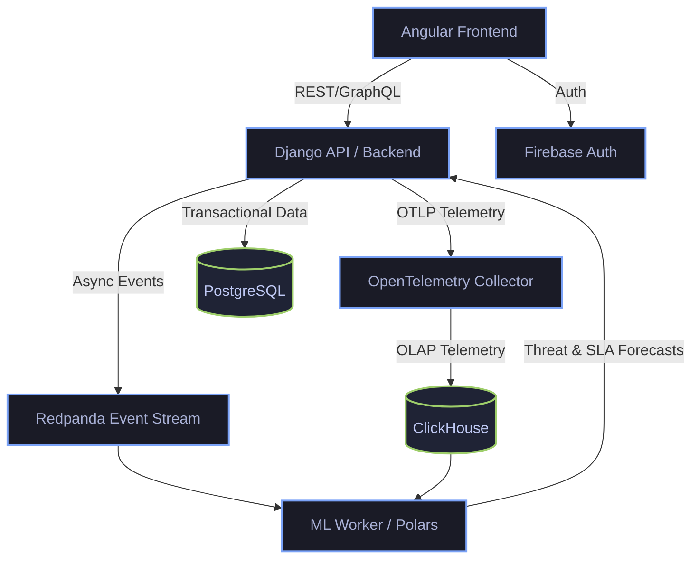

# Data Engineering for Machine Learning: The Whitepaper

**Abstract & Value Add**
This platform redefines modern observability and data engineering by tightly integrating full-stack application development with predictive machine learning. The primary value-add is the Countermeasure Effectiveness Standard (CES)—an algorithmic observability layer that transforms fragmented system telemetry into a singular, real-time diagnostic score. By isolating analytical workloads from transactional paths using an OpenTelemetry and ClickHouse pipeline, the system allows for continuous, highly accurate machine learning training without impacting end-user latency.

---

## The Hypothesis

We hypothesize that traditional observability dashboards—which require manual correlation of disparate metrics—are insufficient for high-velocity incident response. By continuously aggregating P99 latency, SLA adherence, and threat detection signals into a predictive ML model, a system can autonomously adjust its defensive posture and alert operators before cascading failures occur. A unified telemetry pipeline feeding directly into an OLAP database enables real-time scoring (CES) that outpaces standard threshold-based alerting.

---

## Architecture Diagram

The system relies on a decoupled, multi-tier architecture designed for asynchronous telemetry ingestion and machine learning inference.



---

## Core Algorithms: The CES Calculation

The Countermeasure Effectiveness Standard (CES) is calculated using a weighted composite of three critical operational vectors. The algorithm aggregates these metrics dynamically to emit a system state score.

### 1. The CES Scoring Function

The master CES score is computed as:

$$
CES(t) = w_1 \cdot \text{Threat}(t) + w_2 \cdot \text{SLA}(t) + w_3 \cdot \text{Stableness}(t)
$$

Where the weights $(w_1, w_2, w_3)$ are dynamically adjusted by the predictive ML models based on recent historical volatility.

### 2. Threat Vector Algorithm

The Threat calculation penalizes the score aggressively when active incidents or severe anomalies are detected via Redpanda streams:

```python
def calculate_threat_vector(active_incidents: int, p99_latency: float, baseline_latency: float) -> float:
    base_score = 100.0

    # Severe penalty for active incidents
    incident_penalty = active_incidents * 25.0

    # Exponential decay for latency anomalies
    if p99_latency > baseline_latency:
        latency_penalty = ((p99_latency - baseline_latency) / baseline_latency) ** 2 * 10
    else:
        latency_penalty = 0.0

    threat_score = max(0.0, base_score - incident_penalty - latency_penalty)
    return threat_score
```

This algorithmic approach ensures that the platform remains proactively secured, converting raw data engineering pipelines into actionable machine learning intelligence.
